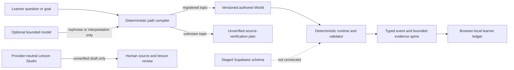

# FORGE - learn broadly, prove specifically

FORGE is a learner-owned learning-system foundation for children learning with a grown-up, teenagers, and adults. Its long-term direction is broad: help someone enter with a question or capability goal, find a rigorous path across subjects, use AI without surrendering the thinking, and keep bounded evidence of what they could do independently.

This repository is currently a **C1 interactive foundation and DG1 candidate**, not the finished institution described by the product vision. `DG#` denotes a delivery/claim gate; `PG#` denotes a program goal. It demonstrates four authored learning Worlds, a deterministic planning boundary, a typed event spine, a privacy-minimal browser evidence trail, optional device/cloud access surfaces, and a provider-neutral AI lesson-draft compiler. It does not yet constitute a complete curriculum, a homeschool replacement, a child-safety operation, or evidence that FORGE improves learning.

## Current release locator

The canonical public release record is [Current Public Release Record](docs/operations/CURRENT_RELEASE.md). It names the only current public tuple and its unresolved release-provenance gates; a local commit, build, or worker handoff never changes that record into a deployment.

## Proposed next direction

FORGE's next product layer is a practical goal-to-capability system:

```text
what I want to understand, do, or make
  → editable map of concepts, prerequisites, capabilities, and gaps
  → reviewed text, demonstrations, videos, simulations, sources, and people
  → active practice and a real project
  → AI and hints withdraw
  → unfamiliar proof and later return
```

FORGE will federate excellent external material rather than pretend it can pre-author everything. External video, including YouTube, remains a reviewed, replaceable resource with an active checkpoint, current lifecycle record, provider/privacy disclosure, and a reviewed alternative whose construct effect is explicit. A construct-changing alternative cannot inherit the original capability claim. A video, generated explanation, or completed lesson never proves capability.

The strategic thesis is that AI makes provisional cognitive assistance abundant, while judgment, trust, sound pedagogy, practical experience, relationships, and independent proof remain scarce. FORGE aims to organize those complements so people become more capable and less dependent on the product. See the [AI-era learning thesis](docs/program/AI_ERA_LEARNING_THESIS.md), [founder idea log](docs/program/FOUNDER_IDEA_LOG.md), proposed [Wave 6 plan](docs/program/WAVE_6_PLAN.md), proposed [ADR-009](docs/adr/0009-practical-multimodal-learning-paths.md), and [independent production-audit mandate](docs/program/PRINCIPAL_PRODUCTION_AUDIT_MANDATE.md).

This is a documented target, not an implemented feature or release claim.

## What is implemented

### Four working learning Worlds

| World | Route | What the slice demonstrates |
| --- | --- | --- |
| Force and motion | [`/learn/force-and-motion`](http://127.0.0.1:3000/learn/force-and-motion) | Prediction, learner model, deterministic comparison, bounded support, AI withdrawal, and unfamiliar graph transfer |
| Proportional reasoning | [`/learn/proportional-reasoning`](http://127.0.0.1:3000/learn/proportional-reasoning) | Exact-rational proportional models, a separating test, reconstruction, and map-scale transfer; includes child-with-grown-up, teen, and adult presentation modes |
| Learning with AI | [`/learn/ai-and-learning`](http://127.0.0.1:3000/learn/ai-and-learning) | Source-grounded research comparison, assistance guardrails, and an independent evidence-set transfer |
| Primary-source reasoning | [`/learn/primary-source-reasoning`](http://127.0.0.1:3000/learn/primary-source-reasoning) | Authentic Library of Congress photographs, observation/inference separation, governed support, and unfamiliar-source transfer |

Each World is authored and versioned. Deterministic code owns state transitions, experiment or scoring logic, proof locks, and evidence conditions. AI is not allowed to manufacture correct answers, unlock proof, or turn one response into a mastery claim.

### A bounded path compiler

The home route at [`/`](http://127.0.0.1:3000/) submits a typed request to `POST /api/forge/plan`.

- Known topics resolve to registered World and source IDs with authored milestones.
- Unknown topics receive an explicitly unverified source-verification plan, not an invented course.
- Age, guardian, source-access, unsafe-topic, adversarial-input, origin, content-type, schema, and request-size boundaries fail closed.
- An optional model may only contribute a visibly unverified rephrase after the deterministic route and authored IDs are frozen.

The earlier physics-specific `POST /api/interpret` route remains for the historical ModelShift World. Its model path is optional and has a deterministic neutral fallback.

### A provider-neutral Lesson Studio

[`/studio`](http://127.0.0.1:3000/studio) is a public explanation of the bounded lesson-draft workflow; its provider connector is structurally locked. Neither a request-only key, target-audience selection, nor page copy establishes authority. Public managed and BYOK Studio calls remain unavailable until active adult server-owned authority plus separately approved quota, abuse, privacy, and review controls exist. There is no managed Studio credential or environment switch.

Any future authorized adapter must return the same strict schema: opening phenomenon, exactly two plausible readings, a separating test, reconstruction, unfamiliar cold transfer, source-review needs, safety notes, and explicit limitations. Its output is always an **unverified editable draft**. It cannot publish a World, verify its own claims, select a correct proof answer, grade cold transfer, or create mastery evidence. Adapter tests are mocked; no live provider call has been verified in this release because no provider credential is available in the workspace.

### A privacy-minimal local evidence ledger

Completed World outcomes can be written to browser `localStorage` and inspected at [`/evidence`](http://127.0.0.1:3000/evidence) or [`/trail`](http://127.0.0.1:3000/trail). The ledger supports schema validation, bounded assistance provenance, return dates, learner export, learner-selected educator export, per-record deletion, and full local deletion.

The local ledger deliberately excludes identity, raw chat, learner explanations, confidence, personality or emotion inference, and mastery scores. It is browser-local only: there is no evidence sync, background sharing, or recovery across devices.

[`/login`](http://127.0.0.1:3000/login) and [`/account`](http://127.0.0.1:3000/account) provide a working privacy-minimal device profile and an optional adult-entry cloud-auth adapter. Device profiles store only a random ID, learner mode, guardian-present confirmation, schema version, and timestamp. Cloud auth is code-complete for a separately provisioned Supabase project, but intentionally unavailable when the three server variables are absent. Cloud identity grants no adult, guardian, sharing, or evidence privileges, and no live project is connected in this release.

### A typed event spine

`src/forge/events.ts` and `src/forge/event-journal.ts` define the canonical, append-only event vocabulary and replay rules for journey, assistance, proof, access, and rights operations. `supabase/migrations/202607220002_forge_event_spine.sql` stages the durable counterpart with SQL contract tests. The browser UI does not yet replay every screen from this durable journal, so DG1 remains a candidate rather than a pass.

### A staged database boundary

[`supabase/migrations/202607220001_forge_learning_os.sql`](supabase/migrations/202607220001_forge_learning_os.sql) and [`supabase/tests/forge_schema_contract.sql`](supabase/tests/forge_schema_contract.sql) define a production-oriented Supabase/PostgreSQL foundation for identity, consent, reviewed curriculum, programs, grants, append-only assistance and evidence, scheduled proof, artifacts, reviews, and privacy requests. The migration uses forced row-level security, scoped adult grants, immutable publication/evidence rules, and no raw-chat or surveillance store.

The migration and SQL contract have been exercised in disposable PostgreSQL. They have **not** been applied to a live Supabase project, and the Next.js application is not connected to them. See [FORGE Database Architecture](docs/FORGE_DATABASE.md) for the exact trust and deployment boundary.

## Current architecture



The implementation is a modular Next.js monolith with explicit internal boundaries:

- `src/forge/` - contracts, policy invariants, world/source registries, and validators;
- `src/lib/forge-planner/` - deterministic topic classification, planning contracts, safety policy, and optional model governor;
- `src/worlds/` and `src/components/worlds/` - domain-owned content, reducers, models, validators, and interfaces;
- `src/lib/forge-evidence/` - privacy-minimal local ledger, export, deletion, scheduling, and evidence-state derivation;
- `src/lib/lesson-studio/` - provider adapters, strict lesson-draft schema, source/safety boundaries, and fail-closed parsing;
- `src/lib/forge-auth/` and `src/lib/forge-profile/` - hardened optional cloud session boundary and privacy-minimal device profile;
- `supabase/` - staged durable-data migration and SQL contract tests.

The broader architecture deliberately remains a modular monolith with a typed event/evidence spine until measured scale or isolation needs justify a split. See [FORGE Architecture](docs/FORGE_ARCHITECTURE.md).

## Run locally

Requirements: Node.js 22 or newer and pnpm 11.9.0 or compatible.

```bash
pnpm install --frozen-lockfile
cp .env.example .env.local
pnpm dev
```

Open `http://127.0.0.1:3000`.

No model credential is required for the authored and deterministic paths. External interpretation and planner calls are off by default even when an existing `OPENAI_API_KEY` is present; keep `OPENAI_INTERPRETATION_ENABLED=false` and `OPENAI_FORGE_PLANNER_ENABLED=false` for public operation unless their separate controls are approved. Public managed and BYOK Lesson Studio calls are locked: neither a request-only key, a page declaration, nor target-audience metadata authorizes a provider request. They require active adult server-owned authority plus separately approved quota, abuse, privacy, and review controls. Lesson Studio has no managed-provider environment switch, and must never use a `NEXT_PUBLIC_*` credential.

## Verify

```bash
pnpm lint
pnpm typecheck
pnpm test
pnpm eval
pnpm build
pnpm test:e2e
```

`pnpm test` runs the application/unit suite and the legacy live-evaluator contract tests. `pnpm test:e2e` starts a local development server when `PLAYWRIGHT_BASE_URL` is absent and runs the desktop and mobile browser projects.

To exercise the staged database contract against a disposable local Supabase stack:

```bash
supabase db reset
psql "$LOCAL_DATABASE_URL" -v ON_ERROR_STOP=1 \
  -f supabase/tests/forge_schema_contract.sql
```

To check an already deployed origin with the production browser spec:

```bash
PLAYWRIGHT_BASE_URL=https://your-production-domain pnpm test:e2e:prod
```

## Routes

| Route | Boundary |
| --- | --- |
| `/` | Universal question intake, deterministic learning contract, and World catalog |
| `/learn/force-and-motion` | Working Model World using the historical ModelShift protocol |
| `/learn/proportional-reasoning` | Working exact-math Model World |
| `/learn/ai-and-learning` | Working source/evidence World |
| `/learn/primary-source-reasoning` | Working historical-literacy World using authentic archival images |
| `/paths/source-corroboration` | Fixture-only adult presentation route; no assignment, entitlement, evidence write, or homeschool authority |
| `/pilot` | Publicly routed but fail-closed adult fixture review shell; unavailable by default, with reviewed fixture markers excluded from public static assets |
| `/studio` | Public explanation of the provider-neutral unverified-draft workflow; connector locked |
| `/login` and `/account` | Private device profile plus optional, separately configured cloud identity |
| `/trail` | Local evidence summary plus the intended question-to-capability trail |
| `/evidence` | Local evidence controls and the bounded evidence contract |
| `POST /api/forge/plan` | Strict same-origin FORGE planner API |
| `POST /api/forge/lesson-draft` | Strict same-origin, fixed-endpoint provider adapter for unverified drafts |
| `POST /api/interpret` | Historical bounded physics interpretation API |

## Deployment boundary

The complete application requires a Next.js/Node-compatible host because it includes server routes. Vercel is the intended deployment target for this foundation; a static-site host can publish design or research artifacts but cannot replace the planner and interpretation APIs without a separate backend.

The current public app is exact source `04eab4263658725d7a228c67682c40fc469757b1` at [modelshift.vercel.app](https://modelshift.vercel.app), deployment `dpl_ET6nUWvjeVMEdacWJgCbxVsCT1qn`, immutable URL `https://forge-learning-r5lgrxkg0-ranapriyanshs-projects.vercel.app`. Public health binds the SHA, platform identity, lock/content/evaluator digests, disabled cloud/provider posture, and the requirement for a provider-observed asset receipt. The app and default-denied pilot route are operational, but release verification remains `DEPLOYMENT_BLOCKED` at 207 pass / 8 fail because Vercel reports a CLI source with `gitSource` and `gitRepo` absent. The build emitted asset digest `02aef5b...`; caller metadata cannot supply the missing provider Git provenance. Local main additionally hardens the collector against the live nested event envelope, duplicate markers, cross-deployment IDs, missing nested timestamps, and mixed event shapes; that later verifier-only code is not part of the deployed source. See the [canonical record](docs/operations/CURRENT_RELEASE.md) for the exact tuple, evidence ceiling, repair gate, and non-mutating rollback procedure.

## What is not yet claimed

- FORGE is not a complete cross-domain curriculum or a replacement for school, teachers, guardians, peers, care, safeguarding, disability services, or public institutions.
- It is not yet a homeschool solution, accredited pathway, credential, or jurisdiction-specific compliance system.
- It is not a minor operational release and has no verified guardian service, adult entitlement service, or operational safeguarding proof.
- There is no live Supabase project, verified-age or guardian onboarding, cloud evidence sync, people network, storage pipeline, privacy worker, or abuse-control service connected to this app.
- The current four Worlds do not establish breadth across everything someone may want to learn.
- Fixture/local contracts and previews exist for capability maps, governed resource candidates, a disabled YouTube metadata adapter, representations, and practical project/practice packets. They are not connected or enabled as an integrated reviewed learner path; the educator review port remains unimplemented.
- Provider adapters and structured parsing are tested with mocks, not live provider credentials; generated drafts are not source-reviewed curriculum.
- No representative learner, educator, minor-safety, external accessibility, assessment-validity, delayed-retention, efficacy, equity, workload, or scale result has been established for broad FORGE.
- One immediate transfer result is bounded evidence from one task, not mastery, intelligence, retention, or a permanent learner label.
- A successful build or browser run demonstrates engineering behavior, not educational effectiveness or child safety.

## Governing documentation

- [FORGE Product Specification](FORGE_PRODUCT_SPEC.md)
- [FORGE Architecture](docs/FORGE_ARCHITECTURE.md)
- [Research-to-System Traceability](docs/FORGE_RESEARCH_TO_SYSTEM.md)
- [Delivery Gates and Honest Claim Protocol](docs/FORGE_DELIVERY_GATES.md)
- [Design System](docs/FORGE_DESIGN_SYSTEM.md)
- [Control Room](docs/FORGE_CONTROL_ROOM.md)
- [Database Architecture](docs/FORGE_DATABASE.md)
- [AI-era Strategy and Scenario Thesis](docs/program/AI_ERA_LEARNING_THESIS.md)
- [Proposed Wave 6 Practical Learning Plan](docs/program/WAVE_6_PLAN.md)
- [Founder Idea Log](docs/program/FOUNDER_IDEA_LOG.md)

## Historical ModelShift v1 artifacts

FORGE preserves the narrow ModelShift experiment as one useful World and as build history. These documents remain historical; they do not govern or validate broad FORGE. The demo/submission package and deadline checklist are explicitly retired: FORGE has no active hackathon, demo-video, judging, YouTube, or Devpost deliverable.

- [ModelShift v1 Final Product Specification](FINAL_PRODUCT_SPEC.md)
- [ModelShift v1 Architecture](docs/ARCHITECTURE.md)
- [ModelShift v1 Evaluation](docs/EVALUATION.md)
- [Retired ModelShift v1 Demo and Submission](DEMO_AND_SUBMISSION.md)
- [Retired ModelShift v1 Build Checklist](BUILD_CHECKLIST.md)
- [Pre-existing Work Boundary](docs/PREEXISTING_WORK.md)

## License

Code and repository-authored materials are licensed under the [MIT License](LICENSE).
