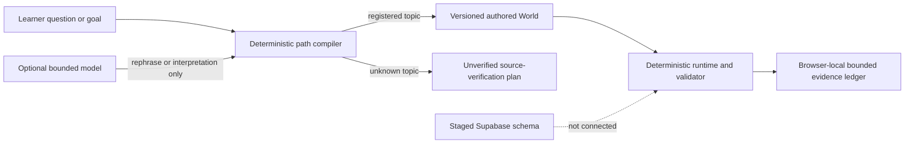

# FORGE - learn broadly, prove specifically

FORGE is a learner-owned learning-system foundation for children learning with a grown-up, teenagers, and adults. Its long-term direction is broad: help someone enter with a question or capability goal, find a rigorous path across subjects, use AI without surrendering the thinking, and keep bounded evidence of what they could do independently.

This repository is currently a **C1 interactive foundation and G1 candidate**, not the finished institution described by the product vision. It demonstrates three authored learning Worlds, a deterministic planning boundary, and a privacy-minimal browser evidence trail. It does not yet constitute a complete curriculum, a homeschool replacement, a child-safety operation, or evidence that FORGE improves learning.

## What is implemented

### Three working learning Worlds

| World | Route | What the slice demonstrates |
| --- | --- | --- |
| Force and motion | [`/learn/force-and-motion`](http://127.0.0.1:3000/learn/force-and-motion) | Prediction, learner model, deterministic comparison, bounded support, AI withdrawal, and unfamiliar graph transfer |
| Proportional reasoning | [`/learn/proportional-reasoning`](http://127.0.0.1:3000/learn/proportional-reasoning) | Exact-rational proportional models, a separating test, reconstruction, and map-scale transfer; includes child-with-grown-up, teen, and adult presentation modes |
| Learning with AI | [`/learn/ai-and-learning`](http://127.0.0.1:3000/learn/ai-and-learning) | Source-grounded research comparison, assistance guardrails, and an independent evidence-set transfer |

Each World is authored and versioned. Deterministic code owns state transitions, experiment or scoring logic, proof locks, and evidence conditions. AI is not allowed to manufacture correct answers, unlock proof, or turn one response into a mastery claim.

### A bounded path compiler

The home route at [`/`](http://127.0.0.1:3000/) submits a typed request to `POST /api/forge/plan`.

- Known topics resolve to registered World and source IDs with authored milestones.
- Unknown topics receive an explicitly unverified source-verification plan, not an invented course.
- Age, guardian, source-access, unsafe-topic, adversarial-input, origin, content-type, schema, and request-size boundaries fail closed.
- An optional model may only contribute a visibly unverified rephrase after the deterministic route and authored IDs are frozen.

The earlier physics-specific `POST /api/interpret` route remains for the historical ModelShift World. Its model path is optional and has a deterministic neutral fallback.

### A privacy-minimal local evidence ledger

Completed World outcomes can be written to browser `localStorage` and inspected at [`/evidence`](http://127.0.0.1:3000/evidence) or [`/trail`](http://127.0.0.1:3000/trail). The ledger supports schema validation, bounded assistance provenance, return dates, learner export, learner-selected educator export, per-record deletion, and full local deletion.

The local ledger deliberately excludes identity, raw chat, learner explanations, confidence, personality or emotion inference, and mastery scores. It is browser-local only: there is no account, server sync, background sharing, or recovery across devices.

### A staged database boundary

[`supabase/migrations/202607220001_forge_learning_os.sql`](supabase/migrations/202607220001_forge_learning_os.sql) and [`supabase/tests/forge_schema_contract.sql`](supabase/tests/forge_schema_contract.sql) define a production-oriented Supabase/PostgreSQL foundation for identity, consent, reviewed curriculum, programs, grants, append-only assistance and evidence, scheduled proof, artifacts, reviews, and privacy requests. The migration uses forced row-level security, scoped adult grants, immutable publication/evidence rules, and no raw-chat or surveillance store.

The migration and SQL contract have been exercised in disposable PostgreSQL. They have **not** been applied to a live Supabase project, and the Next.js application is not connected to them. See [FORGE Database Architecture](docs/FORGE_DATABASE.md) for the exact trust and deployment boundary.

## Current architecture



The implementation is a modular Next.js monolith with explicit internal boundaries:

- `src/forge/` - contracts, policy invariants, world/source registries, and validators;
- `src/lib/forge-planner/` - deterministic topic classification, planning contracts, safety policy, and optional model governor;
- `src/worlds/` and `src/components/worlds/` - domain-owned content, reducers, models, validators, and interfaces;
- `src/lib/forge-evidence/` - privacy-minimal local ledger, export, deletion, scheduling, and evidence-state derivation;
- `supabase/` - staged durable-data migration and SQL contract tests.

The broader architecture deliberately remains a modular monolith with a typed event/evidence spine until measured scale or isolation needs justify a split. See [FORGE Architecture](docs/FORGE_ARCHITECTURE.md).

## Run locally

Requirements: Node.js 22 or newer and pnpm 11.9.0 or compatible.

```bash
pnpm install --frozen-lockfile
cp .env.example .env.local
pnpm dev
```

Open `http://127.0.0.1:3000`.

No model credential is required for the authored and deterministic paths. External model calls are off by default even when an existing `OPENAI_API_KEY` is present. Keep `OPENAI_INTERPRETATION_ENABLED=false` and `OPENAI_FORGE_PLANNER_ENABLED=false` for public child/teen access; enabling either path requires a separate provider-disclosure, consent, and rate-control release. Credentials remain server-only and must never use a `NEXT_PUBLIC_*` variable. Either corresponding `*_DISABLED=true` switch forces authored fallback.

## Verify

```bash
pnpm lint
pnpm typecheck
pnpm test
pnpm eval
pnpm build
pnpm test:e2e
```

`pnpm test` runs the application/unit suite and the legacy live-evaluator contract tests. `pnpm test:e2e` starts a local development server when `PLAYWRIGHT_BASE_URL` is absent and runs the desktop and mobile browser projects.

To exercise the staged database contract against a disposable local Supabase stack:

```bash
supabase db reset
psql "$LOCAL_DATABASE_URL" -v ON_ERROR_STOP=1 \
  -f supabase/tests/forge_schema_contract.sql
```

To check an already deployed origin with the production browser spec:

```bash
PLAYWRIGHT_BASE_URL=https://your-production-domain pnpm test:e2e:prod
```

## Routes

| Route | Boundary |
| --- | --- |
| `/` | Universal question intake, deterministic learning contract, and World catalog |
| `/learn/force-and-motion` | Working Model World using the historical ModelShift protocol |
| `/learn/proportional-reasoning` | Working exact-math Model World |
| `/learn/ai-and-learning` | Working source/evidence World |
| `/trail` | Local evidence summary plus the intended question-to-capability trail |
| `/evidence` | Local evidence controls and the bounded evidence contract |
| `POST /api/forge/plan` | Strict same-origin FORGE planner API |
| `POST /api/interpret` | Historical bounded physics interpretation API |

## Deployment boundary

The complete application requires a Next.js/Node-compatible host because it includes server routes. Vercel is the intended deployment target for this foundation; a static-site host can publish design or research artifacts but cannot replace the planner and interpretation APIs without a separate backend.

No public FORGE release is claimed by this README until the exact commit, environment, browser verification, and allowed claim are recorded. The existing [modelshift.vercel.app](https://modelshift.vercel.app) URL and [RanaPriyansh/modelshift](https://github.com/RanaPriyansh/modelshift) repository are historical ModelShift v1 release references unless a new FORGE deployment is separately verified.

## What is not yet claimed

- FORGE is not a complete cross-domain curriculum or a replacement for school, teachers, guardians, peers, care, safeguarding, disability services, or public institutions.
- It is not yet a homeschool solution, accredited pathway, credential, or jurisdiction-specific compliance system.
- There is no live Supabase project, authentication, guardian onboarding, cloud evidence sync, people network, storage pipeline, or privacy worker connected to this app.
- The current three Worlds do not establish breadth across everything someone may want to learn.
- No representative learner, educator, minor-safety, external accessibility, assessment-validity, delayed-retention, efficacy, equity, workload, or scale result has been established for broad FORGE.
- One immediate transfer result is bounded evidence from one task, not mastery, intelligence, retention, or a permanent learner label.
- A successful build or browser run demonstrates engineering behavior, not educational effectiveness or child safety.

## Governing documentation

- [FORGE Product Specification](FORGE_PRODUCT_SPEC.md)
- [FORGE Architecture](docs/FORGE_ARCHITECTURE.md)
- [Research-to-System Traceability](docs/FORGE_RESEARCH_TO_SYSTEM.md)
- [Delivery Gates and Honest Claim Protocol](docs/FORGE_DELIVERY_GATES.md)
- [Design System](docs/FORGE_DESIGN_SYSTEM.md)
- [Control Room](docs/FORGE_CONTROL_ROOM.md)
- [Database Architecture](docs/FORGE_DATABASE.md)

## Historical ModelShift v1 artifacts

FORGE preserves the narrow ModelShift experiment as one useful World and as build history. These documents remain historical; they do not govern or validate broad FORGE:

- [ModelShift v1 Final Product Specification](FINAL_PRODUCT_SPEC.md)
- [ModelShift v1 Architecture](docs/ARCHITECTURE.md)
- [ModelShift v1 Evaluation](docs/EVALUATION.md)
- [ModelShift v1 Demo and Submission](DEMO_AND_SUBMISSION.md)
- [Pre-existing Work Boundary](docs/PREEXISTING_WORK.md)

## License

Code and repository-authored materials are licensed under the [MIT License](LICENSE).
