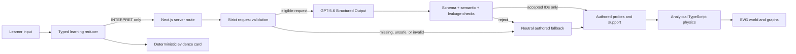

# ModelShift — Proof after help

ModelShift turns a learner's causal explanation into the smallest authored experiment that can test it, then removes assistance and asks for one independent proof.

The prototype is intentionally narrow: one learner aged 13+, one force-and-motion misconception, one deterministic experiment loop, and one immediate near-transfer task. The concept is **zero net force means zero acceleration, not zero velocity**; friction is a force that can cause slowing.

## Release status

This repository contains an implemented local product and deterministic fallback path. It is **not yet submission-ready** at this documentation snapshot.

| Required artifact | Verified state on 2026-07-22 IST |
| --- | --- |
| Local implementation | Present |
| Unit and contract tests | `25/25` passing across four files |
| Offline interpretation corpus | 54 authored fixtures valid; rule baseline `29/38` on clear fixtures (`76.3%`) |
| Lint, typecheck, optimized build | Passing |
| Local browser matrix | Development and optimized `next start`: 5 passed, 3 intentional project skips, 0 failed in each run |
| Live GPT-5.6 evaluation | **Not run**; `OPENAI_API_KEY` is absent |
| Public production URL | Not deployed or independently verified |
| Public repository URL | No Git remote configured |
| Under-three-minute public video | Not recorded or published |
| Principal Codex `/feedback` session ID | Not invoked or recorded |

No live model accuracy, latency, or 85% agreement claim is made. See [Evaluation](docs/EVALUATION.md) for the exact evidence boundary.

## What the product demonstrates

A learner:

1. commits a prediction and confidence before receiving help;
2. explains the causal model behind that prediction in free text;
3. sees a provisional, evidence-grounded interpretation or a neutral fallback;
4. commits a prediction for an authored discriminating experiment;
5. observes trajectories computed by deterministic TypeScript;
6. receives only code-authorized authored support, if requested;
7. reconstructs the force → acceleration → velocity relationship;
8. enters a structurally locked proof mode with AI, hints, and replay absent;
9. submits once in a new graph representation; and
10. receives a truthful **Before / Test / Support / Alone / Later** evidence trail.

The result is evidence from one immediate task. It is not a mastery score and does not establish retention, broad physics knowledge, diagnosis, intelligence, or population-level learning gains.

## Judge path

The complete path is designed to take under five minutes:

1. Choose **Gradually slows** and leave confidence near 70%.
2. Explain: `It slows because the engine is no longer pushing it.`
3. Inspect the quoted evidence, provisional model, selected authored test, and the expandable selection boundary.
4. Commit a prediction for the probe and run the experiment.
5. Compare force and velocity after the push. Optionally request one attention cue.
6. Write a short observation and reconstruct the causal rule.
7. Confirm that proof mode says **AI assistance is now off** and offers no hint or replay control.
8. Choose a velocity graph, explain it, and submit once.
9. Inspect Before, Test, Support, Alone, and `Later: not tested yet`.

Without an API key, step 3 truthfully displays the authored baseline path and the rest of the journey remains available.

## Architecture



The browser holds the current session in React state. There is no database, account, analytics SDK, or learner profile. The server exposes one same-origin JSON route for interpretation. Detailed rationale is in [Architecture](docs/ARCHITECTURE.md).

### Correctness ownership

| Deterministic code owns | GPT-5.6 may do |
| --- | --- |
| Scenario parameters and correct choices | Interpret one free-form explanation |
| Force, acceleration, velocity, position, and graph data | Select 1–3 authored hypothesis IDs |
| Probe compatibility and fallback | Quote short verbatim evidence spans |
| State transitions and support authorization/accounting | Select authored missing-distinction, probe, and Level-1 question IDs |
| Proof-mode lock and single submission | Abstain |
| Transfer checking and evidence-card derivation | Provide a short non-teaching rationale within the strict schema |

GPT-5.6 cannot generate physics, hints, probes, transfer tasks, correct answers, scores, or stage permissions. The optional post-transfer model call described in early planning is not implemented.

## Local setup

Requirements: Node.js 22 or newer and pnpm 11.9.0 or compatible.

```bash
pnpm install --frozen-lockfile
cp .env.example .env.local
pnpm dev
```

Open `http://127.0.0.1:3000`.

The full neutral-fallback journey requires no credential. To exercise the live interpretation path, set a paid/eligible server-side OpenAI key in `.env.local`:

```bash
OPENAI_API_KEY=your_server_side_key
OPENAI_MODEL=gpt-5.6-sol
```

The runtime defaults to `gpt-5.6-sol`. Set `OPENAI_INTERPRETATION_DISABLED=true` to force deterministic fallback. Never use a `NEXT_PUBLIC_*` name for the key.

## Commands

```bash
pnpm lint
pnpm typecheck
pnpm test
pnpm eval
pnpm build
pnpm test:e2e
PLAYWRIGHT_BASE_URL=https://your-production-domain pnpm test:e2e:prod
```

`pnpm eval` is currently an offline corpus and rule-baseline check. It does not call GPT-5.6 even when a key is present. Final release requires a separate live fixture run and truthful production latency evidence.

## Current verified evidence

At 01:20 IST on 2026-07-22:

```text
Test Files  4 passed (4)
Tests       25 passed (25)

fixtures: 54 (version 1.0.0)
fixture input validity: PASS
rule baseline primary-category agreement on clear fixtures: 29/38 (76.3%)
rule baseline always selects an authored probe: PASS
live model evaluation: NOT RUN (OPENAI_API_KEY is absent)
```

The same local QA cycle also passed `pnpm lint`, `pnpm typecheck`, and `pnpm build`. Playwright passed against both the development server and an optimized local `next start` server:

```text
development:       5 passed, 3 intentional project skips, 0 failed (25.0s)
local production:  5 passed, 3 intentional project skips, 0 failed (24.8s)
```

The development run targeted `http://127.0.0.1:3000`; the optimized local production run targeted `http://127.0.0.1:3100`. These are not public-deployment results. The live-model path and a public deployed smoke remain unverified.

## Reliability and fallback

The server accepts only the `INTERPRET` stage, strict same-origin JSON, a known scenario and prediction, confidence from 0–100, and 1–600 characters of explanation. A model call uses the Responses API, strict Structured Outputs, `store: false`, no tools, no streaming, a 500-token output cap, and a six-second abort deadline.

Missing credentials, explicit disablement, timeout, API error, refusal, malformed output, invalid enums, unsupported evidence, probe incompatibility, answer leakage, ambiguity, and adversarial input all normalize to `neutral_core_probe`. Fallback is an ordinary path, not an error screen.

## Accessibility, safety, and privacy

Implemented affordances include semantic fieldsets and labels, visible focus styles, a skip link, stage announcements, text alternatives for graphs/trajectories, responsive layouts, reduced-motion CSS, and valid “I don't know” paths. Local Playwright verifies keyboard-only completion, reduced-motion CSS, role-addressable controls, no horizontal overflow, and the complete fallback journey at 1440×900 and 390×844. An external screen-reader and fresh-user review has not been completed.

The app is marked 13+, requires no identity, and adds no database, tracking, camera, microphone, or long-term profile. Session data remains in the current page. A valid live interpretation sends the submitted explanation to OpenAI with `store: false`; application code does not persist or deliberately log the raw explanation. The interface states that AI interpretation can be wrong and deterministic code owns physics and primary answer checks.

## How Codex and GPT-5.6 were used

Codex was the build and orchestration environment: it converted the governing specification into contracts, created the implementation-grade visual concept, split physics/state/model work into bounded worktrees, integrated and reviewed those changes, built the interface, and assembled verification and documentation. Human-authored scope and claim decisions remain in [Final Product Specification](FINAL_PRODUCT_SPEC.md) and [Decisions](docs/DECISIONS.md).

GPT-5.6 has two distinct roles:

- a GPT-5.6 Sol xhigh Codex task served as goal and architecture authority during the build;
- the product's server route is implemented to use `gpt-5.6-sol` for bounded runtime interpretation.

The runtime model role has **not** been live-verified because no API key is available. See [Codex and GPT usage](docs/CODEX_AND_GPT_USAGE.md).

## Pre-existing work

Before application implementation began, the workspace contained education research, product-planning Markdown, and HTML decision reports. It did not contain a product repository, source application, physics engine, state machine, AI route, tests, deployment, or ModelShift remote. Build-period implementation commits and the exact boundary are recorded in [Pre-existing work](docs/PREEXISTING_WORK.md).

## Known limitations and open release gates

- No live `gpt-5.6-sol` fixture evaluation, latency sample, or validated adaptive production journey yet.
- No public Vercel deployment or public GitHub remote yet.
- No Playwright run against a public deployment; the passing browser evidence targets local development and optimized local production servers.
- No representative learner, educator, child-safety, or external accessibility review.
- One immediate near-transfer item cannot establish delayed retention; `Later` remains `not tested yet`.
- The authored corpus and probe library cover one mechanics distinction only.
- Public demo, Devpost submission, and principal `/feedback` ID remain account-owned completion steps.

## Documentation

- [Architecture](docs/ARCHITECTURE.md)
- [Codex and GPT usage](docs/CODEX_AND_GPT_USAGE.md)
- [Evaluation](docs/EVALUATION.md)
- [Pre-existing work](docs/PREEXISTING_WORK.md)
- [Deployment runbook](docs/DEPLOYMENT.md)
- [Design fidelity ledger](docs/DESIGN_FIDELITY_LEDGER.md)
- [Demo and submission package](DEMO_AND_SUBMISSION.md)

## License and assets

Code and repository-authored materials are licensed under the [MIT License](LICENSE). The ModelShift concept image in `docs/design/modelshift-concept.png` was generated during this build through OpenAI ImageGen under Codex direction. The interface uses system fonts, CSS, and repository-authored SVG; no third-party logos, stock imagery, music, or tracking assets are included.
