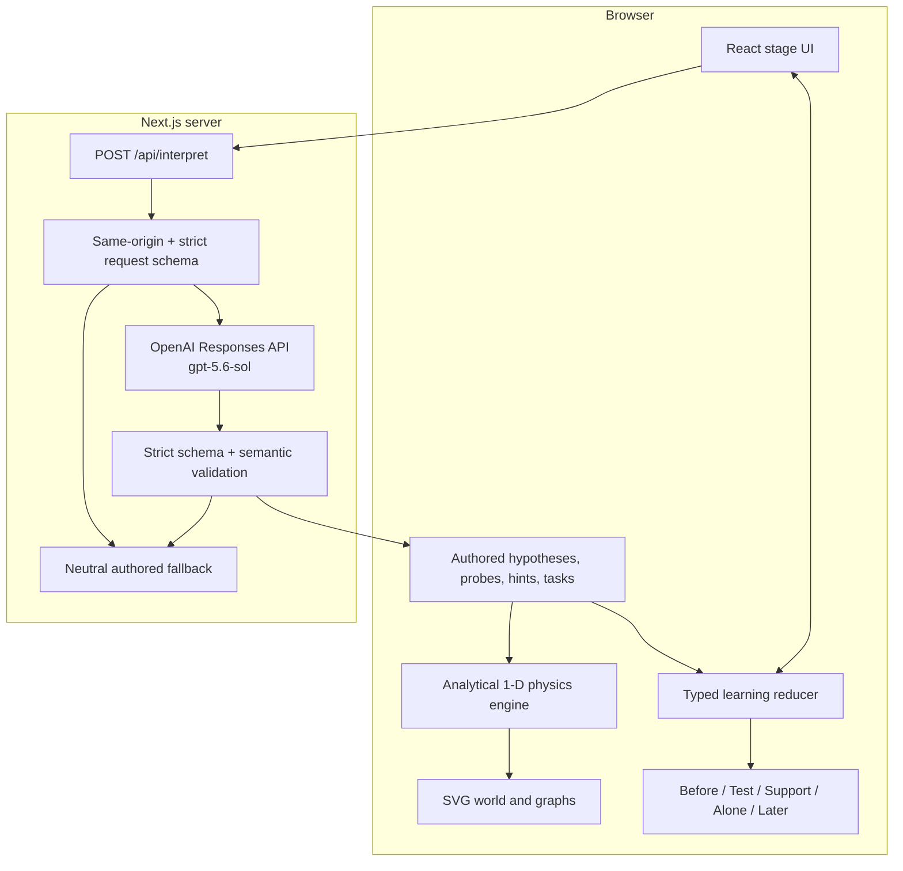

# ModelShift Architecture

## Architectural thesis

ModelShift is deterministic-first. Language interpretation may influence **which authored experiment is shown**, but it cannot influence what the physical world does, which answer is correct, whether support is permitted, whether proof mode is active, or what the evidence card records.

This is a single Next.js App Router application with no database or authentication. The browser holds an ephemeral session; a single server route performs bounded interpretation.

## System topology



## Layer ownership

| Layer | Primary files | Owns | Must not own |
| --- | --- | --- | --- |
| Authored domain content | `src/content/**`, `src/types/modelshift.ts` | IDs, compatibility, prompts, answers, support copy | Runtime generation |
| Physics | `src/domain/physics/**` | Scenario configs, analytical segments, immutable samples, bounds metadata | Learner interpretation or stage flow |
| Learning policy | `src/domain/learning/index.ts` | State transitions, gates, support authorization/accounting, proof lock, evidence derivation | Physics integration or model calls |
| Model boundary | `src/lib/ai/**`, `app/api/interpret/route.ts` | Request/output contracts, one interpretation call, semantic checks, fallback | Objective outcomes, help authorization, scoring |
| Presentation | `src/components/**`, `app/**` | Input, accessible rendering, responsive sequence | Independent physics or correctness logic |
| Evaluation | `src/**/*.test.ts`, `evals/**`, `tests/e2e/**` when present | Invariants, contracts, fixtures, browser evidence | Product behavior |

## Learning state machine

The canonical sequence is:

```text
HOOK → PREDICT → EXPLAIN → INTERPRET → PROBE_PREDICT
     → EXPERIMENT → REFLECT → RECONSTRUCT
     → COLD_TRANSFER → PROOF_RESULT
```

`transitionLearningState` receives typed events and returns either an accepted next state or a rejection that preserves the prior state. The reducer enforces these material guards:

- prediction and finite confidence are required before explanation;
- explanation must be meaningful or explicitly record uncertainty;
- only validated interpretation data enters probe selection;
- a probe prediction is required before the experiment;
- observation and reflection precede reconstruction;
- reconstruction is attempted before cold transfer;
- support is separately authorized and consumed, and cannot be counted twice;
- cold transfer accepts only one submission event; and
- proof result rejects resubmission.

The UI has local display state for form values and animation reveal, but the reducer is the authority for journey stage and recorded evidence.

## Mental-model-to-experiment compilation

The browser sends this bounded request only during `INTERPRET`:

```ts
{
  scenario_id: "mystery_force_cutoff";
  prediction_id: PredictionId;
  confidence: number;        // integer, 0–100
  explanation: string;       // trimmed, 1–600 characters
  stage: "INTERPRET";
}
```

The model may return 1–3 authored hypotheses with ordinal support, at most two exact evidence spans each, at most two authored missing distinctions, one authored probe ID, one authored Level-1 question ID, and an abstention state. Zod produces a strict Structured Output schema with `additionalProperties: false` at each object level.

Post-schema validation then checks:

- unique IDs and internal consistency;
- abstention consistency;
- a non-low, non-neutral primary hypothesis for personalization;
- every evidence span is present verbatim in the learner text;
- rationale text does not leak the answer or governing principle;
- the recommended probe is compatible with the primary hypothesis; and
- the question is the authored default for that probe.

Only a passing object is marked `source: "model"`. Everything else becomes the same frozen fallback object with `mixed_or_unclear`, `neutral_core_probe`, and `neutral_observation_prompt`.

## Runtime model envelope

`interpretExplanation` uses the official OpenAI SDK Responses API with:

- `process.env.OPENAI_MODEL ?? "gpt-5.6-sol"`;
- strict `zodTextFormat` Structured Outputs;
- `max_output_tokens: 500`;
- `store: false`;
- no tools;
- no streaming; and
- a six-second `AbortController` deadline.

The learner text is explicitly delimited as untrusted data. A local adversarial-input detector bypasses the model for common answer requests and prompt-injection patterns. No model output is rendered before server validation.

`OPENAI_API_KEY` is currently absent, so only the missing-key fallback has been exercised against the real local route. A live GPT-5.6 capability or quality claim requires a credentialed fixture and production run.

## Deterministic physics

The engine resolves authored one-dimensional piecewise-constant-force segments analytically:

```text
a = F_net / m
v(t) = v0 + a·t
x(t) = x0 + v0·t + 0.5·a·t²
```

It precomputes immutable samples and metadata before rendering. Friction acts opposite current motion; when it would stop an object within a segment, the engine splits that segment into movement and rest so velocity never reverses numerically. Sampling density changes display resolution, not physical endpoints.

Authored scenario families are:

- `mystery_force_cutoff`;
- four compatible probes: `friction_contrast`, `brief_vs_continuous_force`, `zero_force_velocity_contrast`, and `neutral_core_probe`; and
- `cargo_pod_force_graph` cold transfer.

SVG components consume samples; they do not perform a second integration loop.

## Assistance governor

Conceptual support is authored and code-authorized:

- Level 0: none;
- Level 1: an attention question;
- Level 2: a contrast; and
- Level 3: the principle.

The model may recommend only an authored Level-1 question ID. The reducer decides whether a level can be requested and records it only when consumed. In proof mode every support, replay, and interpretation event is invalid.

## Proof mode as a boundary

Cold transfer is a new force-time/velocity-time representation. It is protected in three layers:

1. the rendered proof stage contains no help, replay, or interpretation controls;
2. the reducer allows only `SUBMIT_TRANSFER` from `COLD_TRANSFER`; and
3. the interpretation route accepts only a request whose stage is exactly `INTERPRET`.

The authored correct choice is checked by code. A successful or unsuccessful choice, or an explicit “I don't know,” advances once to `PROOF_RESULT`. The evidence card is derived from committed reducer context and always reports `Later: not tested yet`.

## Failure behavior

All model-side failures converge on the same complete learner path:

```text
missing key / disabled / timeout / API error / refusal
malformed schema / invalid enum / missing evidence
incompatible probe / answer leakage / ambiguity / adversarial input
                              ↓
                     neutral_core_probe
                              ↓
          deterministic experiment → reconstruction → proof
```

The route returns a bounded fallback object rather than raw errors or model output. `Cache-Control: no-store` is set on responses.

## Privacy and security posture

- no account, database, analytics SDK, ad tracker, camera, or microphone;
- no browser persistence is currently implemented;
- no application logging of raw learner explanations;
- OpenAI requests use `store: false`;
- the key is read only from the server process and never from a `NEXT_PUBLIC_*` variable;
- same-origin and JSON content-type checks protect the route;
- strict request schemas cap explanation length; and
- proof-mode requests are rejected by stage validation.

This is an implementation posture, not a formal security or child-safety certification. No external security, privacy, educator, or child-safety review has been completed.

## Deliberate omissions

There is no second concept, open chat, model-authored hint, generated simulation, account, database, delayed-return scheduler, mastery score, dashboard, social layer, gamification, Apps SDK surface, or Sites deployment. The optional post-transfer model call is also omitted, preserving the clean pre-submit proof boundary.
