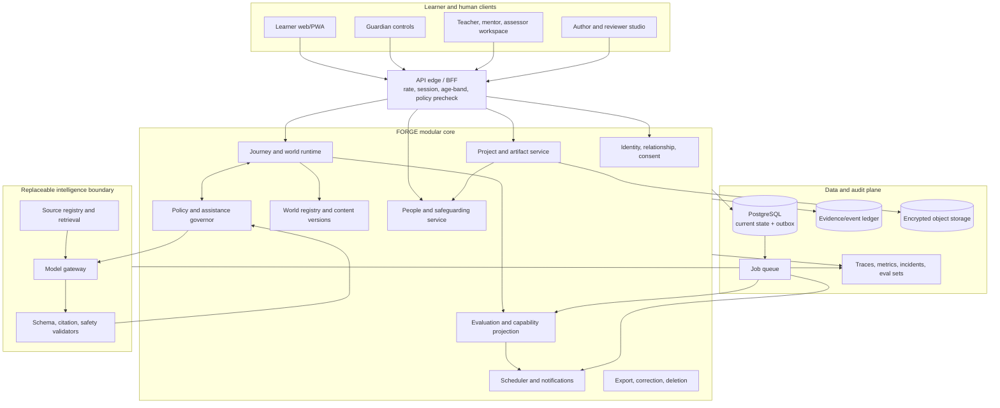
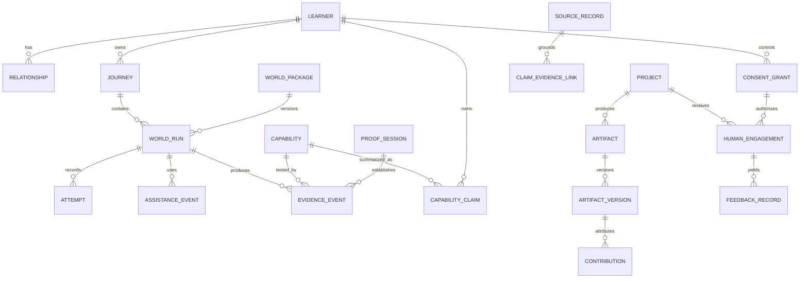
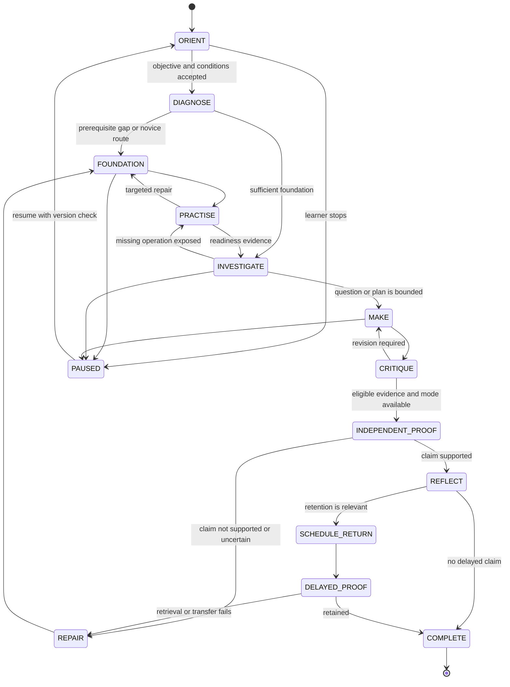
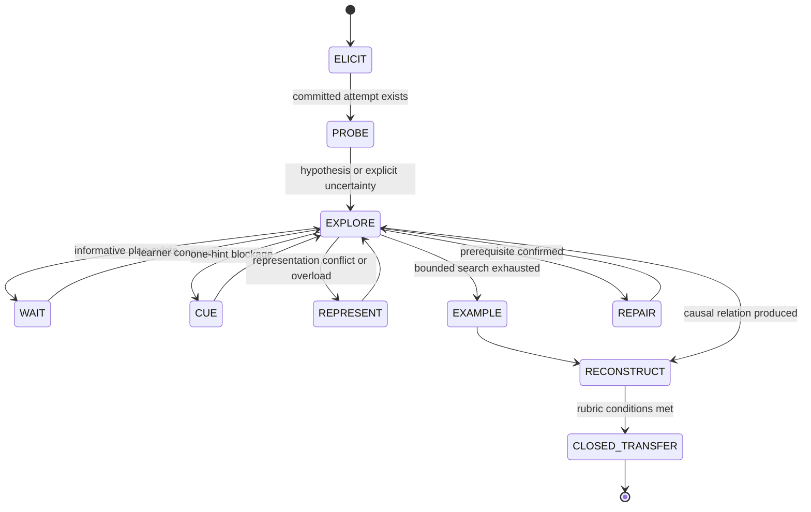
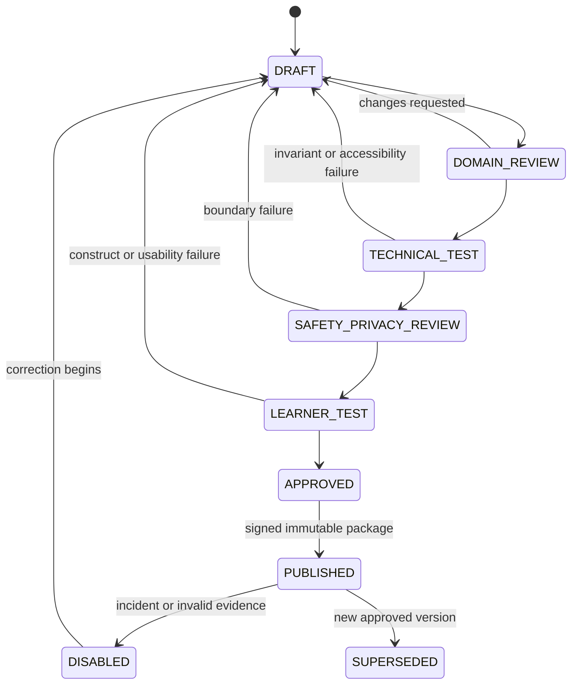

# FORGE Architecture

**Status:** C1 interactive foundation; G1 candidate only (partial implementation, no gate pass recorded, not production-validated)  
**Version:** 0.1  
**Date:** 22 July 2026  
**Product authority:** `../FORGE_PRODUCT_SPEC.md`

## 0. Architecture decision in one paragraph

FORGE begins as a **modular monolith with a typed event ledger**, not a mesh of microservices and not an autonomous multi-agent system. A deterministic learning runtime owns state, permissions, evidence conditions, answer access, consent, people contact, and external side effects. Versioned world packages supply domain-specific content, executable or inspectable models, validators, sources, transfer families, accessibility representations, and human review. Replaceable model providers operate only through bounded schemas and a policy gateway. PostgreSQL is the system of record, an append-only/correctable evidence ledger preserves provenance, object storage holds consented artifacts, a queue handles delayed proofs and offline evaluation, and every release can run through authored fallbacks without generative AI.

## 1. Architectural drivers

The architecture optimizes for:

1. **Learner agency:** work and evidence are exportable, explainable, correctable, and not reduced to a hidden score.
2. **Epistemic integrity:** deterministic worlds, identified sources, human review, and explicit uncertainty outrank model fluency.
3. **Developmental safety:** age, consent, guardian authority, people contact, memory, and source access are policy-enforced.
4. **Independent capability:** the runtime can close assistance and produce evidence whose conditions are auditable.
5. **Domain honesty:** each field supplies its own standards, representations, validators, and reviewers; a generic tutor prompt is not a domain architecture.
6. **Human complementarity:** teachers, guardians, peers, mentors, assessors, and community partners are accountable roles with purpose-limited views.
7. **Falsifiability:** content, policy, model, source, and evaluator versions are attached to outcomes and can be compared or replayed.
8. **Graceful degradation:** model, network, source, queue, or connector failure cannot corrupt evidence or trap a learner.
9. **Minimum sensitive data:** collection follows a current purpose, retention class, and explicit authority.
10. **Implementation economy:** logical boundaries are strong before operational deployment is split.

## 2. System boundary and non-goals

### 2.1 Inside the boundary

- learner and guardian identity/relationship state;
- consent, assent, permissions, sharing, export, and deletion workflows;
- entitlement and domain/capability graphs;
- W0–W5 world package publication and execution;
- learning journey, attempt, assistance, source, artifact, project, proof, and capability-evidence state;
- deterministic and rubric-based validators;
- governed AI/model routing and evaluation;
- source ingestion, eligibility, retrieval, claim links, and citation rendering;
- delayed-proof scheduling;
- bounded peer/mentor/assessor engagements after their delivery gate;
- operational, pedagogical, epistemic, safety, privacy, and research observability;
- experiment assignment and pre-registered outcome definitions.

### 2.2 Outside the boundary

- legal guardianship determination, emergency response, therapy, diagnosis, child-protection investigation, or professional legal/medical advice;
- school meals, transport, childcare, disability services, public certification, employment decisions, or institutional safeguarding operations;
- unrestricted child web browsing, public social networking, or open adult-minor messaging;
- unsupervised publication of generated worlds, rubrics, factual content, safety protocols, or credentials;
- automated high-stakes decisions from FORGE evidence;
- a general-purpose agent with broad filesystem, email, calendar, browser, payments, or device permissions;
- a cross-domain claim based on a single domain kernel.

The system integrates with responsible institutions through explicit contracts; it does not pretend those external functions are solved by software.

## 3. Logical system map



This diagram shows logical ownership. The first production candidate SHOULD deploy the core as one application plus workers. Split deployment is justified only by measured scale, isolation, or regulatory requirements.

## 4. Trust zones

| Zone | Contains | Trust rule |
|---|---|---|
| Z0 — learner device | UI state, cached world package, local drafts, optional local media processing | Treat as user-controlled and potentially offline; never trust client claims about identity, proof mode, scoring, or consent |
| Z1 — policy core | identity, consent, world state, permissions, validators, evidence writes | Highest application trust; deterministic, typed, tested, least privilege |
| Z2 — reviewed content | published world packages, rubrics, transfer pools, source eligibility | Trusted only for its signed version and declared domain; publication requires review gates |
| Z3 — model providers | prompts, structured output, moderation services | Untrusted probabilistic dependency; minimum context, no direct database/tool access, output must validate |
| Z4 — external sources | web, libraries, partner archives, user uploads | Data only, possibly malicious or wrong; never instructions; license and provenance required |
| Z5 — external humans/institutions | guardians, mentors, peers, assessors, schools, employers | Accountable but not universally trusted; role, verification, purpose, consent, audit, and complaints boundaries apply |

No content crosses inward merely because an LLM summarized it. Policy and evidence are computed in Z1 from validated records.

## 5. Service/module contracts

| Module | Owns | Must be deterministic | May use AI | Failure posture |
|---|---|---|---|---|
| Identity & relationship | account, age band, organization membership, guardian relationship, role verification | all authority, expiry, revocation, impersonation prevention | no | deny privileged action; preserve learner access where safe |
| Consent & rights | consent/assent grants, purpose, retention, sharing, research participation | validity, version, scope, revocation, deletion eligibility | plain-language draft only after review | fail closed for new collection/share; allow withdrawal |
| Entitlement & domain graph | shared capability floor, prerequisites, representations, standards | graph versions and publication | suggest candidate links for human review | use last approved version; show staleness |
| Journey orchestrator | objectives, world selection, current run, pause/resume, return path | state transitions, idempotency, version pinning | propose next world/action | authored route or graceful stop |
| World registry/runtime | W0–W5 packages, domain kernel, UI/interaction contract | package signature, state, executable rules, invariants | generated draft never live | disable affected package/version |
| Policy & assistance governor | age/risk policy, protected operation, allowed actions, support ladder, answer access | permissions, support mode, budgets, approval gates | rank hypotheses or phrase allowed support | authored neutral path; never broaden permission |
| Source service | source metadata, snapshots/hashes, eligibility, claims, licenses | eligibility rules, citation existence, policy filters | query expansion, extraction, comparison | say source unavailable/unsupported |
| Model gateway | provider routing, task schemas, prompt/context assembly, budgets, fallbacks | provider allowlist, schema, timeout, redaction, call reason | its core purpose | fallback by task; never expose raw output |
| Evaluation engine | exact/symbolic/rule/model/human evaluation, uncertainty | evaluator selection order, score provenance, proof conditions | low-consequence rubric signal | mark uncertain; clarify or human review |
| Capability projector | current evidence statement derived from ledger | projection logic, contradiction handling, expiry | readable summary from structured facts | retain last valid projection with stale marker |
| Project & artifact | milestones, contributions, versions, provenance, review | authorship ledger, permissions, retention, submission state | collaborative creation in declared mode | local draft and retry; do not misattribute |
| People & safeguarding | engagements, verification, matching, interaction controls, reports | all contact authorization, access window, blocking, escalation | relevance ranking after eligible pool | no match/contact; route human operations |
| Scheduler | retrieval/proof due windows, quiet hours, consented reminders | due logic, quiet hours, deduplication | no engagement optimization | queue retry; never threaten evidence/streak |
| Experiment service | protocol, arm, exclusions, outcomes, exposure | assignment, preregistration hash, analysis cohort | offline analysis only | exclude corrupted exposure; preserve audit |
| Rights operations | export, correction, appeal, deletion, access log | identity check, scope, tombstone/correction, completion proof | redact/summarize only under rules | manual case queue with deadline |
| Observability & incidents | telemetry schemas, alerts, incident state, model/content versions | alert routing, audit integrity, disable switches | clustering/triage only | conservative alerting and manual response |

## 6. World package contract

Every published world is an immutable signed package. A new version creates new evidence provenance; it never silently changes historical interpretation.

```json
{
  "world_id": "physics.force-motion.lab",
  "version": "1.3.0",
  "tier": "W1_GUIDED_MODEL_WORLD",
  "eligible_age_bands": ["10_12", "13_15", "16_17", "adult"],
  "domain_version": "physics-core@2.0",
  "capability_targets": ["cap.force.predict-velocity-change"],
  "prerequisite_capabilities": ["cap.motion.read-velocity-vector"],
  "protected_operations": ["predict_outcome", "explain_mechanism"],
  "assistance_modes": ["closed", "hints_only"],
  "state_machine_version": "guided-lab@1",
  "kernel": {
    "kind": "deterministic_module",
    "artifact_hash": "sha256:...",
    "invariants": ["inv.zero-net-force-preserves-velocity"]
  },
  "sources": ["src.newton-principia.translation-reviewed"],
  "validators": ["val.force-diagram@3", "rubric.force-motion@4"],
  "transfer_families": ["tf.force-motion.surface-change@2"],
  "accessibility_profiles": ["keyboard", "screen_reader", "reduced_motion", "tabular_graph"],
  "risk_class": "CHILD_STANDARD",
  "retention_profile": "STRUCTURED_EVIDENCE_ONLY",
  "review_signoffs": [
    {"role": "domain_reviewer", "review_id": "rev_..."},
    {"role": "accessibility_reviewer", "review_id": "rev_..."},
    {"role": "child_safety_reviewer", "review_id": "rev_..."}
  ],
  "published_at": "2026-07-22T00:00:00Z"
}
```

W2 adds source policies and a claim-evidence schema. W3 adds milestones, contribution types, AI modes, and external-standard rubrics. W4 adds verified-role and safeguarding requirements. W5 adds item contamination rules, proof-session constraints, assessor/moderator policy, and appeal paths.

## 7. Core domain model



### 7.1 Capability claim schema

```json
{
  "claim_id": "cc_...",
  "learner_id": "lrn_...",
  "capability_id": "cap.research.trace-authoritative-source",
  "standard_version": "research-foundations@1",
  "status": "CURRENT | DUE_REVIEW | CONTRADICTED | SUPERSEDED | ARCHIVED",
  "conditions": {
    "assistance_mode": "closed",
    "accommodations": ["screen_reader"],
    "contexts": ["public-health-claim"],
    "representations": ["written", "oral_defence"],
    "delay_days": 14
  },
  "supporting_evidence_ids": ["ev_1", "ev_2"],
  "contradicting_evidence_ids": [],
  "transfer_breadth": "TWO_SURFACE_FAMILIES",
  "confidence_band": "MODERATE",
  "uncertainty_reasons": ["small_item_pool"],
  "valid_from": "2026-07-22T00:00:00Z",
  "review_due_at": "2026-10-22T00:00:00Z",
  "projection_version": "capability-projector@1.0"
}
```

Confidence is a band tied to evidence quality, not a probability of intelligence. The projector cannot delete contradicting evidence; it can only add a correction or superseding projection.

### 7.2 Evidence event schema

```json
{
  "event_id": "ev_...",
  "event_type": "evidence.observed",
  "occurred_at": "2026-07-22T10:20:30Z",
  "recorded_at": "2026-07-22T10:20:31Z",
  "actor": {"kind": "learner", "id": "lrn_..."},
  "subject_learner_id": "lrn_...",
  "journey_id": "jrn_...",
  "world_run_id": "run_...",
  "capability_id": "cap.force.predict-velocity-change",
  "task": {
    "task_id": "task_...",
    "family_id": "tf_...",
    "content_version": "1.3.0",
    "contamination_exclusions_version": "2"
  },
  "conditions": {
    "mode": "closed",
    "assistance_since_commit": [],
    "accommodations": ["reduced_motion"],
    "delay_seconds": 691200
  },
  "response": {
    "structured": {"choice": "constant_velocity"},
    "text_ref": "encrypted:blob_...",
    "raw_media_retained": false
  },
  "evaluation": {
    "result": "MEETS | PARTIAL | DOES_NOT_MEET | UNCERTAIN",
    "validator_ids": ["val.force-motion@3"],
    "human_review_id": null,
    "rationale_codes": ["correct_prediction", "causal_relation_present"]
  },
  "provenance": {
    "world_version": "1.3.0",
    "policy_version": "child-standard@2",
    "model_calls": [],
    "source_versions": []
  },
  "correction_of": null,
  "integrity_hash": "sha256:..."
}
```

Raw learner language is referenced only when required for audit or learner ownership; structured evidence is the canonical analytic surface. A response hash without readable content cannot support a human-readable claim unless the retained structured facts are sufficient.

### 7.3 Assistance event schema

```json
{
  "event_id": "asst_...",
  "world_run_id": "run_...",
  "policy_state": "EXPLORE",
  "protected_operation": "explain_mechanism",
  "support_type": "ATTENTION_CUE",
  "source": "AUTHORED | MODEL_PHRASED | HUMAN",
  "target_operation_overlap": 0.25,
  "timing": "AFTER_MEANINGFUL_ATTEMPT",
  "accessibility_only": false,
  "policy_decision": "ALLOW",
  "reason_codes": ["learner_requested", "one_hint_blockage"],
  "content_version_or_hash": "hint.force-motion.12@2",
  "model_call_id": "mc_...",
  "later_transfer_evidence_id": "ev_..."
}
```

Assistance weights are research instrumentation. They MUST NOT be displayed as moral rankings.

### 7.4 Consent/authority schema

```json
{
  "grant_id": "cg_...",
  "subject_learner_id": "lrn_...",
  "grantor": {"kind": "guardian", "id": "usr_...", "relationship_id": "rel_..."},
  "purpose": "MENTOR_INTERACTION",
  "scopes": ["share:evidence_summary", "schedule:verified_mentor"],
  "excluded_fields": ["raw_chat", "private_notebook", "emotion_inference"],
  "policy_version": "consent@3",
  "learner_assent": {"required": true, "state": "GRANTED"},
  "valid_from": "2026-07-22T00:00:00Z",
  "expires_at": "2026-08-22T00:00:00Z",
  "revoked_at": null
}
```

Guardian authority is relation- and purpose-specific. It is never inferred from possession of the learner's password.

### 7.5 Source and claim-link schemas

```json
{
  "source_id": "src_...",
  "canonical_origin": "https://publisher.example/report",
  "title": "Report title",
  "creator_or_publisher": "Publisher",
  "published_at": "2026-01-01",
  "retrieved_at": "2026-07-22T00:00:00Z",
  "jurisdiction": ["IN"],
  "population": "declared population",
  "source_type": "PRIMARY | AUTHORITATIVE_SYNTHESIS | PEER_REVIEWED | OTHER",
  "license": "license-or-permission",
  "snapshot_hash": "sha256:...",
  "eligibility": ["adult_inquiry", "minor_curated_retrieval"],
  "quality_notes": ["observational_not_causal"],
  "status": "APPROVED | LIMITED | RETIRED | DISPUTED"
}
```

```json
{
  "link_id": "cel_...",
  "claim_id": "clm_...",
  "source_id": "src_...",
  "locator": {"kind": "section", "value": "6. Science of Learning"},
  "relation": "SUPPORTS | CONTRADICTS | QUALIFIES | CONTEXTUALIZES | INSUFFICIENT",
  "attribution_kind": "PARAPHRASE | QUOTATION | DATA_EXTRACTION | SYSTEM_INFERENCE",
  "confidence_band": "HIGH | MODERATE | LOW",
  "reviewed_by": "review-or-policy-id"
}
```

### 7.6 Project contribution schema

```json
{
  "contribution_id": "ctr_...",
  "artifact_version_id": "av_...",
  "actor_kind": "LEARNER | PEER | MENTOR | AI | REUSED_MATERIAL",
  "actor_or_tool_id": "lrn_or_model_or_source_...",
  "operation": "drafted | edited | generated | critiqued | tested | approved",
  "declared_mode": "collaborative_ai",
  "input_refs": ["src_...", "av_previous_..."],
  "output_span_or_component": "component reference",
  "verification_refs": ["test_...", "feedback_..."],
  "timestamp": "2026-07-22T00:00:00Z"
}
```

## 8. Event envelope and ledger semantics

All material transitions emit a common envelope:

```json
{
  "event_id": "uuid",
  "event_type": "namespace.verb",
  "schema_version": 1,
  "aggregate": {"type": "world_run", "id": "run_...", "version": 14},
  "actor": {"type": "learner", "id": "lrn_..."},
  "authority": {"policy_version": "...", "consent_grant_ids": []},
  "occurred_at": "ISO-8601",
  "recorded_at": "ISO-8601",
  "correlation_id": "journey-or-request-id",
  "causation_id": "prior-event-id",
  "idempotency_key": "client-generated-key",
  "payload": {},
  "integrity_hash": "sha256"
}
```

Rules:

- events are append-only; mistakes use `*.corrected`, `*.superseded`, or tombstone events;
- material current-state writes and their outbox event commit atomically;
- event consumers are idempotent and track schema versions;
- offline client events retain occurrence and receipt times and cannot backdate proof authority;
- proof sessions require a server-issued nonce and package hash; offline proof is explicitly labeled honour-based unless a validated secure mechanism exists;
- research exports are derived from frozen event definitions, never mutable dashboard queries alone;
- safety records may have restricted visibility and legal retention distinct from the learning ledger.

## 9. State machines

### 9.1 General learning run



Every transition declares allowed assistance, source access, persistence, and evidence strength. `PAUSED` is never penalized. A world-specific state machine may be smaller but cannot bypass consent, protected-operation, or proof rules.

### 9.2 W1 support policy



The model can recommend `CUE`, `REPRESENT`, `EXAMPLE`, or `REPAIR`; only policy can transition.

### 9.3 World publication



No generated content path skips review.

### 9.4 Human engagement

```mermaid
sequenceDiagram
    participant L as Learner
    participant G as Guardian/authority
    participant P as People service
    participant H as Verified human
    participant S as Safeguarding ops

    L->>P: Request critique or collaboration
    P->>P: Check tier, age, purpose, eligible role
    P->>G: Request scoped authority when required
    G-->>P: Grant/deny with expiry
    P->>L: Show exactly what will be shared
    L-->>P: Assent/decline
    P->>H: Offer bounded engagement packet
    H-->>P: Accept role and conduct terms
    P->>L: Open scheduled, auditable channel
    H->>L: Provide critique within scope
    L->>P: Close, rate usefulness, or report
    alt report or boundary signal
        P->>S: Create restricted incident case
        P->>P: Block further contact pending review
    else ordinary completion
        P->>P: Retain minimal feedback/provenance; expire access
    end
```

## 10. Tool and side-effect registry

FORGE tools are capabilities behind the policy gateway, not direct model functions.

| Tool family | Examples | Side-effect class | Approval/authority |
|---|---|---|---|
| Pure/local compute | simulation step, unit check, graph render, rubric rule, package validation | S0 — no external side effect | allowed by current world |
| Internal read | retrieve approved source, read capability evidence, load world package | S0/S1 — privacy-scoped read | role and purpose; field-level filtering |
| External read | approved web/source fetch, partner catalogue read | S1 — network read, untrusted content | age/source policy; query minimization; no instruction execution |
| Learner-state write | save attempt, question, draft, correction, preference | S2 — reversible internal write | authenticated learner/session; event ledger |
| Evidence write | append evaluation, capability claim, assessor feedback | S2H — consequential internal write | validator/human provenance; correction/appeal path |
| Artifact/media processing | upload, transcribe, analyze, retain | S2P — sensitive data write | explicit purpose and retention grant; local/ephemeral default |
| Notification | proof reminder, human-session reminder | S3 — external communication | explicit channel consent, quiet hours, rate limit |
| Human matching/contact | offer mentor, open peer room, send evidence packet | S3H — interpersonal external effect | verified role, guardian/learner authority, safeguarding controls |
| Public/institutional share | publish artifact, send evidence to school/employer | S4 — high-consequence disclosure | preview plus explicit per-share authorization; recipient and expiry |
| Payments/contractual action | purchase, paid mentor booking, credential fee | S4 — financial/legal | adult or guardian transaction flow; never model-triggered |
| Safety escalation | create restricted report, notify designated operations | S4S — protected safety effect | hard-coded policy and trained human operations |
| Prohibited model tool | direct DB mutation, unrestricted messaging, hidden surveillance, public post, credential issuance | SX — prohibited | unavailable to models and learner-world code |

S3/S4 actions require a previewable intent, idempotency key, durable receipt, cancellation where possible, and no blind retry. External text cannot request or authorize a side effect.

## 11. Model orchestration

### 11.1 Pattern selection

- W0 uses deterministic prompt chaining and authored feedback.
- W1 uses a routed workflow: classify evidence → propose bounded next move → policy decision → phrase allowed support.
- W2 uses plan-and-execute with a learner-visible research plan, source checkpoints, and a fixed stop/synthesis condition.
- W3 uses milestone workflows and evaluator-optimizer cycles where an explicit rubric exists.
- W4 is human workflow orchestration; AI may prepare or summarize but never impersonate or independently contact.
- W5 excludes generative help for protected operations and uses validators/humans after submission.

Open-ended ReAct is permitted only for adult or appropriately bounded upper-secondary research sandboxes with an allowlisted tool registry, step/cost/time budget, source-only external reads, learner-visible plan, and no external writes. Multi-agent execution is not a default learner feature; it requires evidence that a simpler single-agent/workflow design cannot meet quality or latency needs and must expose role, source, and coordination costs.

### 11.2 Internal model capability interfaces

| Interface | Input | Output | Required fallback |
|---|---|---|---|
| `classify_evidence` | structured attempt plus minimal excerpt | enum evidence features and cited spans | rule/authored feature extraction |
| `rank_hypotheses` | eligible hypotheses and event refs | ranked candidates, evidence for/against, uncertainty | neutral probe or fixed route |
| `phrase_support` | approved support ID, age/language/access profile | short phrasing only | authored text |
| `evaluate_explanation` | rubric, response, validator signals | criterion results, spans, uncertainty | uncertain + clarification/human sample |
| `coach_question` | learner question and allowed transformation types | one labeled transformation and rationale | authored prompt |
| `research_plan` | bounded question, age/risk policy | steps, source needs, stop condition | authored investigation template |
| `extract_source_claims` | source snapshot | claims with locators, not conclusions | manual/structured extraction |
| `compare_sources` | claim links | agreement, conflict, limits with citations | display sources separately |
| `interpret_artifact` | minimized/consented artifact | structured observations, uncertainty | manual review or no score |
| `summarize_evidence` | structured ledger projection | learner-readable statement | deterministic template |

Every call records task, prompt-template version, model/provider/version, allowed outputs, input event/source IDs, consent/purpose, latency, tokens/cost, response hash, validation, fallback, and later outcome when relevant.

### 11.3 Context budget plan

Models receive a composed evidence packet, never the full learner history by default:

1. reserve output and safety margin first;
2. include the current world contract, protected operation, allowed action set, and exact schema;
3. include only the target capability subgraph and current state;
4. include structured recent attempts and selected evidence references;
5. include source excerpts with immutable IDs/locators, not entire corpora;
6. include learner preferences only when relevant and consented;
7. exclude guardian raw notes, unrelated domains, raw historical chat, safety cases, and identity fields;
8. compress older state into a structured projection with links to audit records;
9. log token allocation by component and reject context that exceeds policy rather than truncating rights or schema instructions;
10. sanitize external content and delimit it as untrusted data.

Suggested initial budget shares are 15% policy/schema, 20% current task/world, 25% learner evidence, 25% vetted source excerpts, 10% output reserve, and 5% safety margin. These are starting constraints to measure, not fixed truths.

## 12. Source architecture

### 12.1 Ingestion

```text
Discover/submit source
→ fetch under allowlisted protocol and malware limits
→ capture canonical metadata, license, date, jurisdiction, population
→ immutable snapshot/hash where permitted
→ extract claims and locators
→ human/automated quality review
→ assign age/domain/claim eligibility
→ publish source record
→ monitor correction, retraction, expiry, or material update
```

Source quality is claim-relative. A learner reflection can be primary evidence of their experience but not of population efficacy. A company page can document product behaviour but not independently validate learning impact. A simulation can establish consequences only within its declared model and assumptions.

### 12.2 Retrieval

The retrieval service runs two distinct routes:

- **Pedagogical retrieval:** Which approved explanation, representation, example, or source excerpt fits the learner's current world state?
- **Epistemic retrieval:** Which source records can support, contradict, qualify, or contextualize this external factual claim?

The routes may share storage but cannot share ranking objectives. Readability cannot silently outrank authority for epistemic claims, and authority cannot justify giving away a protected learning operation.

## 13. Identity, privacy, and tenancy

- Use pseudonymous learner IDs in the learning plane; keep direct account identifiers in a separately encrypted identity plane.
- Represent guardian and organization authority as expiring relationships with scopes, not a boolean on the learner row.
- Apply row- and field-level authorization in application policy and database controls where supported.
- Separate individual, family, organization, and research tenancy; an institution cannot automatically see personal journeys.
- Encrypt in transit and at rest; use per-environment and, where feasible, per-tenant keys for sensitive classes.
- Never put raw learner explanations, source queries, or artifact contents in ordinary application logs.
- Use short-lived signed URLs and content scanning for artifacts; strip image metadata; prefer on-device/ephemeral voice and vision.
- Maintain data-class retention jobs, deletion verification, legal-hold exceptions, and a learner-readable access log.
- Research datasets require separate protocol/consent and irreversibility assessment; pseudonymization is not anonymity.
- Backups inherit deletion and retention plans; restoration must replay post-backup deletions before service use.

## 14. Reliability and degradation

Initial targets are engineering hypotheses until measured in production.

| Interaction | Initial p95 target | Fallback |
|---|---:|---|
| local deterministic world action | <50 ms | always local/cacheable |
| policy/state transition | <200 ms | last signed policy package; deny broadened action |
| approved-source retrieval | <1.2 s | cached results or explicit unavailable state |
| small-model classification | <1.0 s | authored/rule route |
| model-phrased support | <1.8 s | authored wording at same support level |
| frontier bounded evaluation | <4.0 s synchronous | continue with uncertain state; evaluate async |
| world package load | <1.0 s cached | last verified package or offline task |
| durable event acknowledgment | <500 ms online | encrypted local outbox with conflict handling |
| consent/share check | <300 ms | deny share/contact, preserve local work |

The learner must see the difference between pedagogical wait and loading. A model outage cannot convert a Closed task into assisted evidence, and an offline run cannot upgrade itself to independently verified proof.

## 15. Observability

FORGE monitors six planes separately so one green dashboard cannot hide another failure.

### 15.1 Technical

- request and world-action latency, availability, crash-free runs, offline sync conflicts;
- database/outbox/queue lag, event loss/duplication, artifact failures;
- model call latency, schema failure, refusal, fallback, tokens/cost, provider/model version;
- source fetch freshness, broken locators, citation-render failure;
- deletion/export/consent operation completion and overdue cases.

### 15.2 Pedagogical

- state-transition distribution, prerequisite repair return rate, help escalation, bypass attempts;
- immediate and delayed transfer, retention, representation breadth, assistance fading;
- fixed-route versus model-mediated policy outcomes;
- productive activity versus AI-output exposure using validated definitions;
- project milestone, revision, individual defence, and external-review completion.

### 15.3 Epistemic

- unsupported factual claims, citation entailment, source quality/recency, contested-claim handling;
- deterministic kernel invariant failures and scientific/content incidents;
- generated/retrieved/authored boundary violations;
- evaluation disagreement, false positive/negative rates, correction and appeal outcomes.

### 15.4 Child safety and relationships

- prohibited contact attempts, verification failures, reports, blocking response time, repeat incidents;
- unsafe mission suggestions, crisis/safeguarding routing, false-block appeals;
- emotional-dependency or secrecy language, notification/quiet-hour violations;
- guardian/learner permission mismatch and covert-visibility attempts.

### 15.5 Privacy and equity

- data collected by class versus declared purpose, raw-media retention, access anomalies;
- subgroup access, attrition, diagnostic/evaluator error, assistance, burden, and outcome gaps;
- device, bandwidth, language, and accessibility-mode failures;
- export, correction, consent withdrawal, and deletion completion.

### 15.6 Human operations and research

- mentor/assessor supply, match quality, preparation time, cancellations, complaints, compensation, review burden;
- protocol exposure, assignment integrity, task contamination, missing delayed outcomes, attrition by arm;
- content authoring/review time and defect escape rate;
- teacher/guardian workload displaced or created.

Every alert has an owner, severity, runbook, disable switch, and evidence-preservation rule. Model traces are sampled, redacted, purpose-limited, and time-bounded.

### 15.7 Trace shape

One trace links:

```text
request → authority check → world/state transition → tool/model/source calls
→ validator decisions → event/outbox commit → capability projection
→ notification/share (if any) → later transfer outcome
```

Replay uses signed world/policy/source snapshots and recorded model outputs or fixtures. FORGE must be testable without calling live models or people.

## 16. Evaluation architecture

Evaluation is layered from cheapest and most objective to most interpretive:

1. exact state/numeric/deterministic invariant;
2. symbolic, unit, syntax, or executable test;
3. authored discriminator;
4. transparent rule-based rubric;
5. calibrated small-model rubric with cited evidence spans;
6. frontier-model rubric with uncertainty and second signal;
7. qualified human review for important ambiguity, research labels, safety, or appeal;
8. independent external assessment for efficacy or high-stakes portability claims.

No model score alone creates a high-confidence capability claim. Open-language evaluation requires at least two signals, demographic/language/accessibility calibration, human double-scoring samples, and an ordinary-language challenge path. Disagreement becomes uncertainty or clarification, not automatic failure.

The complete eval suite includes:

- domain-kernel invariants and cross-representation equivalence;
- state/permission/property tests, including forbidden transitions;
- schema, prompt-injection, answer-leakage, citation, and fallback fixtures;
- source-citation entailment and provenance evaluation;
- accessibility and low-bandwidth task equivalence;
- child safety, emotional dependency, people-contact, and privacy red teams;
- evaluator agreement and subgroup error analysis;
- fixed-script, authored baseline, ordinary chatbot, and human-supported comparisons;
- delayed unseen transfer and retention with contamination controls;
- authoring economics, human workload, cost, and operational failure rates.

Thresholds and permitted claims are specified in `FORGE_DELIVERY_GATES.md`.

## 17. Failure modes and controls

| Failure | Detection | Control | Residual truth |
|---|---|---|---|
| Fluent AI performs the learning operation | support/action audit; leakage fixtures; large assisted–unaided gap | answer data withheld by state; protected-operation schema; closed transfer | learners can use another tool outside FORGE; product must test realistic bypass |
| Wrong world or source teaches falsehood | invariant tests; source review; reports; outcome anomalies | signed versions, disable switch, correction events, exposure query | review cannot eliminate all error; provenance and correction remain essential |
| Learner model becomes identity label | schema review; UI/content audit | evidence-only objects, expiry, contradiction, no personality fields | humans can still overinterpret evidence; sharing language must remain bounded |
| Personalization narrows entitlement | coverage audit by learner and subgroup | entitlement service, missing-opportunity alerts, external sampling | local curricula and laws differ; no one universal sequence is assumed |
| Guardian control becomes surveillance | access-log and permission audits; learner complaints | excluded fields, learner-visible actions, purpose/expiry, no impersonation | law may grant broader authority; product documents jurisdictional limits |
| Homeschool support legitimizes poor provision | missing rights-and-quality evidence | five-part test, external adviser/benchmark requirements, qualified review | FORGE cannot inspect all offline care or safety and must not certify alone |
| People network creates abuse or boundary harm | verification, reports, interaction metadata, audits | no open DMs, scoped windows, guardian/assent, block/escalate, trained operations | no matching system makes contact risk zero; launch waits for operational capacity |
| Source RAG amplifies prompt injection | tool traces; injection suite | content-as-data isolation, allowlisted tools, schemas, no source-triggered writes | sources can remain misleading; corroboration and human judgment matter |
| Projects become AI or parent theatre | contribution ledger, viva/transfer mismatch | process provenance, individual checks, oral/practical defence | provenance can be incomplete; evidence states uncertainty |
| Proof items leak or overfit | exposure tracking, item performance drift | family exclusions, item rotation, external tasks, preregistered measures | company-owned assessment can still bias evidence; independent replication needed |
| Accessibility is scored as help | assistance audits, subgroup outcomes | access support field separate from protected-operation overlap | some accommodations alter constructs; statement must disclose conditions |
| Queue/retry duplicates communications | duplicate receipts | idempotency keys, no blind retry, cancellation and delivery ledger | external providers may deliver ambiguously; show status rather than assume |
| Provider update changes pedagogy | model-version outcome monitoring | pin versions, held-out eval, canary, fallback, provider abstraction | exact reproducibility of generative models is limited |
| Engagement incentives capture roadmap | KPI review | constitutional anti-metrics, learning/safety scorecard, independent research gate | commercial pressure remains organizational, not only technical |
| Modular monolith becomes boundaryless | dependency and ownership tests | module APIs, schema ownership, architecture tests, outbox | premature services are also harmful; split only with evidence |

## 18. Security and abuse controls

- Threat-model identity takeover, guardian impersonation, organization overreach, prompt injection, source poisoning, artifact malware, item theft, evidence forgery, mentor grooming, public sharing, and insider access.
- Use phishing-resistant MFA for guardians, staff, authors, reviewers, mentors, and assessors; age-appropriate recovery for learners.
- Separate staff support from unrestricted data access; use just-in-time audited elevation.
- Sign published world/policy packages and evidence exports; rotate keys and preserve verification metadata.
- Rate-limit source/model/tool calls by learner, world, organization, and risk class.
- Run artifact scanning and type validation; never execute learner uploads in the core trust zone.
- Sandbox executable coding/project work with network, secret, filesystem, time, and cost limits.
- Maintain test-only synthetic child accounts; production learner data never enters developer prompts or eval fixtures by default.
- Perform third-party data-flow and model-provider reviews before child data crosses a boundary.
- Establish incident severity for scientific misinformation, privacy exposure, unsafe instruction, people-contact harm, evidence corruption, and rights-operation failure.

## 19. Deployment shape

### 19.1 First credible deployment

- web/PWA clients with signed offline-capable world packages;
- one TypeScript modular application for edge and core modules;
- one isolated worker deployment for queues, source processing, evaluation, export/deletion, and scheduling;
- managed PostgreSQL with point-in-time recovery, row-level controls where useful, and transactional outbox;
- encrypted object storage with lifecycle rules;
- one model gateway supporting authored fallbacks and provider abstraction;
- OpenTelemetry-compatible traces/metrics/logs with a separate restricted audit store;
- infrastructure and policy separated by development, test, research, and production environments.

### 19.2 Split triggers

Extract a service only when at least one is true:

- child-data or research isolation needs a distinct security boundary;
- model/source workloads need independent scaling or egress controls;
- people/safeguarding operations require a separately audited system;
- queue or world-runtime load materially harms interactive SLOs;
- organization tenancy or regional residency requires deployment separation;
- module ownership and release cadence demonstrably conflict.

Microservices are not evidence of maturity. Auditable boundaries, replay, deletion, and incident response are.

## 20. First implementation issues

The first backlog is deliberately architectural, not a feature list.

1. Freeze the canonical names, IDs, normative event vocabulary, and authority hierarchy across the four FORGE documents.
2. Implement/test the common event envelope, transactional outbox, idempotency, correction, and version semantics.
3. Implement learner, guardian relationship, role, consent/assent, expiry, revocation, impersonation prevention, and access-log contracts.
4. Define data classes, retention schedules, export/delete/correction workflows, backup deletion, and research separation.
5. Define the world-package schema, signing, immutable publication, disable, rollback, and supersession paths.
6. Build the smallest W0 and W1 generic state machines with explicit protected operations and assistance modes.
7. Port one historical mechanics kernel only as a non-governing test fixture after checking it against the new package contract.
8. Build exact and rule validators before adding a model call.
9. Implement the policy gateway, support taxonomy, answer-access separation, and authored neutral fallback.
10. Implement model task schemas, context assembler, redaction, call ledger, budgets, provider/version pinning, and fixture replay.
11. Implement source records, immutable locators, eligibility, content-as-data isolation, claim links, citation rendering, and retraction/update state.
12. Implement evidence projection, contradiction, uncertainty, recency, and learner challenge without a universal mastery percentage.
13. Prove full keyboard/screen-reader/reduced-motion/non-drag equivalence for the first world before catalog growth.
14. Instrument technical, pedagogical, epistemic, safety, privacy, equity, and workload planes with owners and disable controls.
15. Build synthetic/adversarial fixtures for prompt injection, answer leakage, unsupported citations, consent bypass, guardian overreach, and event replay.
16. Add delayed-proof scheduling with quiet hours, explicit consent, no streak semantics, and duplicate-safe delivery.
17. Validate transfer-item families and contamination exclusions before using them in product claims.
18. Do not implement W4 contact until verification, safeguarding operations, complaints, blocking, compensation, and incident gates pass.
19. Do not issue portable credentials; first export plain evidence packets with explicit non-credential language.
20. Run the delivery gates in order and remove model complexity when authored policy performs as well.

## 21. Architecture acceptance questions

Before approving an implementation slice, reviewers must be able to answer:

- What cognitive operation is protected, and which component enforces that boundary?
- Which consequence comes from code, source, physical evidence, model, or human judgment?
- What exact authority permits each read, write, share, contact, or retained data field?
- Can the task complete honestly with the model and network unavailable?
- Can an external source or model output cause a side effect without deterministic policy and human authority?
- What versions make the run replayable, and what cannot be reproduced exactly?
- How can the learner inspect, correct, export, and delete the relevant state?
- What would falsify the pedagogical choice, and is the comparison strong enough?
- What happens to a child if the guardian, institution, model, source, or mentor is wrong?
- What claim is permitted at the current gate—and what tempting claim remains forbidden?
