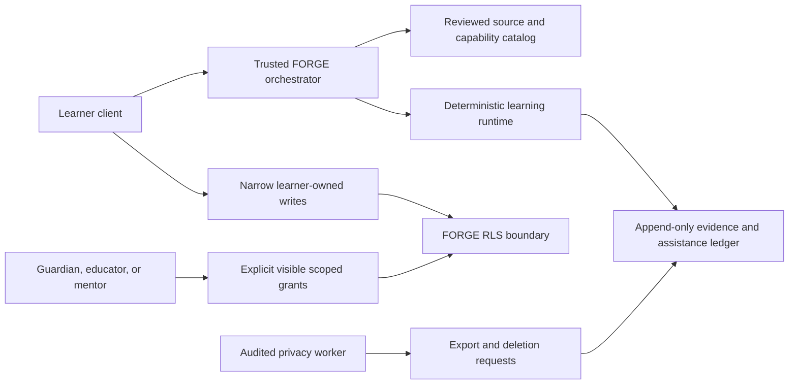

# FORGE Database Architecture

Status: production-oriented foundation, not yet connected to a live Supabase project.

The migration at `supabase/migrations/202607220001_forge_learning_os.sql` gives FORGE a durable data boundary for learner-owned plans, reviewed curriculum, governed assistance, and proof-after-help evidence. It is deliberately not a chat transcript store, a surveillance model, or a single “mastery score” database.

## System boundary



The database has two schemas:

- `forge` contains application-facing tables. Every table has RLS enabled and forced.
- `forge_private` contains non-exposed integrity and RLS helpers with an empty `search_path`.

The Supabase Auth `auth.users.id` is the account identity. FORGE does not duplicate email, password, or identity-verification data.

## Data layers

| Layer | Tables | Authority |
|---|---|---|
| Identity and age-banded settings | `profiles`, `learner_profiles`, `profile_roles` | Learner owns their profile; role verification is server-authored |
| Relationships and consent | `guardian_relationships`, `consent_records` | Relationship does not grant access; consent is an append-only decision history |
| Grounded curriculum | `source_packages`, `source_items`, `source_claims`, `capability_definitions`, `capability_contracts`, `learning_world_releases` | Only reviewed, published versions are readable; trusted authoring workflow writes |
| Learner program | `learning_programs`, `program_capability_assignments`, `learning_goals` | Learner-owned; explicitly granted adults may manage only authorized programs |
| Capability projection | `learner_capability_states` | Rebuildable server projection, never the evidence source of truth |
| Adult access | `learner_access_grants`, `access_grant_revocations` | Learner-visible, explicit, scoped, time-bounded, and append-only |
| Runtime | `learning_session_runs`, `learner_artifacts`, `policy_decisions` | Trusted orchestrator creates canonical runs and policy facts; intentional artifacts have narrow client writes |
| Evidence | `assistance_events`, `evidence_events`, `proof_schedules`, `human_reviews` | Canonical events are server-authored and append-only; proof schedules remain separate from demonstrated evidence |
| Inquiry | `question_nodes` | Learner-owned question graph; mentors require an explicit scope |
| Privacy operations | `data_subject_requests` | Metadata for audited export, correction, restriction, and deletion workflows |

## Identity and IDs

- Account-facing identity remains a Supabase Auth UUID because it must join `auth.uid()` safely.
- Internal FORGE records use `bigint generated always as identity`. This is SQL-standard, compact, and insertion-ordered.
- Stable curriculum identity comes from versioned keys such as `capability_key`, `package_key`, `world_key`, and integer versions. Runtime evidence points to exact immutable versions rather than “latest.”
- Idempotency keys on session and evidence writes prevent retry duplication. They must be opaque random values generated by the trusted orchestrator, not learner identifiers.

## Learner ownership and adult access

The default rule is simple: `learner_user_id = auth.uid()`.

An adult receives access only when all of these conditions are true:

1. There is an explicit row in `learner_access_grants` for that learner, grantee, and one allowlisted scope.
2. The grant has started and has not expired.
3. No matching row exists in `access_grant_revocations`.
4. A program-specific grant is used only for that program. A global grant may span programs.
5. If the grantee role is `guardian`, an active verified `guardian_relationships` row must also exist.

A guardian relationship alone never authorizes a read. Educator and mentor labels alone never authorize a read. A learner and the grantee can both see the grant and its revocation. Only the learner may directly issue a grant; production onboarding should still route issuance through a server flow that confirms intent and shows the exact scope in plain language.

Scopes are deliberately granular:

- profile and consent: `profile:read`, `consent:manage`
- programs and goals: `program:read`, `program:manage`, `goals:read`, `goals:manage`
- learning record: `capability:read`, `session:read`, `evidence:read`, `assistance:read`
- scheduled proof: `proof:read`, `proof:manage`
- inquiry and artifacts: `questions:read`, `questions:mentor`, `artifacts:read`, `artifacts:contribute`
- review and privacy: `reviews:create`, `privacy:assist`

`forge_private.has_session_scope` carries a session's program into evidence, assistance, artifact, policy, and question access. This prevents a program-specific grant from silently widening to the learner's entire record.

## Capability contracts instead of mastery scores

A capability is a bounded claim under specified conditions. A versioned `capability_contract` records:

- the claim and meaningful action;
- required representations;
- allowed assistance policy;
- transfer specification;
- evidence requirements;
- deterministic or governed validator contract;
- the exact reviewed source package.

`learner_capability_states` separates concept availability, procedural execution, representation coordination, misconception competition, transfer breadth, retrieval strength, epistemic stance, and assistance profile. This table is a cache that can be rebuilt from evidence. It must never be presented as a permanent trait, diagnosis, or universal mastery percentage.

## Source grounding and release safety

Factual curriculum is published through a reviewed chain:

`source_package -> source_item -> source_claim -> capability_contract -> learning_world_release`

Each package is versioned and content-addressed. Source items preserve publisher, canonical URL or controlled object path, retrieval date, license, and citation metadata. Claims are marked `supported`, `qualified`, `contested`, or `background_only`. Database triggers freeze a package, its items, and its claims after publication. Published capability contracts and world releases are also immutable; they may only move to a terminal withdrawn, disabled, or retired state. Corrections require a new version.

Only rows in a published state are selectable by the authenticated application role. Client roles cannot author or publish source packages, contracts, or world releases. A release records deterministic bundle, validator, and fixture versions so a historical evidence event can be replayed against the exact learning world that produced it.

This schema stores source metadata and controlled object references. It does not grant the right to ingest or redistribute copyrighted material; the content pipeline must enforce license and retention rules before publication.

## Canonical runtime writes

Authenticated clients cannot insert or mutate these canonical tables:

- `learning_session_runs`
- `learner_capability_states`
- `policy_decisions`
- `assistance_events`
- `evidence_events`
- `proof_schedules`

The trusted orchestrator writes them only after deterministic validation and policy checks. RLS is still present for read isolation, but the service-role key must never reach a browser, mobile bundle, log, or public environment variable.

Evidence integrity is reinforced in three ways:

1. Composite foreign keys bind session, learner, capability contract, artifacts, proof schedules, and reviews to the same owner.
2. Every foreign key has a matching leading-column index.
3. Triggers reject updates and ordinary deletes from evidence, assistance, policy, consent, and access-grant ledgers.

The evidence row scopes its claim, names the representation and context, records assistance state, distinguishes an independent attempt, and lists what remains untested. Database checks require independent, closed-transfer, and delayed-proof events to have no instructional assistance. A proof schedule can close only against an unaided delayed-proof event for the same learner and capability contract. A successful transfer is not stored as “mastery.” Submitted human reviews are frozen; a correction requires a new review and an explicit supersession link.

## Artifacts and sensitive media

`learner_artifacts` represents intentional work such as a prediction, explanation, reconstruction, transfer response, reality observation, project, or question note. It is not a general message table.

Text may be stored when it is the learner's chosen artifact. Object storage paths may point to drawings or files. If an artifact is marked as sensitive media, a trigger requires the learner's current effective `sensitive_artifact_capture` consent decision to be the referenced granted decision. A later denial or withdrawal makes the older grant unusable for new uploads.

Object storage bucket policies, malware scanning, media redaction, and signed URL lifetime are not in this migration and must ship before media upload is enabled.

## Data deliberately absent

The schema has no canonical fields for:

- raw chat transcripts or private conversation history;
- personality profiles or learning-style diagnoses;
- emotional-state inference;
- faces, voiceprints, precise location, or household telemetry;
- advertising identifiers or engagement targeting;
- unbounded model prompts and completions.

Model and policy actions are stored as typed decisions, authored content keys, versions, evidence spans or digests, and bounded outputs. Raw provider payloads belong in short-lived operational traces with separate access and retention, not the learner record.

## Export and deletion workflow

`data_subject_requests` records the request type, data classes, jurisdiction, state transitions, due date, export object, manifest checksum, deletion boundary, and failure reason. `subject_reference_digest` should be a server-generated keyed digest, not a plain hash of a guessable identifier. Clients do not insert these rows directly; an authenticated request endpoint creates them after binding the requester and subject.

The migration does not expose a destructive client RPC. A separately reviewed privacy worker should:

1. authenticate the requester and verify legal authority;
2. freeze the request scope and mark it `processing` in a short transaction;
3. create an export and checksum manifest before deletion when policy requires it;
4. begin a deletion transaction and set `forge.erasure_request_id` to the matching request ID;
5. explicitly delete append-only learner events first, allowing their triggers to verify the processing request;
6. delete or irreversibly de-identify dependent learner data in a documented order;
7. remove the Auth/profile link only after dependent records are gone, allowing request user FKs to become null while retaining the keyed digest and deletion boundary;
8. store the completion result without learner content.

The worker must use the service role in a trusted server context and set the service-role JWT claim or connect as an approved database operator. It must lock the request row, be idempotent, and fail closed if any expected data class was not processed.

## Privilege model

- `anon` has no access to the `forge` or `forge_private` schemas.
- `authenticated` may select application tables through RLS and has narrowly enumerated insert/update rights for learner-authored profile, plan, artifact, question, review, grant, revocation, and consent rows. Privacy requests and canonical runtime records go through trusted server endpoints.
- `authenticated` has no `DELETE` privilege on FORGE tables.
- `service_role` is the trusted orchestration and maintenance role. It bypasses RLS in Supabase, so application code must perform authentication, authorization, schema validation, and idempotency before every canonical write.
- `forge_private` is not an API schema. Do not add it to Supabase exposed schemas.

If direct client reads from the custom `forge` schema are desired, add only `forge` to the project's exposed schemas and continue using RLS. A server-only API may leave it unexposed.

## Validation

Run the migration and contract test against a disposable local Supabase stack before any remote deployment:

```bash
supabase db reset
psql "$LOCAL_DATABASE_URL" -v ON_ERROR_STOP=1 \
  -f supabase/tests/forge_schema_contract.sql
```

The contract test verifies:

- all required tables exist;
- RLS is enabled and forced everywhere;
- every table has a primary key and all internal IDs are ordered `bigint identity` values;
- every foreign key has a matching index;
- timezone-naive timestamps are absent;
- append-only triggers are installed and enabled;
- anonymous access, authenticated deletes, and direct client ledger/catalog writes are absent;
- cross-learner ownership constraints exist;
- private RLS helpers are hardened;
- forbidden raw-chat and surveillance column names are absent;
- export and deletion metadata is present.

For a release, add behavioral integration tests with real local Supabase Auth users for learner isolation, expired and revoked grants, guardian relationship requirements, program-scoped adult access, sensitive-artifact consent withdrawal, evidence immutability, and privacy-worker deletion ordering.

## Known boundaries before production

This migration is a strong database foundation, not a declaration that FORGE is ready for child accounts or regulated home education.

- Age-band collection does not establish parental authority or legal consent. Jurisdiction-specific onboarding and counsel-reviewed policy are required.
- Guardian, educator, mentor, reviewer, and content-author verification workflows are not implemented here.
- Storage policies, encryption/key management, backups, point-in-time recovery, regional residency, retention jobs, and breach response remain deployment work.
- Curriculum review tooling and licensing enforcement remain application work.
- Canonical multi-row writes need server-side transactions or reviewed RPCs so run state, policy decisions, assistance, evidence, and schedules commit atomically.
- Model-provider retention and training settings must be configured separately.
- Research exports require a distinct consent, de-identification, and governance pipeline.
- Production load tests should validate grant-policy and evidence-timeline query plans at expected scale.

Until those controls pass review and tests, describe this as the FORGE database foundation, not as proof of child-safety, legal compliance, homeschool accreditation, or learning efficacy.
