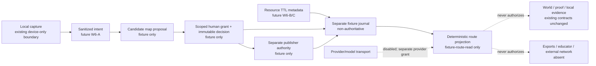

# FORGE Wave 6 authority/data/event preflight (W6-000)

**Status:** fixture-only trust-kernel implementation. This document is a worker-owned preflight packet, not an adult-verification, human-review, publication, provider, cloud, or release record.

## Boundary and architecture

`src/forge/pilot-authority/` supplies a closed `pilot-entitlement.v1` vocabulary and process-local synthetic fixtures. A valid fixture must be minted in-process and is held in a `WeakSet`; a spread object, JSON round trip, copied symbol/Boolean, browser assertion, or model-shaped record cannot pass an evaluator. Every parsed external-shaped record uses own data descriptors with closed keys, bounded ASCII identifiers, canonical millisecond UTC timestamps, bounded unique arrays, and exact lower-case SHA-256 digests before a value is read. Accessors, inherited fields, extra fields, and proxy traps that throw fail closed.

The production default `readPilotAuthoritySnapshot()` returns `null` for every invocation. It reads no cloud identity, request, cookie, profile, query, local storage, environment, provider, or external resource. No route imports this kernel. The only allowed positive result is a narrow synthetic `fixture-route-read` or `fixture-route-projection` result in a caller-supplied local test fixture; it carries no execution capability.

`ServerOwnedPilotEntitlement` in `src/lib/forge-auth/provider-authority.server.ts` now extends the shared `PilotEntitlementV1` rather than declaring a second `pilot-entitlement.v1` vocabulary. Before Zod traverses a reader snapshot, a descriptor-safe preflight clones only own data fields and validates the shared entitlement subset with the canonical lower-case ID, semver, lower-case SHA-256, exact UTC-millisecond lifecycle, revocation-reason, and unique-operation rules. The provider-specific facts (consent, purpose and quota reservation) remain additional checks, and the entitlement must include `provider-transport`; the existing default provider reader remains structurally disabled and its issued grant stays short-lived and single-use.

The current provider API takes only a provider purpose. It validates the entitlement's `inputDigest` and `dependencyRef` shape, but it cannot compare either to a caller-supplied resource/input expectation without a separately reviewed API change. Exact outbound input/dependency binding is therefore an explicit activation gate, not a current provider-authority claim.

The dashed edges are deliberate denials. This slice does not connect local capture to an entitlement, does not send sanitized intent to a model, does not create a map, does not store TTL metadata, and does not write an event, review, publication, resource, evidence, or export.

## Canonical contracts and deterministic states

| Contract | Exact binding | What it cannot establish |
| --- | --- | --- |
| `PilotEntitlementV1` | server-issued fixture identity; subject account, tenant, cohort, fixed purpose, eligibility/issuer refs, policy and dependency digests, reviewed input digest, issued/expiry/revocation/reason, closed operation set | adult verification, account creation, provider permission, curriculum publication, resource assignment, evidence, proof, sharing, or general availability |
| `PilotAuthoritySnapshotV1` | process-local issuer membership plus exact account/tenant/cohort/entitlement/dependency | cookie/profile/query/local-storage/model authority or an operative server session |
| `ReviewerGrantV1` | human reviewer, one tenant/scope/item/input/dependency/purpose/policy/qualification, bounded lifecycle | human identity verification, an active review service, cross-item review, author approval, or publication |
| `ReviewDecisionRefV1` | immutable process-local decision derived from a current grant; exact item/input/dependency/policy and independence | model, learner, client, journal, or self-review authority |
| `PublisherAuthorityV1` | separate current human publisher, fixed pilot purpose, exact item/input/dependency/policy, issued no earlier than the final accepted decision | publication service, catalog write, assignment, route eligibility, or sharing |
| fixture journal | fixed `pilot_authority_fixture` aggregate, monotonic sequence/tenant/timestamp/terminal lifecycle | an accepted `world_run` or `world_package` event, audit durability, or replay authority |

`projectPilotCandidateItem` accepts an unknown, descriptor-closed request at runtime. Its only statuses are:

1. `candidate` — no complete valid independent human review set.
2. `reviewed-unpublished` — all four current scoped decisions exist but no separate valid publisher exists.
3. `published-ineligible` — valid synthetic publication exists but a dependency or route entitlement is stale, absent, or denied.
4. `eligible-for-reviewed-adult-pilot` — a non-future candidate, exact current independent decisions made no earlier than candidate creation, a separately issued publisher no earlier than the final accepted decision, exact dependency, and a process-local route snapshot are all valid.

Even the fourth status exposes only `fixtureRouteRead: true`. `curriculumPublication`, `resourceAssignment`, `externalNetwork`, `evidenceUpgrade`, `proofAuthority`, `educatorSharing`, and `generalAvailability` are all explicitly `false` in every projection.

## Writer / authority / side-effect matrix

| Operation | Permitted writer in this slice | Authority source | Side-effect class | Explicit denial |
| --- | --- | --- | --- | --- |
| Mint synthetic entitlement/snapshot | test fixture only | in-process `WeakSet` | deterministic local test object | identity, cloud account, cookie, profile, query, model |
| Evaluate future fixture route | pure evaluator | exact snapshot + request binding | no-write local computation | direct/deep-link API, browser assertion, stale dependency |
| Mint reviewer grant/decision | test fixture only | synthetic scoped human fixture | deterministic local test object | learner/model/client/journal/reviewer self-approval |
| Mint publisher authority | test fixture only | synthetic separate human fixture bound to the fixed pilot purpose | deterministic local test object | author/reviewer publisher, pre-review publication, durable publication |
| Project candidate | pure evaluator | current sealed fixtures only | no-write local computation | assignment, resource/network, evidence/proof, sharing |
| Append/replay fixture event | test fixture only / pure reader | sealed event plus sequence/tenant rules | no-write local computation | accepted journal, durable audit, authority resurrection |
| Provider transport | existing provider module | separate server consent/quota/short-lived issued grant | disabled | entitlement alone, fixture route result, browser configuration |
| Resource metadata / player / model / exports | nobody | none | unavailable | all calls and all external side effects |

## Field-level inventory

| Field group | Purpose / sensitivity | Owner and destination | Logs / encryption assumption | Retention, export, deletion, backup | Model eligible |
| --- | --- | --- | --- | --- | --- |
| subject account, tenant, cohort | exact fixture isolation; high identity linkage if live | future closed-cohort identity service; **local fixture only now** | no log sink; no storage; no encryption claim | process-local memory only; eligible for GC/process restart; browser refresh does not clear it; no browser persistence/export/backup | No |
| eligibility/issuer refs | opaque recruitment/consent authority pointer; sensitive governance metadata | future operator, never learning route; local fixture now | no log sink | process memory only; no export/backup | No |
| policy/dependency/input digests | immutable identity/replay binding; low content exposure, linkable | local fixture evaluator | no log sink | process memory only; no backup | No |
| issuance/expiry/revocation/reason | access lifecycle; sensitive security state | future server authority; local fixture now | no log sink | process memory only; no durable delete path because no persistence exists | No |
| reviewer/publisher IDs, qualification refs, decision refs | scoped governance identity; sensitive personnel/security data | future review service; local fixture now | no log sink | process memory only; no export/backup | No |
| candidate item/input digest | immutable candidate binding; digest is not raw learner prose | local fixture evaluator | no raw input or learner prose is accepted/logged | process memory only | No |
| fixture event IDs / reason codes | deterministic compatibility test metadata | separate fixture reader only | no log sink | process memory only; tombstone/hold are test-state only | No |
| resource TTL / provider deletion metadata | named for future W6-B/C only | **not implemented or stored here** | no log/encryption/retention claim | no storage/export/backup exists | No |

No arbitrary URL, HTML, file, iframe, network destination, tool request, credential, raw prompt, raw learner text, age evidence, cookie, or local-storage value is a field in an authority record.

## State, memory, and context budget

The kernel holds only sealed fixtures in the current process and immutable scalar/digest facts. It has no cache, browser persistence, session persistence, event store, queue, request body, retrieval context, model context, provider metadata, raw text, or side-effect retry. `WeakSet` membership is process-local and may disappear only when its object is garbage-collected or when the process restarts; a browser refresh does not clear a server-process fixture. Collections are bounded: entitlement operations `<=3`, review decisions `<=4`, journal replay `<=256`, identifiers `<=160` characters, reasons `<=240`, and timestamps are exact UTC millisecond instants. Any future route must obtain a fresh current dependency comparison; a stale tab/cache cannot reuse an older snapshot after the evaluator receives current dependency facts.

## Event compatibility and rollback

The accepted journal remains untouched and still has only `world_run` and `world_package` aggregates. W6 fixture events are `pilot_authority_fixture` only and their old-reader model returns `unknown_aggregate`; no accepted journal parser is extended or relaxed. The fixture reader accepts only locally minted events, exact monotonically increasing sequence, one tenant/aggregate, nondecreasing timestamp, and known event vocabulary.

`entitlement-revoked`, `candidate-withdrawn`, `candidate-incident-held`, and `candidate-tombstoned` are monotonic. A later candidate/review/publication event for a terminal candidate fails; a publication needs a preceding review for that exact candidate. A rollback to code that does not know this fixture aggregate must reject it; it cannot interpret it as an accepted world event. This is compatibility behavior for tests only, not a schema migration, persisted tombstone, or operational rollback rehearsal.

## Threat model and enforced boundary

| Threat | Fixture-kernel control | Residual / activation gate |
| --- | --- | --- |
| Minor or self-attestation bypass | no age/profile/query/cookie/storage input can mint snapshot; production reader returns null | live adult recruitment/consent/identity/tenancy/abuse controls are absent |
| Deep link / direct API/embed | exact server snapshot plus account/tenant/cohort/policy/input/dependency checks; no route wired | future route/action/DB must enforce independently under ADR-005 |
| Prompt/metadata injection | authority records exclude raw text, URL, HTML, tool and credential fields | future model/resource contracts must taint/validate their own inputs |
| Getter/proxy/brand clone | own descriptor parsing, caught proxy traps, closed keys, `WeakSet` issuer checks, deep freeze | JavaScript cannot universally detect a fully transparent proxy; no attacker data is trusted without a sealed mint |
| Reviewer compromise/self-approval | one human scoped grant, exact item/input/dependency, four independent reviewers, candidate/decision/publisher chronology, author forbidden, separate publisher forbidden to author/reviewer | operative human identity, qualification verification and appeal/audit service are absent |
| Cross-tenant replay | exact tenant bindings in snapshot/review/publisher and one-tenant journal replay | durable tenancy/RLS are absent |
| Stale cache/tab | current dependency ref and bounded expiry are rechecked | cache invalidation service and server distribution are absent |
| Proof contamination | projection sets `evidenceUpgrade` and `proofAuthority` false | existing World proof-after-help contract remains separately authoritative |
| Unsafe project | no project record, assignment or execution capability | W6-E safety packet remains future work |
| Rollback resurrection | terminal fixture lifecycle rejects later resurrection and old reader rejects aggregate | no persisted rollback/backup rehearsal exists |
| Provider deletion/tombstone | fixture tombstone monotonic only | provider TTL/cache/outbox/analytics/export deletion is not implemented |

## Synthetic planning thresholds — not operating evidence

These are predeclared planning values, not observed service metrics and not authority to activate a pilot.

| Threshold | Planning value | Freeze condition |
| --- | ---: | --- |
| review minutes per candidate map | 45 minutes median | p90 exceeds 90 minutes for two weekly windows |
| review minutes per resource | 30 minutes median | p90 exceeds 60 minutes for two weekly windows |
| review queue age | 2 business days | any queue item exceeds 5 business days |
| correction SLA | 1 business day high-risk; 5 business days ordinary | missed high-risk SLA or repeated ordinary misses |
| re-review load | <=20% of weekly reviews | >30% for two weeks |
| incident/on-call capacity | named owner and same-day triage | no named owner/coverage or untriaged high-risk incident |
| per-capability marginal cost | <= USD 75 planning ceiling | ceiling exceeded without explicit principal decision |
| accessibility debt | zero known P0/P1; tracked P2 | any P0/P1 or unresolved construct-changing alternative |
| authority/replay error budget | zero unauthorized allow, cross-tenant accept, or terminal resurrection | any occurrence freezes expansion pending root cause and replay repair |

## Program-goal / delivery-gate dependency map

`PG#` is a program-goal namespace; `DG#` is a delivery/claim-gate namespace. The arrows below are dependency relationships, not passes or equivalence claims.

| Program goal | Related delivery gates | W6-000 contribution |
| --- | --- | --- |
| PG0 Program control and truth | DG0 | traceable boundary, explicit non-claims, fixture-only compatibility decision |
| PG1 Trust core and durable replay | DG1, DG2, DG7 | authority/replay preflight only; no durable trust core or minor operation |
| PG2 Learning kernel / World factory | DG1, DG3, DG4, DG6 | preserves existing World/evidence separation; grants no World route |
| PG3 AI lesson intelligence / publication | DG2, DG3, DG4, DG6 | model and publication are denied; reviewer/publisher separation is preflight vocabulary only |
| PG4 Foundations / learner-frontier pathways | DG1, DG3, DG4, DG6, DG10 | candidate/review distinction is maintained; no pathway entitlement |
| PG5 Unified learner experience / access | DG1, DG2, DG3, DG4 | no UI change; future route access is fixture-only |
| PG6 Projects, people, contribution | DG5, DG8 | no project, people, educator, assignment or external contribution authority |
| PG7 Measurement validity / research | DG6, DG9, DG10 | no outcome/evidence upgrade; thresholds are planning only |
| PG8 Homeschool / institutional operations | DG2, DG5, DG6, DG7, DG8, DG10 | no jurisdiction, record, portability, sharing or homeschool claim |
| PG9 Capability commons / observatory | DG4, DG6, DG10 | no common/publication/provider/observatory operation |

## Evaluation plan, activation gates, and next issues

The contract suite covers valid synthetic fixtures; anonymous/profile/query/cookie/local-storage/model inputs; descriptor getter and proxy rejection; hostile/non-Date route clocks; closed-key/Unicode/digest/timestamp/duplicate-array cases; account/tenant/cohort/purpose/policy/input/dependency/expiry/revocation denials; grant scope/item/input/dependency/purpose lifecycle; candidate/decision/publisher chronology; self/conflicted/duplicate/nonhuman/stale review; separate publisher; clone/JSON/forged-brand mutation; fixture journal ordering/cross-tenant/stale/terminal replay; old-reader rejection; canonical provider-entitlement regressions and getter-safe reader preflight; and unchanged provider short-lived single-use behavior.

Before a closed 18+ pilot can be considered, an accepted exact-SHA packet must additionally provide server-owned adult identity and closed-cohort issuance, tenancy/RLS, recovery and abuse controls, configured-project gate, trusted source/reviewer services, durable audit/revocation/retention/deletion, route/action/database enforcement, source/resource/project reviews, provider/privacy/connector policy, accessibility and incident operations, human-study/ethics decision where applicable, cost/workload evidence, and a real rollback/kill-switch drill. W6-000 does not satisfy any of those activation gates.

W6-001 through W6-005 pure modules are already accepted on the current main branch. This packet retroactively closes their missing planned authority/data/event preflight; it does not upgrade any of them into adult-pilot or operational authority. The next unmet implementation packet is W6-006 (adult pilot map editor and route shell), only after principal acceptance of this exact preflight plus audit repairs and the separately required activation gates. W6-007 and W6-008 remain separate packets; no one is activated by this slice.
