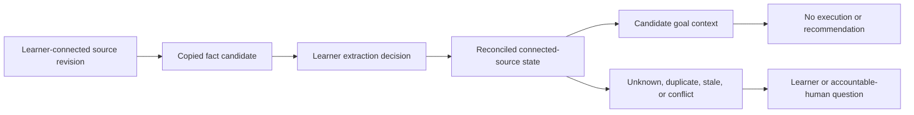

# University Source Review UX

**Status:** implementation contract for a development-only reviewed fixture

**Surface:** `/internal/university-source-review`

**Claim ceiling:** local fixture behavior and rendered engineering evidence only

## Decision

The first university-facing interface will be a source review ledger that answers:

> What do my connected copies say, what remains unknown, where do they conflict, and what can I safely carry into planning?

It will not be a semester dashboard, calendar replacement, tutor chat, or planner recommendation. The existing course-source contract fixes `recommendationAllowed`, `executionAllowed`, and `pathActivationAllowed` to `false`.

## Research synthesis

| Pattern | Adopt | Reject or constrain |
| --- | --- | --- |
| [Karpathy autoresearch](https://github.com/karpathy/autoresearch) | fixed baseline, fixed evaluation harness, one bounded change, keep/discard log, simplicity criterion | synthetic or agent evaluation as student evidence |
| [GOV.UK task list](https://design-system.service.gov.uk/components/task-list/) | sentence-case states, unresolved work receives attention, short action names, large row targets | status chips that look clickable, long repetitive hint text |
| [Linear Triage](https://linear.app/docs/triage) | imported candidates remain outside the workflow until accept, correct, reject, duplicate, or defer review | automated routing that silently creates academic authority |
| [Sunsama](https://www.sunsama.com/) | realistic workload, one daily focus, tasks beside time constraints | activity analytics as learning evidence |
| [MyStudyLife](https://mystudylife.com/) | academic terminology and quick schedule entry | another all-in-one dashboard, grade forecast, or reminder-first product |
| [Astra AI](https://astra-ai.co/) | urgent exam entry and a clear next learning step | opaque mastery percentage, broad outcome guarantees, answer-first framing |
| [Things](https://culturedcode.com/things/) | Today focus, quiet hierarchy, keyboard efficiency, progressive detail | forcing one universal productivity ontology |

## Layers: user needs

The target student:

- needs to know whether a copied deadline matches the source in front of them;
- needs omissions, stale sources, duplicates, and conflicts to remain visible;
- needs one obvious review action without learning a new workspace ontology;
- needs to understand why confirming a copy does not verify current university truth;
- needs a recovery path when the product cannot resolve a consequential conflict;
- must retain control over correction, rejection, export, and later deletion.

## Layers: conceptual model

Objects shown in the interface:

- source revision;
- coverage declaration;
- freshness state;
- copied fact candidate;
- learner extraction decision;
- duplicate or conflict group;
- restricted assessment mode;
- review outcome and next safe recovery.

The surface never exposes tenant, rights, publication, persistence, or institutional authority as established.

## Layers: interaction flow

1. Enter through a development-only server gate.
2. Read the exact boundary: sample data, no save, no connector, no recommendation.
3. Inspect connected-source coverage and freshness.
4. Address the dominant conflict by reviewing each copied candidate.
5. Accept that it matches the copy, correct the transcription, or reject the extraction.
6. Reconciliation reruns deterministically after each decision.
7. If both differing facts still match their copies, the conflict remains.
8. The interface prepares a neutral human question but does not send it.
9. A policy candidate remains restricted even after transcription confirmation.
10. Refresh restores the server fixture and removes all local review changes.

## Layers: surface

### Direction contract

**THESIS:** Connected facts remain outside planning until review; the surface refuses the student-dashboard default.

**OWN-WORLD:** FORGE paper, ink, evidence cyan, learner amber, human rust, hairlines, and flat ledger rows. Controls use the incumbent 6px radius; bounded surfaces use 12px.

**STORY:** The student sees what was inspected, confronts one consequential conflict, reviews copied facts, and leaves with either a safe connected-source state or a precise human question.

**FIRST VIEWPORT:** A compact boundary header leads into one wide conflict ledger. A narrow context column holds connected coverage and the immutable authority ceiling. The unresolved conflict, not a metric, dominates.

**FORM:** Established FORGE operating surface, extended as a source-review workbench. No concept seed is used because this is a bounded extension inside an accepted visual system.

### Responsive and access behavior

- Desktop: primary ledger plus narrow context column.
- Below 760px: one column; context follows the dominant conflict.
- At 320px: actions stack, dates wrap, source comparison becomes sequential, and every source label repeats.
- Keyboard: DOM order follows reading order; correction fields receive focus when opened; status updates use a polite live region.
- Reduced motion: no automatic motion; only instantaneous state changes.
- Forced colors: borders, focus, status diamonds, and buttons remain visible through system colors.
- Color is never the only indicator of conflict, freshness, authority, or decision.

## Fixed UX evaluation harness

The Karpathy-style iteration loop is adapted as follows:

1. Freeze the fixture, task script, viewport matrix, and success rubric.
2. Establish a baseline screenshot and task walkthrough.
3. Change one bounded interaction or hierarchy variable.
4. Run component tests and rendered desktop, 320px, keyboard, reduced-motion, and forced-colors checks.
5. Log the hypothesis, result, regressions, and keep/discard decision.
6. Prefer equal clarity with less UI or fewer steps.
7. Never call agent success, automated accessibility checks, or fixture completion student validation.

### Fixed task rubric

- The user can state which sources were inspected.
- The user can find the unresolved deadline conflict within five seconds of orientation.
- The user can explain what “matches this copy” does and does not prove.
- The user can correct or reject without losing the original fact.
- The user can identify why assessment assistance remains restricted.
- The user can reach a safe next recovery when the conflict cannot be resolved in-product.

## Failure states in scope

- fixture gate disabled;
- schema or semantic fixture failure;
- no candidate decision yet;
- correction cancelled or invalid;
- exact duplicate;
- unresolved conflict after both copies are confirmed;
- partial coverage;
- stale and unknown freshness;
- copied assessment permission with no policy authority;
- deterministic projection pending or failed;
- refresh reset.

## Explicitly out of scope

- real student files, screenshots, calendars, or LMS data;
- parsing original file bytes;
- durable save, sync, identity, tenancy, RLS, export, or deletion;
- sending a human question;
- planner recommendation or automatic scheduling;
- live AI, tutoring, proof, evidence, or learning claim;
- deployment or production enablement.
