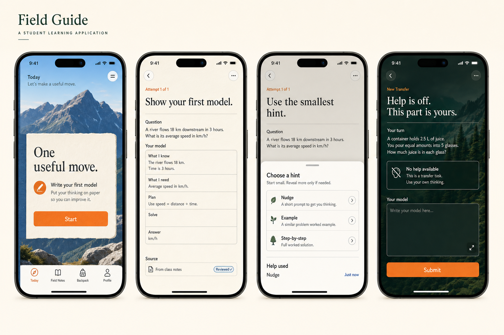

# Field Guide

## Alternate mobile and iOS design lane

**Status:** `CONCEPT_ONLY`

**Platform target:** native iPhone design exploration and mobile product guidance

**Implementation status:** a separate native reference exists at `ios/FORGETerrain`

Field Guide is a pocket learning instrument for one useful move at a time.
It combines a field notebook, a clear route, and calm natural landscapes.

This lane does not change the active web implementation.
This lane does not create provider, storage, identity, evidence, or publication authority.
This lane does not establish educational efficacy.

## Concept board



The board shows Today, Attempt, Hint, and Proof states.
It shows light and dark presentation.
The board is illustrative and not an accessibility test.

## Display-only coded sample

`src/components/forge/design-lab/FieldGuideIPhoneSample.tsx` provides one coded Today sample.
The component has no application state, route, or learning logic.
The component is a gallery display, not a native iOS implementation.

The native reference implements the approved FORGE Terrain system.
It does not promote this alternate concept lane to the active direction.

## Product intent

Field Guide helps a student:

1. choose one real goal;
2. see one useful next move;
3. attempt the difficult part before assistance;
4. request the smallest useful hint;
5. complete a fresh task without instructional help;
6. return later and check what remains.

The design uses landscapes as orientation, not as a reward.
The design uses progress states only when learner work creates those states.

## Design character

### Creative direction

The interface feels like a precise field notebook beside a mountain trail.
The notebook holds facts, attempts, source rights, and evidence.
The landscape gives each major learning state a distinct place.

Use these qualities:

- clear native hierarchy;
- warm paper surfaces;
- deep cobalt and evergreen fields;
- restrained orange actions;
- large editorial headings;
- practical controls;
- visible source and help states;
- calm transitions.

Do not use these patterns:

- card-grid dashboards;
- chatbot framing;
- persistent AI characters;
- streaks;
- points;
- badges;
- leaderboards;
- confetti;
- countdown pressure;
- infinite feeds;
- variable rewards;
- shame for a missed return;
- notifications that increase time in the application.

## Semantic color proposal

These colors are concept tokens.
Validate all final combinations before implementation.

| Token | Light value | Dark value | Meaning |
| --- | --- | --- | --- |
| `field-paper` | `#F7F2E8` | `#101A16` | Main reading surface |
| `field-surface` | `#FFFDF8` | `#17231E` | Bounded work surface |
| `field-ink` | `#111714` | `#F8F4EA` | Primary text |
| `field-muted` | `#58615C` | `#B8C2BC` | Supporting text |
| `field-cobalt` | `#174EA6` | `#8DB7FF` | Reviewed source or evidence |
| `field-evergreen` | `#174B37` | `#8BCBAD` | Stable path or return state |
| `field-orange` | `#D95718` | `#FF9A62` | Learner action |
| `field-line` | `#CFC8BA` | `#3C4A43` | Structure and separation |

Color never carries required meaning alone.
Each status also uses text, position, and an accessible symbol.

## Native navigation

Use a native `TabView` with four stable destinations.

| Tab | Purpose | Typical content |
| --- | --- | --- |
| Today | One useful move | Current action, reason, time range, return |
| Field Notes | Work and sources | Attempts, course material, source review |
| Backpack | Durable learner records | Proof records, returns, offline drafts, exports |
| Profile | Learner controls | Access, theme, haptics, privacy, data controls |

Use a `NavigationStack` inside each tab.
Preserve each tab position when the student changes tabs.

Use a sheet for:

- scan and import;
- source-rights review;
- hint choice;
- reschedule options;
- export and deletion confirmation.

Use a full-screen cover for protected proof.
Keep the proof exit available and clearly labeled.
Do not hide proof exit behind a gesture.

Do not use a custom gesture when a native control gives the same result.
Support the native back gesture outside protected proof.

## End-to-end flow

### 1. Onboarding

Onboarding contains five short screens.

#### Screen 1: purpose

Headline: **Learn what matters next.**

Explain the learning loop in one sentence:

> Attempt, use measured help, prove on a fresh task, and return later.

Primary action: **Continue**

Secondary action: **Explore without setup**

#### Screen 2: data location

Show that work stays on the device by default.
Do not imply cloud backup or account continuity.

Show these actions:

- Continue with device-only work
- Review data controls

#### Screen 3: import rights

Explain that access does not establish reuse rights.
Explain that FORGE does not determine institutional policy.

Show these source choices:

- My own work
- I have permission
- Public or open material
- I am not sure

The uncertain choice must remain available.

#### Screen 4: access preferences

Read system settings first.
Offer explicit controls for:

- text size guidance;
- VoiceOver guidance;
- Reduce Motion;
- increased contrast;
- light, dark, or system appearance;
- haptics.

Do not require a student to disclose a disability.

#### Screen 5: first goal

Ask for one real goal in the student's words.
Do not generate a goal automatically.
Do not publish a path without learner acceptance.

Primary action: **Show one useful move**

### 2. Today

Today opens with one useful move.
It does not open with a dashboard.

Show:

- the current goal;
- one action;
- why the action matters now;
- a realistic time range;
- the connected source state;
- the assistance state;
- an offline state when applicable.

The main action uses `field-orange`.
Evidence and reviewed-source states use `field-cobalt`.

Today can show a due return above a new action.
The student can defer a return without losing prior work.

#### Today wireframe

```text
┌─────────────────────────────┐
│ Today                  ···  │
│                             │
│ [cobalt landscape]          │
│ ┌─────────────────────────┐ │
│ │ ONE USEFUL MOVE         │ │
│ │ Write your first model. │ │
│ │                         │ │
│ │ Why now                 │ │
│ │ This exposes the gap.   │ │
│ │                         │ │
│ │ 15–20 min · Offline OK  │ │
│ │                         │ │
│ │ [ Start ]               │ │
│ └─────────────────────────┘ │
│ Today  Notes  Pack  Profile │
└─────────────────────────────┘
```

### 3. Scan and import rights

Start capture from Field Notes or the current task.
Use the system camera and document picker.

Request camera or file access only after the student selects the action.
Explain every denied permission with a recovery action.

Before analysis, show a rights sheet.

#### Rights sheet

```text
┌─────────────────────────────┐
│ Before FORGE reads this     │
│                             │
│ What can you do with it?    │
│ ○ This is my own work       │
│ ○ I have permission         │
│ ○ It is public or open      │
│ ○ I am not sure             │
│                             │
│ [ Review pages ]            │
│ Save locally without use    │
└─────────────────────────────┘
```

The student reviews every selected page.
The student can remove pages and redact regions.

Record:

- the student's rights statement;
- the file name or source label;
- capture time;
- selected pages;
- extraction status;
- review status;
- deletion state.

Do not infer copyright, license, consent, or institutional permission.
Do not upload uncertain material.
Allow a local draft when the rights state is uncertain.

### 4. Attempt

Attempt appears before instructional help.

Show:

- one clear question;
- a response field;
- a source drawer;
- a visible draft state;
- a **Request a hint** action.

Save the response locally while the student types.
Mark the response as a draft until the student submits it.

Do not grade the protected operation with a model.
Do not convert one answer into a mastery claim.

#### Attempt wireframe

```text
┌─────────────────────────────┐
│ ‹ Attempt              ···  │
│ Attempt 1 of 1              │
│                             │
│ Show your first model.      │
│ ─────────────────────────── │
│ Question                    │
│ Why does this method work?  │
│                             │
│ Your model                  │
│ ┌─────────────────────────┐ │
│ │                         │ │
│ │                         │ │
│ └─────────────────────────┘ │
│ Saved on this device        │
│                             │
│ [ Submit attempt ]          │
│ Request a hint              │
└─────────────────────────────┘
```

### 5. Hint

Hints use a student-controlled ladder.
Reveal one level only after the student requests it.

Suggested levels:

1. **Nudge** — direct attention to one useful feature.
2. **Contrast** — compare two plausible readings.
3. **Worked example** — use a different case.

Do not provide the current protected answer.
Do not reveal later levels automatically.

Record the exact help level.
Show **Help used** beside the attempt.
Use neutral language.

VoiceOver announces the new hint heading after presentation.
Reduce Motion removes sheet bounce and background scaling.

### 6. Proof

Proof uses a fresh transfer task.
Instructional help is unavailable.
Accessibility support remains available.

Before entry, show this boundary:

> This task checks what you can do without instructional help.

During proof:

- hide hint controls;
- hide answer-changing assistance;
- retain text, contrast, VoiceOver, and input alternatives;
- show the connected task and source version;
- allow exit without penalty;
- preserve an unfinished local draft.

After submission, report only the bounded result.
Do not show a grade, rank, or mastery percentage.

#### Proof wireframe

```text
┌─────────────────────────────┐
│ ‹ Exit proof                │
│                             │
│ [evergreen landscape]       │
│                             │
│ Help is off.                │
│ This part is yours.         │
│                             │
│ Fresh task                  │
│ Apply the model here…       │
│                             │
│ ┌─────────────────────────┐ │
│ │ Your response           │ │
│ └─────────────────────────┘ │
│                             │
│ No instructional help       │
│ [ Submit ]                  │
└─────────────────────────────┘
```

### 7. Return

A return checks the same bounded capability later.
It is not a daily streak.

Show:

- why the return exists;
- the earliest useful date;
- the allowed completion window;
- the exact prior proof reference;
- reschedule and decline controls.

Use these states:

- Upcoming
- Ready
- Completed
- Missed window
- Declined
- Not tested

Do not replace **Not tested** with failure.
Do not claim retention without a reviewed later check.

Notifications are optional.
One scheduled reminder is the default maximum.
Do not send escalating reminders.

### 8. Return wireframe

```text
┌─────────────────────────────┐
│ Return                      │
│                             │
│ Bring the model back.       │
│                             │
│ Ready now                   │
│ 10–12 min · fresh case      │
│                             │
│ This checks the capability  │
│ from your earlier proof.    │
│                             │
│ [ Begin return ]            │
│ Choose another date         │
│ Decline this return          │
└─────────────────────────────┘
```

## Dynamic Type

Support every iOS Dynamic Type category through accessibility sizes.
Do not cap the student's preferred size.

Use these rules:

- reflow two-column areas into one column;
- let controls grow vertically;
- keep action labels visible;
- avoid fixed-height text containers;
- use native text styles;
- keep body lines near a readable measure;
- test the largest accessibility size;
- avoid important text inside images.

At large sizes, move the tab label below its symbol.
If a tab still truncates, use a shorter stable label.

## VoiceOver

Use native controls and semantic headings.

Required behavior:

- announce each screen title first;
- keep source status next to its source;
- announce help level and help use;
- announce proof entry and exit boundaries;
- move focus to new sheet headings;
- retain focus after validation errors;
- group decorative landscape images as hidden;
- provide meaningful descriptions for instructional images;
- never use color as the accessible name;
- support rotor navigation by headings, links, fields, and landmarks.

Scan review reads pages in document order.
Redaction controls identify the page and region.

## Reduce Motion

Respect the system Reduce Motion setting.

When Reduce Motion is active:

- remove parallax;
- remove landscape zoom;
- replace spring transitions with a short dissolve;
- keep progress changes immediate;
- do not animate proof boundaries;
- do not animate repeated status loops.

Motion never carries result meaning.

## Haptics

Haptics confirm a direct action.
Haptics do not create a reward schedule.

Use:

- selection feedback for a rights choice;
- light impact feedback for a confirmed local save;
- warning feedback before destructive deletion;
- one completion feedback after a submitted attempt.

Do not use:

- repeated completion pulses;
- random feedback;
- proof-result fanfare;
- haptics for scrolling;
- haptics that continue after the application loses focus.

Provide an application haptics control.
Respect the system setting when available.

## Offline drafts

Device-local drafts are a first-class state.

Each draft shows:

- **Saved on this device**;
- the last local save time;
- its source-rights state;
- its submission state;
- export and delete controls.

Do not show **Synced** without a confirmed remote receipt.
Do not discard a draft after an interrupted scan or proof exit.

Handle these failures:

- storage unavailable;
- storage full;
- unreadable stored bytes;
- application termination during save;
- file provider unavailable;
- camera permission denied;
- scan extraction failure.

Preserve unreadable bytes for learner-controlled export.
Do not silently rewrite malformed data.

## Light and dark appearance

Offer:

- System
- Light
- Dark

Use the system setting during onboarding.
Store only the explicit application override.

Dark mode uses a deep green-black ground.
It does not use pure black for every surface.

Retain semantic color meanings in both modes.
Do not invert source images without review.
Validate contrast in increased-contrast mode.

## Student-safe motivation

Field Guide supports return through clarity and ownership.
It does not use compulsion.

Use:

- one visible next move;
- clear purpose;
- realistic time ranges;
- visible gaps;
- student-chosen reminders;
- honest completion states;
- specific feedback;
- recovery after interruption;
- export and deletion control;
- landscapes that create calm orientation.

Do not use:

- streak loss;
- points;
- badges;
- ranks;
- social comparison;
- hidden engagement scores;
- urgency without a real external deadline;
- messages that shame absence;
- automatic notification escalation;
- randomized rewards;
- infinite content.

Measure task completion only for the student's stated goal.
Do not optimize time in the application.

## Native state and component map

| State | Native pattern | Main action | Important boundary |
| --- | --- | --- | --- |
| Onboarding | Paged flow | Continue | No authority from preference |
| Today | `NavigationStack` root | Start | One action, not a dashboard |
| Import | System picker plus sheet | Review pages | Access is not reuse authority |
| Attempt | Form and source drawer | Submit attempt | Attempt precedes help |
| Hint | Detent sheet | Reveal one hint | Record exact help |
| Proof | Full-screen cover | Submit | Instructional help absent |
| Return | Scheduled detail | Begin return | No retention claim before result |
| Offline draft | Local record detail | Continue | No false sync state |

## Future prototype acceptance checks

A later native prototype must check:

- iPhone layouts from compact width through large Pro Max size;
- portrait and landscape where supported;
- all Dynamic Type categories;
- VoiceOver reading and focus order;
- Voice Control names;
- Switch Control reachability;
- Reduce Motion;
- increased contrast;
- light and dark appearance;
- color-blind distinguishability;
- camera and file permission denial;
- uncertain import rights;
- offline launch and relaunch;
- storage-full recovery;
- proof entry, exit, and assistance absence;
- optional notification denial;
- haptics disabled;
- export and deletion.

Automated checks do not establish VoiceOver conformance.
Representative student evaluation remains required.

## Claim boundary

This document is an alternate design lane.
The concept board is an original visual sample.
No Swift, SwiftUI, Xcode project, application target, or native runtime was added.
No release, usability, accessibility, retention, or learning claim follows.
