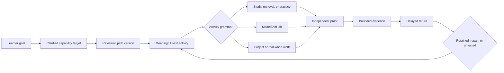
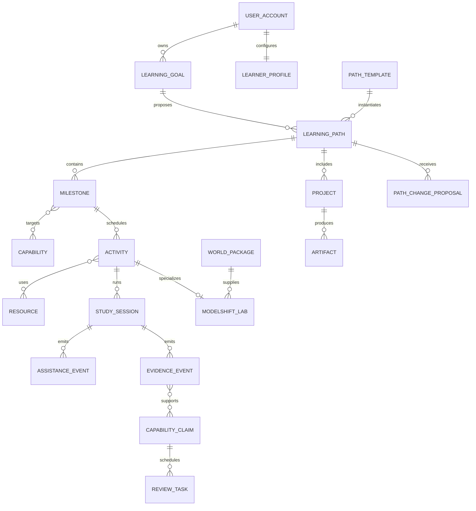

# FORGE Product Re-Foundation

Status: normative product and technical direction

Repository baseline: `e8e896f702ecfa3863f190d908136f52b79c83d8`

Audience: product, learning design, frontend, backend, AI systems, safety, content, evaluation, and release owners

Scope: current working truth, real-product V1, and longer-term architecture

Supersedes: historical prototype-submission framing for future FORGE work

## 1. Purpose and authority

This document defines the coherent product model that the current FORGE implementation should grow into without discarding technically sound work.

It resolves the relationship between:

- learner goals;
- reviewed and personalized learning paths;
- daily learning actions;
- authored and external resources;
- retrieval and deliberate practice;
- ModelShift laboratories;
- projects and real-world work;
- assistance withdrawal;
- independent capability evidence;
- delayed return;
- accounts and learner-owned continuity.

This is a real-product specification. Historical Build Week documents remain useful evidence about the original ModelShift implementation, but their scope limits and submission framing do not govern future product work.

When this document conflicts with an older prototype-specific artifact, this document governs the broader product. `FINAL_PRODUCT_SPEC.md` continues to govern the validated behavior of the force-and-motion ModelShift World where its requirements do not conflict with the FORGE constitution.

The terms `MUST`, `MUST NOT`, `SHOULD`, `SHOULD NOT`, and `MAY` are normative.

## 2. Decision in one sentence

> FORGE is a learner-owned capability system that turns a personally meaningful goal into a credible reviewed path, active study and practical work, selective ModelShift experiences, independent proof, and evidence that remains honest after assistance disappears.

The governing learner story is:

> I told FORGE where I wanted to go. It gave me a credible path, helped me do the work, used ModelShift when my mental model mattered, and showed me what I could eventually do without assistance.

## 3. Product status layers

Every roadmap, interface, claim, and acceptance decision MUST distinguish these three layers.

### 3.1 Current Working Truth

Current Working Truth means behavior and contracts present at repository baseline `e8e896f702ecfa3863f190d908136f52b79c83d8` and supported by existing repository evidence.

Current Working Truth includes:

- a question-first public shell and goal intake;
- explicit map acceptance, revision, and rejection behavior;
- four authored working Worlds:
  - force and motion;
  - proportional reasoning;
  - AI and learning;
  - primary source reasoning;
- a shared World runtime and bounded evidence semantics;
- a device-local, privacy-minimal evidence ledger;
- local age-mode gates for reviewed Worlds;
- a current availability map that shows released areas and explicit gaps;
- a source-corroboration path presentation that is fixture-only;
- a Lesson Studio whose public provider connector is intentionally locked;
- fail-closed cloud authentication and durable evidence configuration;
- an unavailable adult pilot route unless server-owned review authority is configured;
- tested visual-system assets and responsive/accessibility contracts.

Current Working Truth does not include:

- an enabled production cloud account system;
- durable cross-device learner state;
- a live production database;
- a public adult cohort;
- a live provider-authenticated lesson-generation flow;
- arbitrary learner-supplied provider keys;
- production external-resource acquisition;
- production YouTube playback or assignment;
- reviewed broad curriculum coverage;
- live model efficacy evidence;
- institutional, homeschool, accreditation, credential, or education-replacement validity.

At the time this document was written, cloud, provider, live-database, and manual representative-user acceptance evidence had not been run. This includes:

- no approved-project live database migration proof;
- no live provider-spend or provider-authenticated evaluation;
- no production cross-device account proof;
- no manual assistive-technology evidence;
- no representative learner, educator, guardian, or reviewer acceptance study for this re-foundation.

These remain explicit unrun gates. They MUST NOT be converted into completion claims by documentation, UI copy, environment variables, fixtures, or broad green test counts.

### 3.2 Real-Product V1

Real-Product V1 is the first externally usable adult product that proves the complete FORGE relationship:

> Goal -> reviewed path -> meaningful next action -> active learning -> practical work or ModelShift -> independent proof -> bounded evidence -> delayed return.

V1 requires real identity, persistence, deletion, source and resource authority, operational failure behavior, and a reviewed practical learning path.

The first V1 population is explicitly entitled adults aged 18 and older. Existing reviewed under-18 Worlds MAY remain available in device-only modes, but they are not part of the first cloud-account release.

### 3.3 Longer-Term Architecture

Longer-Term Architecture supports:

- multiple reviewed domain grammars;
- broader adult paths;
- educator authoring and review;
- safe and governed external resources;
- reviewed model-provider integrations;
- supervised teen and child programs;
- projects with accountable human critique;
- institutions, families, microschools, and homeschool support;
- portable capability evidence;
- a capability commons and reviewed World ecosystem.

Longer-Term Architecture is not implemented breadth. A future object, route, schema, or plan is not proof that the corresponding product, population, authority, or outcome exists.

## 4. Required-outcome traceability

The original re-foundation mandate named 25 outcomes. This document addresses them as follows.

| Required outcome | Governing section |
| --- | --- |
| 1. Product thesis | Sections 2, 5 |
| 2. Product boundary | Sections 6, 7 |
| 3. Exact target users | Section 7 |
| 4. Public-to-onboarding-to-app journey | Sections 9, 10 |
| 5. Conceptual object model | Sections 11, 12 |
| 6. Route and information architecture | Sections 24, 25 |
| 7. Authentication and account model | Section 13 |
| 8. Onboarding question strategy | Section 10 |
| 9. Learning-path generation model | Sections 14, 15 |
| 10. Curated-path model | Section 15 |
| 11. Resource and media model | Section 16 |
| 12. Study-session model | Section 17 |
| 13. ModelShift integration | Section 18 |
| 14. Project model | Section 19 |
| 15. Evidence and progress model | Section 20 |
| 16. AI responsibility boundaries | Sections 21, 22 |
| 17. Data model and persistence needs | Sections 28, 29 |
| 18. Safety, privacy, and age boundaries | Sections 30, 31 |
| 19. Failure and fallback behavior | Section 32 |
| 20. Migration map from current product | Section 25 |
| 21. Smallest coherent product slice | Section 35, P0 |
| 22. Extensible real-product architecture | Sections 27-35 |
| 23. Frontend contract | Sections 26, 33 |
| 24. Critical assumptions and falsification | Section 34 |
| 25. Prioritized implementation plan | Section 35 |

The former short prototype slice is intentionally translated into the smallest coherent real-product P0 slice. Its former future architecture is translated into V1 and longer-term P1/P2 architecture. No submission requirement remains.

## 5. Product thesis and north star

### 5.1 Product thesis

AI makes provisional cognitive assistance abundant. It can explain, summarize, translate, draft, quiz, simulate dialogue, and generate plans at low marginal cost.

Abundant assistance does not make durable capability abundant. The scarce complements are:

- a truthful statement of what the learner wants to become able to do;
- a credible sequence of prerequisites and meaningful actions;
- reviewed sources and executable models;
- active retrieval and deliberate practice;
- feedback that does not perform the target operation;
- real projects and physical or social consequences;
- accountable human judgment;
- proof after support is withdrawn;
- delayed evidence that survives a change in wording, representation, or context.

FORGE organizes those scarce complements.

### 5.2 Product north star

> A learner can do something meaningful in an unfamiliar situation with materially less assistance, and can still do it after delay.

The primary cohort-level learning outcome is:

> Delayed independent transfer per active learning hour.

This metric requires:

- an unfamiliar task family;
- a named protected operation;
- instructional AI and solution-generating help structurally absent;
- accessibility support retained and recorded separately;
- exact task, content, policy, validator, and source versions;
- a baseline or comparison appropriate to the claim;
- a defined delay;
- uncertainty and subgroup reporting.

It MUST NOT be displayed as a personal productivity score.

### 5.3 Product operating outcomes

V1 SHOULD also measure:

- median time from goal entry to first meaningful action;
- percentage of proposed paths explicitly accepted after review;
- learner ability to explain why the next action belongs in the path;
- completion of unfamiliar independent proof;
- completion of delayed return;
- assistance fading across comparable work;
- confidence calibration;
- project completion with explanation or defence;
- resource review time and correction latency;
- provider fallback and authored-path completion;
- export and deletion success;
- burden on learners, reviewers, and educators.

### 5.4 Metrics FORGE refuses to optimize

FORGE MUST NOT optimize:

- raw session duration;
- daily streak;
- message count;
- answers generated;
- videos watched;
- lessons completed;
- notifications opened;
- content volume;
- leaderboard position;
- emotional attachment;
- hidden engagement score;
- opaque mastery percentage.

These events MAY be observed for reliability or funnel diagnosis only when their learning, safety, and privacy interpretation is explicit.

## 6. Product boundary and non-goals

### 6.1 What FORGE is

FORGE is:

- a goal-to-capability system;
- a reviewed path and activity orchestrator;
- a collection of authored executable learning Worlds;
- a study and project workspace;
- a governed use of AI for interpretation and assistance;
- a learner-owned evidence and return system;
- an educator and reviewer tool where proper authority exists;
- a bridge from digital learning to practical work, people, and the physical world.

### 6.2 What ModelShift is

ModelShift is FORGE's distinctive learning protocol for concepts where a learner's model should be elicited, compared, tested, reconstructed, and demonstrated without assistance.

ModelShift is not:

- the whole FORGE product;
- a universal treatment for every activity;
- a chatbot;
- a generic simulation library;
- a personality diagnosis;
- an authority for truth or grading.

### 6.3 What FORGE is not

FORGE is not:

- an answer engine;
- a persistent AI companion;
- a generated-link playlist;
- an LMS with a new visual skin;
- a generic course generator;
- a social feed;
- a credential mill;
- a surveillance or proctoring system;
- a personality or learning-style profiler;
- a replacement for qualified teachers, care, safeguarding, peers, civic life, laboratories, arts, sport, or human mentorship;
- a homeschool system merely because content can be opened at home;
- proof of efficacy merely because the software works.

### 6.4 Explicit V1 non-goals

V1 MUST NOT include:

- open public profiles or peer messaging;
- an unrestricted open-web learner agent;
- under-18 cloud accounts;
- a mentor marketplace;
- institution-wide grades or admissions decisions;
- automated credentials;
- autonomous curriculum publication;
- arbitrary provider endpoints or models;
- browser-stored raw provider keys;
- advertising or behavioral targeting;
- emotion inference;
- camera-based proctoring;
- permanent ability labels;
- automatic cloud upload of device-local history;
- universal "learn anything" coverage claims.

## 7. Target users and release populations

### 7.1 Primary V1 learner

The primary V1 learner is:

- aged 18 or older;
- learning independently or alongside an educator, program, or workplace;
- able to state a topic, question, practical goal, profession, or area of general knowledge;
- willing to perform active work rather than only consume explanations;
- seeking trustworthy structure and evidence without enrolling in a full institution;
- using a modern phone, tablet, or computer;
- allowed to begin locally before creating an account.

The first reviewed V1 path SHOULD target an important, practical, cross-domain capability:

> Verify an AI-generated claim before acting.

This path is strategically appropriate because it:

- addresses the AI-era mission directly;
- is useful outside school;
- combines source reasoning, active comparison, project work, and independent proof;
- reuses the current AI-and-learning and primary-source assets;
- demonstrates a non-physics FORGE experience;
- can still use ModelShift only where rival readings and separating evidence genuinely apply.

It MUST remain candidate or internal until exact source receipts, reviewed resources, project rubric, proof family, and delayed-return family are published.

### 7.2 Secondary current users

Existing reviewed device-local experiences MAY support:

- teenagers in reviewed teen Worlds;
- children learning with a grown-up in reviewed grown-up-managed Worlds;
- adults using device-local Worlds without an account.

A local age selection is a device preference, not verified identity, consent, assent, or guardian authority.

### 7.3 Future users

Future reviewed programs MAY support:

- families and homeschool settings;
- teachers and teaching assistants;
- tutors and learning coaches;
- microschools and community programs;
- universities and workforce programs;
- adult continuing education;
- supervised youth cohorts;
- content authors, reviewers, and researchers.

Each future population requires separate authority, safeguarding, privacy, support, evaluation, and release evidence.

### 7.4 Homeschool boundary

FORGE can become infrastructure for homeschool and microschool learning only after it can provide or coordinate:

- broad curriculum entitlement;
- literacy, numeracy, disciplinary knowledge, practical work, arts, movement, and civic learning;
- adult responsibility and learner voice;
- stable peer and community contact;
- qualified subject support;
- external benchmarks and moderated evidence;
- safeguarding, complaints, disability, and emergency procedures;
- transitions into examinations, school, apprenticeship, higher education, or work.

Until those gates exist, FORGE MUST describe itself as a learning and capability system that can support learning at home, not as a complete homeschool replacement.

## 8. Product relationship model

The learner goal owns direction. Reviewed path authority owns scope and sequence. Activities create learning opportunities. ModelShift is one activity grammar. Projects create consequential work. Proof and return create evidence. AI may assist several transitions but owns none of their authority.

## 9. End-to-end learner journey

### 9.1 Public arrival

A learner may arrive with:

- a precise capability goal;
- a topic;
- a question;
- a project;
- a profession or role;
- an area of general knowledge;
- no clear direction.

The public surface MUST offer one clear natural-language entry:

> What do you want to understand, make, change, or become able to do?

Speech input MAY be offered as an accessibility and convenience option. Raw audio MUST be discarded by default.

### 9.2 Goal clarification

FORGE preserves the learner's original words and produces an explicitly uncertain draft interpretation.

It asks only questions whose answers can change:

- the target capability;
- a prerequisite;
- the path depth;
- the route timing;
- resource eligibility;
- safety or access.

The learner can correct the interpretation before it becomes an active goal.

### 9.3 First credible value

Before a long preference form or account prompt, the learner sees:

- a concise target statement;
- a 3-7 milestone path preview;
- the first useful action;
- a practical outcome;
- reviewed, candidate, and gap labels;
- why the sequence is credible;
- what remains uncertain or unavailable.

### 9.4 Path decision

The learner MUST explicitly:

- accept;
- revise;
- reject;
- or save the path as a draft.

Silence, navigation, or AI inference cannot activate a path.

### 9.5 First activity

Where policy permits, the learner begins one useful local activity before creating an account.

The activity MUST identify:

- what the learner will do;
- why it is the next action;
- what support is available;
- what operation the learner must own;
- what evidence, if any, can result.

### 9.6 Account conversion

An account prompt appears when continuity creates clear value, such as:

- saving the accepted path across devices;
- preserving a project;
- scheduling a delayed return;
- exporting a durable record;
- continuing an adult entitled program.

The account prompt MUST state exactly what will and will not be uploaded.

### 9.7 Authenticated home

The authenticated home shows:

- one primary next action;
- the active goal and path context;
- why the action is next;
- a due return if one exists;
- explicit alternatives such as pause, switch path, explore, or ask for help.

It MUST NOT be a dense dashboard of generic metrics or recommendations.

### 9.8 Study, project, proof, and return

The learner:

1. encounters or retrieves the target idea;
2. performs a meaningful cognitive or practical operation;
3. uses bounded support if needed;
4. explains, practises, or builds;
5. completes an unfamiliar protected proof where appropriate;
6. receives a bounded evidence statement;
7. returns after delay;
8. continues, repairs, applies, or changes the goal.

### 9.9 Successful journey statement

The journey succeeds when the learner can truthfully say:

> I know what I am working toward, why this is the next action, what help I used, what I demonstrated without help, and what remains open.

## 10. Progressive onboarding

### 10.1 Onboarding principle

Onboarding is a goal-clarification interaction, not a profile interrogation.

FORGE MUST learn the minimum information required to create a credible first path, then collect additional preferences progressively when they become relevant.

### 10.2 Required first input

The only universal first input is the learner's natural-language description of what they want.

Examples:

- "I want to understand politics without getting manipulated."
- "I want to become a software engineer."
- "Why do prices go up?"
- "I need to learn enough statistics to read medical studies."
- "I have no idea. I want to be more capable and informed."

### 10.3 Clarification strategy

FORGE asks at most three first-session questions unless a safety or access boundary requires more.

Priority order:

1. Desired action or outcome:
   - "What should you be able to do with this?"
2. Starting point:
   - "Which of these best describes what you can already do?"
3. Time and hard constraints:
   - "Is there a deadline, weekly time limit, access need, or material constraint that changes the route?"

Age or education stage is asked early only when it changes legal, safety, language, content, or account eligibility.

### 10.4 Progressive profile fields

FORGE MAY later collect:

- language;
- accessibility settings;
- device and bandwidth constraints;
- preferred session length;
- cadence and deadlines;
- allowed materials;
- available equipment;
- preference for more structure or more exploration;
- resource-format preference;
- interests that the learner explicitly chooses to save.

These fields MUST be:

- optional where possible;
- editable;
- purpose-explained;
- scoped to route selection or access;
- excluded from advertising and personality inference.

### 10.5 Prohibited onboarding

FORGE MUST NOT ask for:

- a learning style;
- an avatar or AI companion;
- a personality type;
- emotional vulnerability;
- a permanent ability level;
- unnecessary exact age or birth date;
- school rank or grade-point average without a defined need;
- extensive demographic data before value;
- a thirty-topic curriculum preference form.

### 10.6 No-direction path

When a learner has no clear direction, FORGE presents a bounded choice among meaningful human outcomes, such as:

- reason clearly about claims;
- understand numbers and risk;
- make and repair things;
- communicate ideas;
- understand society and government;
- use computing and AI responsibly;
- explore the natural world;
- manage practical life.

It asks for one desired change or curiosity. It does not diagnose the learner or auto-enroll them in a broad identity path.

## 11. Canonical conceptual model

### 11.1 First-class objects

| Object | Definition | Primary authority |
| --- | --- | --- |
| `UserAccount` | Authentication, consent, entitlement, ownership, export, and deletion | Identity service and user |
| `LearnerProfile` | Explicit access, language, cadence, and preference settings | Learner or authorized grown-up |
| `LearningGoal` | Learner-owned desired capability or meaningful outcome | Learner |
| `Capability` | Versioned meaningful action under named conditions | Reviewed authors |
| `PathTemplate` | Curated and versioned route structure | Reviewed publication |
| `LearningPath` | Learner-owned accepted instance pinned to a path version | Learner |
| `PathPatch` | Learner-approved pace, order, context, or equivalent-resource adaptation | Learner plus deterministic validator |
| `Milestone` | Coherent capability boundary with explicit exit evidence | Path version |
| `Activity` | Executable learning or practical operation | Authored package or reviewed path |
| `Resource` | Governed input used by an activity | Source/resource authority |
| `StudySession` | One learner execution of an activity | Runtime and learner |
| `WorldPackage` | Internal executable domain package | Authored, reviewed, deterministic |
| `ModelShiftLab` | Activity using the ModelShift protocol | World package and runtime |
| `Project` | Practical brief, stages, artifacts, critique, defence, and proof | Learner, authors, reviewers |
| `Artifact` | Learner-produced work with revision and provenance | Learner |
| `AssistanceEvent` | Immutable support event and protected-operation overlap | Runtime policy |
| `EvidenceEvent` | Immutable observation from validator, reviewer, or accountable action | Named evidence authority |
| `CapabilityClaim` | Bounded interpretation of evidence | Deterministic claim policy or human review |
| `EvidenceRecord` | Learner-readable projection of evidence and open conditions | Evidence projection |
| `ReviewTask` | Scheduled return, retrieval, proof, critique, or repair | Scheduler and path |
| `PathChangeProposal` | Suggested change that has no effect until accepted | AI, author, or learner proposal |
| `SavedResource` | Learner-to-resource bookmark relation | Learner |
| `SourceReceipt` | Immutable binding among sources, claims, rights, and reviews | Source authority |

### 11.2 Objects that are not first-class

The following are not primary product objects:

- `Course`;
- `Module`;
- `Lesson`;
- `ChatThread`;
- `Recommendation`;
- `MasteryScore`;
- `EngagementLevel`;
- `LearningStyle`;
- `Persona`.

`Milestone` replaces vague modules. `Activity` replaces lessons. `PathChangeProposal` replaces hidden recommendations. Conversation is an interface event, not canonical learner state.

### 11.3 Object relationships

### 11.4 Lifecycle separation

The model MUST keep these lifecycles separate:

- path authoring and publication;
- learner path participation;
- activity execution;
- project production;
- evidence disposition;
- delayed review;
- resource availability;
- account and entitlement.

Completing one lifecycle MUST NOT silently upgrade another.

Examples:

- finishing a path does not prove capability;
- watching a resource does not complete an activity;
- submitting a project does not establish independent performance;
- accepting a path does not publish its template;
- signing in does not authorize cloud evidence sync;
- a positive evidence event does not prove retention.

## 12. Authority model

FORGE has five authority classes.

### 12.1 Learner authority

The learner owns:

- goal wording;
- path acceptance;
- path pause and retirement;
- optional profile preferences;
- project artifacts;
- saved questions and resources;
- sharing decisions;
- export and deletion requests;
- correction challenges.

### 12.2 Authored authority

Reviewed authors own:

- capability definitions;
- prerequisite relationships;
- path templates;
- activity instructions;
- World kernels;
- misconception families;
- transfer task families;
- project briefs;
- rubrics;
- source needs;
- limitations.

### 12.3 Deterministic authority

Tested code owns:

- state transitions;
- permissions;
- answer access;
- proof locks;
- idempotency;
- deterministic simulations;
- numeric and symbolic validators;
- content-version identity;
- policy enforcement;
- evidence derivation where rules are sufficient.

### 12.4 Model proposal authority

AI MAY:

- interpret learner language;
- ask a bounded clarification;
- summarize without changing ownership;
- propose milestones from reviewed components;
- rank authored alternatives;
- phrase a permitted hint;
- propose a path change;
- draft author content;
- identify uncertainty;
- request human review.

AI output remains a proposal until accepted by the applicable learner, deterministic, authored, or human authority.

### 12.5 Human review authority

Accountable humans own:

- source and rights review;
- curriculum publication;
- ambiguous consequential scoring;
- safety review;
- provider approval;
- content withdrawal;
- appeals;
- research interpretation;
- institutional decisions.

No interface copy may allow one authority class to impersonate another.

## 13. Authentication, guest use, continuity, and import

### 13.1 Guest mode

Guest mode is a first-class local mode.

It supports:

- natural-language goal intake;
- draft goal interpretation;
- a local path preview;
- explicit path acceptance;
- one or more reviewed local activities;
- device-local progress and bounded evidence;
- export;
- explicit conversion to an adult account.

Guest mode MUST NOT:

- imply identity verification;
- establish guardian authority;
- upload local history automatically;
- enable server-owned adult-only resources without entitlement;
- create a public profile.

### 13.2 Adult V1 account

The first cloud account SHOULD use low-friction passwordless authentication:

- email magic link as the primary mechanism;
- passkey MAY be added when recovery and device support are operational;
- allowlisted federated sign-in MAY be added later;
- password login is not required for V1.

The account stores the minimum identity required for:

- authentication and recovery;
- consent and entitlement;
- cross-device continuity;
- data export and deletion;
- operational communication;
- optional research consent kept separately.

### 13.3 Entitlement

Authentication is not authorization.

Adult V1 capability requires a server-issued entitlement that names:

- account;
- cohort or product mode;
- allowed route and package versions;
- age population;
- external-resource policy;
- provider policy;
- evidence storage authority;
- start and expiry;
- revocation;
- policy version.

Client assertions, query parameters, cookies, or local age preferences cannot create this authority.

### 13.4 Account conversion

When a guest creates an account, FORGE presents an import preview that lists:

- goals;
- accepted paths;
- project drafts;
- evidence records;
- review tasks;
- saved resources;
- excluded raw or ephemeral data.

The learner chooses what to import.

Import MUST be:

- idempotent;
- content-version-aware;
- duplicate-safe;
- revocable where policy permits;
- logged without raw secret or unrelated text;
- separated from account creation.

### 13.5 Cross-device continuity

Cross-device continuity includes:

- onboarding state;
- goals;
- accepted paths and versions;
- current milestone and next action;
- completed sessions;
- projects and artifacts;
- ModelShift attempts;
- bounded evidence;
- review tasks;
- saved resources;
- explicit preferences.

Raw chat, voice, video, hidden inferences, and unrelated browsing MUST NOT become canonical continuity state.

### 13.6 Account controls

V1 MUST provide:

- readable data inventory;
- export;
- deletion request and status;
- session/device sign-out;
- consent view;
- sync status;
- per-object sharing controls;
- correction and appeal path;
- clear local-only and cloud-stored labels.

## 14. Learning-path generation

### 14.1 Inputs

Path generation receives:

- accepted learning goal;
- desired practical outcome;
- explicit starting evidence or uncertainty;
- available time and deadline;
- access and material constraints;
- learner-controlled preferences;
- eligible path templates and components;
- published capability graph;
- current resource snapshot;
- current evidence;
- explicit content gaps.

### 14.2 Generation pipeline

The pipeline is:

1. preserve original learner intent;
2. create a sanitized, previewable interpretation;
3. identify candidate target capabilities;
4. ask the minimum discriminating clarification;
5. retrieve published path templates and capability nodes;
6. identify prerequisite and coverage gaps;
7. assemble one primary and at most two alternative route proposals;
8. validate graph, audience, resource, proof, and safety constraints;
9. explain the sequence in learner language;
10. show reviewed, candidate, and gap status;
11. collect accept, revise, reject, or save decision;
12. pin the accepted path to an immutable version.

### 14.3 Deterministic and reviewed boundaries

Deterministic code MUST own:

- valid IDs;
- graph traversal;
- prerequisite constraints;
- audience and age policy;
- availability;
- publication status;
- resource eligibility;
- proof and project requirements;
- maximum route shape;
- path version identity;
- learner acceptance.

Reviewed authority MUST own:

- capability definitions;
- path templates;
- prerequisite claims;
- source and resource decisions;
- proof standards;
- project rubrics;
- limitations.

AI MAY:

- interpret the goal;
- rank valid target candidates;
- explain sequence;
- propose optional context;
- produce a learner-readable summary;
- propose a change after new evidence.

AI MUST NOT invent:

- capabilities;
- sources;
- publication state;
- resource availability;
- proof tasks;
- safety permissions;
- reviewer decisions;
- completion or evidence.

### 14.4 Vague, conflicting, or unrealistic goals

For vague goals, FORGE offers a small set of different capability interpretations and asks which one matters.

For unrealistic deadlines, FORGE separates:

- minimum safe useful outcome;
- credible route;
- what cannot be compressed;
- optional later depth.

For conflicting interests, FORGE asks which outcome has priority or proposes a shared foundation without pretending all goals fit one path.

For low available time, FORGE reduces breadth and session size, not evidence quality.

For uncertain level, FORGE uses a short, low-stakes probe or begins with a reversible first activity.

For missing reviewed content, FORGE shows a gap. It does not generate a fake course.

For model failure, FORGE returns an authored clarification or deterministic candidate list.

## 15. Curated, personalized, and versioned paths

### 15.1 Path-template requirements

A publishable `PathTemplateVersion` MUST declare:

- target outcome;
- target capability IDs and versions;
- prerequisite edges;
- intended audience;
- expected prior knowledge;
- milestones;
- activity sequence and allowed branches;
- active-effort estimate;
- project binding;
- proof binding;
- delayed-return binding;
- reviewed resource snapshot;
- alternatives and fallbacks;
- accessibility and material constraints;
- source receipts;
- content gaps and exclusions;
- authors;
- scoped review decisions;
- publication state;
- supersession and withdrawal behavior.

### 15.2 Path authority states

Path templates use:

`draft -> candidate -> scoped-review -> reviewed -> published -> superseded | withdrawn`

Review and publication are separate. A reviewed package is not public until publication authority acts.

### 15.3 Learner-path states

Learner paths use:

`proposed -> accepted -> active -> paused -> completed | retired`

Path completion means the planned activities closed according to the path contract. It does not mean the target capabilities were retained.

### 15.4 Milestone states

Milestones use:

`not-started -> active -> ready-for-proof -> awaiting-return -> closed | repair`

The visible state MUST explain what operation or evidence changes it.

### 15.5 Personalization

Safe personalization MAY change:

- pace;
- cadence;
- equivalent reviewed resource;
- optional example;
- representation;
- accessible operation;
- project context;
- order where graph constraints permit;
- optional enrichment.

Changing any of these creates a learner `PathPatch` that MUST be inspectable and reversible.

Changing:

- target capability;
- prerequisite requirement;
- project requirement;
- proof standard;
- source claim;
- audience boundary;
- validator;

creates a new candidate path version requiring applicable review.

### 15.6 Credibility

A path is credible only when:

- its target is meaningful and bounded;
- its prerequisites are visible;
- its reviewed resources are eligible now;
- its activities require learner operations;
- its project or application matches the target;
- its proof tests the target independently;
- its delayed return is defined;
- its gaps and uncertainty are visible;
- its version and reviewers are inspectable.

A generated list of topics or links is not a course and MUST NOT be called one.

### 15.7 Preset path families

Future preset paths MAY include:

- Become AI-literate;
- Think like an engineer;
- Build strong general knowledge;
- Understand politics and government;
- Learn philosophy seriously;
- Understand psychology;
- Learn software development;
- Improve scientific reasoning;
- Become financially literate.

Each is a broad orientation, not a promise to become a profession. Public copy MUST name what the path can and cannot support.

## 16. Resource and media model

### 16.1 Resource is not activity

A `Resource` is an input. An `Activity` names what the learner does with it.

Watching, reading, or opening a resource creates exposure evidence only. It cannot create a capability claim.

### 16.2 Resource types

FORGE supports:

- authored FORGE text;
- reviewed external reading;
- YouTube or other external video;
- diagram or representation package;
- interactive exercise;
- deterministic simulation;
- ModelShift World;
- project brief;
- physical experiment;
- retrieval prompt;
- assessment or proof task;
- primary source;
- learner artifact;
- human critique packet.

### 16.3 Resource lifecycle

External resources use:

`discovered -> candidate -> observed -> scoped-review -> eligible -> assigned`

Side states:

`rejected | expired | inaccessible | withdrawn | superseded`

Discovery never creates assignment authority.

### 16.4 Resource observation

A `ResourceObservation` records:

- canonical URL and provider identity;
- observed title and creator;
- observed date;
- observation expiry;
- availability;
- duration or size;
- language;
- transcript availability;
- accessibility signals;
- embed and tracking behavior;
- region or account restrictions;
- rights and commercial signals;
- known safety concerns;
- content digest where possible.

Observation is time-bounded metadata, not pedagogical review.

### 16.5 Resource review

Scoped reviews cover:

- factual/source quality;
- pedagogical role and learning fit;
- accessibility;
- age safety;
- rights and attribution;
- privacy and tracking;
- commercial conflict;
- suitability for assignment.

Eligibility is derived from current observations, reviews, path audience, and policy. It MUST NOT be a manually stored truth flag that outlives its inputs.

### 16.6 YouTube and external video

Video MAY be used when it supplies:

- an otherwise difficult observation;
- expert demonstration;
- visual explanation;
- worked example;
- primary testimony;
- practical technique;
- motivating context.

Video MUST NOT become an autoplay feed.

Every assigned video needs:

- a reviewed role;
- transcript or meaningful alternative;
- click-to-load behavior where third-party tracking is present;
- an active checkpoint;
- a fallback;
- current eligibility;
- clear external-provider status.

Active checkpoints include:

- predict before watching;
- pause and explain;
- identify the claim and evidence;
- retrieve without replay;
- compare with another source;
- apply the method;
- audit an error;
- build or revise an artifact.

Views, likes, watch time, sponsorship, engagement rank, or model preference cannot determine assignment.

### 16.7 Caching and replacement

FORGE MAY cache:

- approved metadata;
- licensed text;
- transcripts where rights allow;
- thumbnails where policy allows;
- internal representation packages;
- fallback activities.

FORGE MUST NOT proxy or reproduce external content beyond rights.

When a resource expires or is withdrawn:

- new assignment stops;
- active paths show the affected activity;
- a reviewed fallback is selected where one exists;
- path version and evidence provenance remain inspectable;
- evidence is not silently rewritten;
- the learner receives a bounded repair or alternative.

### 16.8 Representation trust hierarchy

Use this order when practical:

1. direct observation;
2. deterministic simulation;
3. reviewed source-bound diagram or media;
4. reviewed generated source-bound draft;
5. analogy with explicit mapping and failure boundary.

Visual richness never substitutes for truth, source, or active learning.

## 17. Study-session model

### 17.1 Session modes

Activities may use these modes:

- orient;
- watch or read;
- guided study;
- retrieve;
- practise;
- explain;
- translate representation;
- experiment;
- ModelShift;
- project;
- critique;
- reflect;
- prove;
- return;
- repair.

These are activity grammars, not a learner personality menu.

### 17.2 Session contract

Every `StudySession` declares:

- goal and path context;
- target capability;
- activity mode;
- estimated active effort;
- protected operation;
- available support;
- access accommodations;
- source and content versions;
- completion condition;
- possible evidence;
- save and recovery behavior;
- next-action rules.

### 17.3 Session lifecycle

`ready -> active -> paused -> submitted -> evaluated -> closed`

Side states:

`offline | interrupted | invalid | contaminated | abandoned | superseded`

Pause and stop are always available without penalty.

### 17.4 Next-mode decision

Deterministic policy selects among eligible activities using:

- target capability;
- prerequisite evidence;
- prior exposure;
- retrieval history;
- representation gap;
- project requirement;
- support history;
- proof readiness;
- delayed-return due date;
- explicit learner constraints;
- learner choice among equivalent valid actions.

Examples:

- no prior exposure -> orient or guided study;
- previous exposure but weak retrieval -> retrieve;
- correct answer with weak mechanism -> explain;
- representation-specific success -> translate representation;
- stable causal misconception -> ModelShift;
- capability requires production -> project;
- sufficient supported work -> prove;
- delayed task due -> return;
- failed or contaminated proof -> repair or reschedule.

### 17.5 Passive-consumption guard

FORGE MUST prevent endless passive consumption by:

- limiting consecutive consume-only activities;
- inserting retrieval or explanation;
- requiring an active checkpoint for assigned media;
- showing why the next operation matters;
- letting the learner stop rather than autoplay;
- refusing to treat consumption as capability evidence.

## 18. ModelShift integration

### 18.1 Trigger conditions

ModelShift SHOULD be used only when:

- the target contains a causal, relational, or competing model;
- two or more plausible readings make different predictions;
- an authored disagreement point exists;
- a separating test is available;
- the world, source, or accountable review can disagree with the learner;
- the target can be tested in an unfamiliar context;
- support can be withdrawn without removing access.

If those conditions do not hold, use another activity grammar.

### 18.2 Protocol

The ModelShift protocol is:

1. encounter a meaningful phenomenon or claim;
2. commit a prediction or stance and confidence;
3. explain in the learner's own words;
4. present exactly two uncertain plausible readings;
5. identify their point of disagreement;
6. explain why a selected test separates them;
7. run a deterministic or source-authoritative comparison;
8. offer the minimum governed support;
9. require learner reconstruction;
10. announce assistance withdrawal;
11. present an unfamiliar transfer;
12. record bounded evidence;
13. schedule delayed return.

### 18.3 Stable assets

The current force-and-motion World remains the reference ModelShift implementation.

FORGE SHOULD preserve:

- deterministic physical state;
- synchronized representations;
- explicit learner commitment;
- language-to-two-readings compiler;
- disagreement and separating test;
- governed assistance;
- reconstruction;
- proof with AI structurally absent;
- bounded evidence;
- keyboard, 320px, and reduced-motion behavior.

### 18.4 Generalization boundary

Physics success does not authorize a universal learning claim.

Each domain needs:

- its own representation grammar;
- its own truth authority;
- its own valid disagreement patterns;
- its own separating experiences;
- its own validators;
- its own transfer definition;
- its own reviewers and falsification.

## 19. Project and real-world work

### 19.1 Project object

A `Project` contains:

- practical brief;
- target capabilities;
- audience or external standard;
- constraints;
- material and access needs;
- safety classification;
- stages;
- artifact requirements;
- source and AI-use provenance;
- critique plan;
- revision history;
- explanation or defence;
- independent proof;
- delayed return where appropriate.

### 19.2 Project families

Projects may ask learners to:

- build;
- investigate;
- repair;
- design;
- explain;
- perform;
- serve;
- audit;
- compare;
- decide.

### 19.3 Project lifecycle

`proposed -> accepted -> planned -> active -> critique -> revision -> submitted -> defended -> closed`

Side states:

`paused | blocked | unsafe | withdrawn | abandoned`

Submitting an artifact means only that the artifact exists. It does not establish independent capability.

### 19.4 AI in projects

AI MAY:

- clarify the brief;
- propose a plan;
- surface constraints;
- find reviewed resources;
- offer a rubric-aligned question;
- compare revisions;
- help format provenance.

AI MUST NOT:

- perform the protected operation;
- fabricate fieldwork;
- invent sources or people;
- grade independent proof;
- hide its contribution;
- create an apparently human artifact without disclosure.

### 19.5 Human and physical work

FORGE SHOULD move capability beyond the screen through:

- safe household-scale experiments;
- local observation;
- making and repair;
- writing for a real audience;
- source verification;
- performance;
- community questions;
- educator or mentor critique.

Human contact cannot ship until identity, role, scope, consent, expiry, reporting, safeguarding, audit, and revocation are operational.

## 20. Evidence and progress

### 20.1 Three-layer evidence model

FORGE separates:

1. `EvidenceEvent`: immutable observation.
2. `EvidenceDisposition`: what that observation permits.
3. `CapabilityClaim`: bounded learner-readable statement.

### 20.2 Evidence dispositions

Allowed dispositions include:

- `not-evaluated`;
- `open-question`;
- `demonstrated-once`;
- `not-demonstrated`;
- `uncertain`;
- `invalidated`;
- `contaminated`;
- `contradicted`;
- `superseded`;
- `return-due`;
- `retained-on-return`;
- `repair-needed`.

`mastered` is not an allowed automatic disposition.

### 20.3 Evidence record

An `EvidenceRecord` names:

- capability;
- task and context;
- learner action;
- assistance;
- accessibility support;
- result;
- validator or reviewer authority;
- content, source, task, policy, and model versions;
- time and delay;
- confidence;
- known contamination;
- limitations;
- what remains untested;
- correction and supersession history.

Example:

> On this new source-comparison task, you identified the disagreement and selected corroborating evidence without instructional help. A terminology glossary remained available. Delayed retention and application to statistical claims remain untested.

### 20.4 Progress surfaces

Progress may show:

- accepted path and completed activities;
- concept exposure;
- retrieval attempts;
- representation tested;
- project and artifact work;
- support used;
- independent transfer;
- confidence calibration;
- delayed return;
- contradictions;
- open questions;
- gaps and untested areas.

It MUST NOT compress these into a single mastery score.

### 20.5 Proof mode

Protected proof removes:

- hints;
- generative explanation;
- interpretation assistance;
- experiment selection;
- prior solution access;
- answer-changing tools;
- instructional chat.

Protected proof retains:

- keyboard and switch access;
- screen-reader semantics;
- reduced motion;
- contrast and scalable text;
- non-drag alternatives;
- timing accommodations;
- translation or glossary only when it does not perform the protected operation;
- pause and safe exit.

Accessibility and cognitive assistance MUST be recorded separately.

### 20.6 Evidence ownership

Learners can:

- read evidence;
- see its provenance;
- challenge an interpretation;
- export it;
- delete eligible records;
- control sharing;
- see corrections and supersession.

Evidence MUST NOT be used alone for grades, admissions, discipline, employment, or permanent profiling.

## 21. AI responsibility boundaries

### 21.1 AI may

AI MAY:

- interpret natural-language goals;
- ask bounded clarifying questions;
- summarize learner language without changing ownership;
- propose target capabilities from reviewed IDs;
- assemble candidate paths from eligible components;
- explain sequence;
- propose equivalent reviewed resources;
- phrase a policy-permitted hint;
- compare two plausible readings;
- coach a learner question;
- draft author content;
- flag uncertainty;
- suggest a path repair;
- assist with accessibility transformations.

### 21.2 AI may not

AI MUST NOT:

- publish curriculum;
- invent a capability or resource ID;
- determine domain truth;
- create scientific laws during a session;
- bypass the state machine;
- expose protected answers;
- grade protected proof;
- upgrade evidence;
- claim retention;
- establish source authenticity;
- grant adult or guardian authority;
- infer personality, emotion, or learning style;
- create a relationship persona;
- contact people;
- spend provider credit without authority;
- upload learner data without explicit scope;
- silently modify an accepted path.

### 21.3 Model failure

Every model-assisted operation needs:

- structured input;
- structured output;
- allowlisted action set;
- confidence or uncertainty;
- evidence references;
- timeout;
- retry policy;
- authored or deterministic fallback;
- redacted logs;
- version identity;
- offline evaluation.

The learning path MUST remain useful when model services fail.

## 22. Provider and authoring boundaries

### 22.1 Learner provider use

Learners do not select arbitrary providers or models in V1.

Learner-facing model use is:

- server-authorized;
- purpose-bound;
- quota-bound;
- policy-bound;
- replaceable;
- source-grounded where factual;
- nonessential to deterministic proof.

### 22.2 Adult author use

The authoring system MAY support managed providers or adult administrative BYOK only after:

- verified adult server authority;
- fixed provider adapters;
- allowlisted models;
- no arbitrary base URL;
- request-only credential handling;
- encryption and strict secret redaction;
- quota and spend limits;
- abuse controls;
- privacy review;
- prompt-injection controls;
- structured output validation;
- immutable review history;
- source receipt validation;
- separate publication authority.

### 22.3 Authoring lifecycle

Author drafts use:

`draft -> source-needed -> factual-review -> pedagogy-review -> access-review -> proof-review -> approved-package | rejected | withdrawn`

An approved package is still not published until publication authority acts.

No model can self-approve, verify its own sources, grade proof, or publish.

## 23. Product surfaces

FORGE has four learner-facing surface classes and two role-gated surface classes.

### 23.1 Public website

Purpose:

- explain the product;
- show reviewed paths;
- explain ModelShift;
- communicate evidence, source, AI, privacy, safety, and accessibility;
- accept a natural-language goal;
- provide a bounded guest entry.

### 23.2 Authentication and onboarding

Purpose:

- create optional continuity;
- clarify goal;
- establish adult entitlement where applicable;
- preview and accept a path;
- explicitly import selected local state.

### 23.3 Authenticated application

Purpose:

- show the next meaningful action;
- manage goals and paths;
- run ordinary study;
- manage projects;
- review evidence;
- complete delayed returns;
- manage data and preferences.

### 23.4 Focus mode

Purpose:

- remove broad application chrome during concentrated work;
- preserve exit, source, safety, and access controls;
- run ModelShift and other protected activities.

### 23.5 Author surface

Purpose:

- draft, review, source-bind, test, and propose publication;
- never appear as learner navigation.

### 23.6 Operations surface

Purpose:

- inspect entitled cohorts, review queues, content versions, incidents, rollback, and system health;
- never act as a learner dashboard.

## 24. Route and information architecture

### 24.1 Public routes

| Route | Purpose |
| --- | --- |
| `/` | Concise product story, natural-language goal entry, reviewed examples, ModelShift proof, trust |
| `/start` | Guest-first goal clarification and path preview |
| `/paths` | Published reviewed path directory |
| `/paths/[slug]` | Path outcome, milestones, project, proof, resources, limitations, and start action |
| `/modelshift` | Explain the engine and offer a bounded reviewed guest lab |
| `/how-forge-works` | Learning method, assistance withdrawal, projects, and return |
| `/trust` | Evidence, sources, AI, privacy, safety, and accessibility |
| `/trust/evidence` | Evidence contract and claim limits |
| `/coverage` | Released, candidate, unavailable, and gap map |
| `/sign-in` | Optional adult continuity and recovery |

Public primary navigation:

- Paths;
- How FORGE Works;
- Evidence and Trust;
- Start learning.

### 24.2 Authenticated learner routes

| Route | Purpose |
| --- | --- |
| `/app` | Today: one next action, active path, due return, explicit alternatives |
| `/app/goals` | Learner goals and drafts |
| `/app/paths` | Active, paused, proposed, and completed paths |
| `/app/paths/[pathId]` | Path rationale, milestones, activities, gaps, version, and edits |
| `/app/study/[sessionId]` | Standard study session |
| `/app/projects` | Active and past projects |
| `/app/projects/[projectId]` | Brief, stages, artifacts, critique, provenance, and defence |
| `/app/evidence` | Learner evidence records |
| `/app/evidence/[recordId]` | Provenance, conditions, support, limitations, and challenge |
| `/app/returns` | Due retrieval, proof, and repair tasks |
| `/app/library` | Saved reviewed resources and learner bookmarks |
| `/app/settings` | Account, sync, access, consent, export, deletion, and preferences |

Authenticated primary navigation:

- Today;
- Paths;
- Projects;
- Evidence;
- account menu.

Returns appear on Today when due and MAY have a secondary route. They do not need permanent primary navigation.

### 24.3 Focus routes

| Route | Purpose |
| --- | --- |
| `/focus/activity/[sessionId]` | Concentrated non-ModelShift activity |
| `/focus/modelshift/[sessionId]` | ModelShift protocol and protected proof |

Focus mode retains:

- exit;
- save state;
- source or idealization access;
- safety information;
- accessibility controls;
- error recovery.

### 24.4 Author and operations routes

| Route | Purpose |
| --- | --- |
| `/author` | Author workspace |
| `/author/drafts/[draftId]` | Draft and source-plan workspace |
| `/author/review/[packageId]` | Scoped review history |
| `/admin/review` | Role-gated queues and publication decisions |
| `/internal/pilot` | Server-entitled cohort inspection |
| `/internal/coverage` | Detailed internal graph and release status |

These routes MUST be role-gated and absent from learner navigation.

## 25. Existing-page migration

The migration preserves proven mechanisms and removes information-architecture ambiguity.

| Current route | Decision | Destination and required behavior |
| --- | --- | --- |
| `/` | Redesign without discarding visual assets | Keep the current visual language and natural-language intake. Split the current marketing, app, catalog, manifesto, and continuity jobs. Public home explains and starts; returning users go to `/app`. |
| `/login` | Merge and rename | Move to `/sign-in`. Support guest-first passwordless adult continuity. Remove duplicate device and account messaging. |
| `/account` | Move behind authentication | Move account, device, sync, export, deletion, consent, and preferences to `/app/settings`. |
| `/evidence` | Split trust from learner data | Move explanatory evidence copy to `/trust/evidence`; move the live learner ledger to `/app/evidence`. |
| `/trail` | Retire as primary navigation | Move questions and capability history into path and evidence detail. Move due work to `/app/returns`. Preserve useful illustrative anatomy in trust documentation. |
| `/studio` | Role-gate and move | Move to `/author` with a compatibility redirect after authorization is preserved. Keep the provider connector locked until accepted adult server authority and controls exist. Remove Studio from learner navigation. |
| `/pathways` | Rename to coverage | Current page is an availability audit, not a learner path directory. Move to `/coverage`. Build a new `/paths` from published reviewed templates. |
| `/paths/source-corroboration` | Preserve as candidate path seed | Keep its working World, project compiler, and explicit limitations. It remains internal or preview-only until sources, resources, project, proof, and return are reviewed. Then publish as `/paths/[slug]` and instantiate under `/app/paths/[pathId]`. |
| `/pilot` | Remove from public information architecture | Preserve its server-gated controller and tests under `/internal/pilot`. The unavailable screen is not a product destination. |
| `/learn/force-and-motion` | Preserve as flagship ModelShift asset | Keep as a bounded guest entry and compatibility route. New path-backed sessions use `/focus/modelshift/[sessionId]`. |
| `/learn/proportional-reasoning` | Preserve World; change entry | Launch from accepted paths and session state. Replace surprise device-mode blocking with one-time onboarding when policy allows. |
| `/learn/ai-and-learning` | Preserve as non-physics flagship | Use in the adult AI-verification path. Launch path-backed work under `/focus/activity/[sessionId]` or ModelShift only when the protocol conditions apply. |
| `/learn/primary-source-reasoning` | Preserve World and age policy | Launch from reviewed paths. Do not expose as an isolated catalog item without target and evidence context. |

Legacy routes MUST remain until:

- destination routes preserve policy and deep links;
- current evidence semantics are maintained;
- focus and recovery work;
- redirects are tested;
- no reviewed user is stranded.

## 26. Frontend contract

The frontend thread owns visual decisions. It MUST represent the following product states and actions.

### 26.1 Global status vocabulary

Every data-backed surface supports:

- loading;
- ready;
- empty;
- offline;
- stale;
- partial;
- unavailable;
- permission-denied;
- expired;
- withdrawn;
- superseded;
- malformed;
- error;
- retrying;
- safe fallback.

The surface MUST distinguish "nothing exists" from "not authorized," "not reviewed," "not loaded," and "failed."

### 26.2 Goal states

`draft | clarifying | ready-for-path | active | paused | retired`

Required actions:

- edit original wording;
- accept interpretation;
- reject interpretation;
- pause;
- retire;
- create another goal.

### 26.3 Path states

Template:

`draft | candidate | in-review | reviewed | published | superseded | withdrawn`

Learner instance:

`proposed | accepted | active | paused | completed | retired`

Required visible fields:

- target outcome;
- milestone rationale;
- reviewed/candidate/gap labels;
- exact version;
- effort;
- project;
- proof and return;
- limitations;
- source/resource status;
- edit consequences.

Required actions:

- accept;
- revise;
- reject;
- start;
- pause;
- resume;
- switch;
- inspect version;
- compare proposed change.

### 26.4 Activity and session states

`ready | active | paused | submitted | evaluated | closed`

Side states:

`offline | interrupted | invalid | contaminated | abandoned | superseded`

Required actions:

- begin;
- save and exit;
- resume;
- request allowed support;
- change accessible representation;
- submit;
- retry where policy permits;
- report a problem.

### 26.5 Resource states

`eligible | external | click-to-load | fallback | expired | inaccessible | withdrawn | blocked`

Required visible fields:

- provider;
- why this resource;
- review status and date;
- expected learner action;
- transcript or alternative;
- tracking/third-party boundary;
- fallback.

### 26.6 Project states

`proposed | accepted | planned | active | critique | revision | submitted | defended | closed`

Required actions:

- accept brief;
- edit plan;
- record constraints;
- add artifact revision;
- record AI and source provenance;
- request critique;
- respond to critique;
- submit;
- defend;
- pause or stop.

### 26.7 Evidence states

`not-evaluated | open-question | demonstrated-once | not-demonstrated | uncertain | invalidated | contaminated | contradicted | superseded | return-due | retained-on-return | repair-needed`

Required visible fields:

- exact claim;
- conditions;
- support;
- access accommodations;
- validator/reviewer;
- source/content/task versions;
- limitations;
- what remains untested;
- correction history.

Required actions:

- inspect provenance;
- challenge;
- export;
- delete where eligible;
- share explicitly;
- complete return.

### 26.8 Account and sync states

`guest-local | signed-out | authenticating | authenticated | entitled | not-entitled | sync-disabled | syncing | synced | conflict | import-preview | deletion-pending`

Required actions:

- continue locally;
- sign in;
- recover;
- preview import;
- select import;
- cancel;
- export;
- request deletion;
- revoke session;
- inspect sync status.

### 26.9 Interaction requirements

All critical actions MUST:

- use explicit verbs;
- name their destination or consequence;
- have keyboard operation;
- retain focus continuity;
- work at 320 CSS px;
- support reduced motion;
- expose noncolor and nonmotion state;
- preserve learner input on recoverable failure;
- provide cancellation and reversal where meaningful.

The interface MUST NOT:

- use a generic "Continue" when the next operation can be named;
- imply correctness before validation;
- hide assistance use;
- celebrate a single answer as mastery;
- autoplay the next activity;
- withdraw accessibility in proof;
- use probabilities for learner interpretations;
- use model "thinking" as a character or status.

## 27. System architecture

### 27.1 Architectural principle

The architecture encodes pedagogy and authority. It does not rely on a prompt to behave.

The V1 architecture remains a modular Next.js monolith around:

- typed domain contracts;
- append-only learning events;
- immutable authored package versions;
- relational projections;
- deterministic policy;
- replaceable model adapters;
- role and entitlement checks;
- explicit source and review authority.

Microservices, a general agent runtime, a vector-database cluster, public social infrastructure, and custom model training are not required for V1.

### 27.2 Module boundaries

| Module | Responsibility |
| --- | --- |
| Identity and entitlement | Authentication, account, consent, cohort, role, route authority |
| Goal and onboarding | Intent capture, clarification, acceptance, profile constraints |
| Capability graph | Capabilities, prerequisites, graph validation, gaps |
| Path system | Templates, versions, learner instances, patches, next-action policy |
| Resource catalog | Observation, review, eligibility, fallback, source binding |
| Session orchestrator | Activity lifecycle, allowed transitions, recovery |
| World runtime | Shared protocol, events, support, proof locks |
| Domain World plugins | Domain-specific state, truth, validators, representations |
| ModelShift | Two-reading compiler, disagreement, separating test, withdrawal |
| Projects | Brief, stages, artifacts, critique, defence |
| Evidence | Append-only events, dispositions, claims, projections, corrections |
| Scheduler | Delayed return, expiry, repair, notification policy |
| Lesson Studio | Proposal-only generation and immutable review workflow |
| Provider adapters | Fixed transports, schemas, budgets, redaction, fallback |
| Evaluation and release | Offline evals, quality gates, release identity, rollback |

### 27.3 Authority boundaries in code

- `src/forge/**` owns shared identity, manifests, policies, events, registry, and runtime contracts.
- `src/worlds/**` and `src/components/worlds/**` own domain-specific answers and experiences.
- planner code routes only to reviewed IDs or explicit gaps.
- lesson Studio generates proposals only.
- evidence code derives bounded claims from trusted events.
- auth code fails closed.
- Supabase is staged durable architecture until approved-project proof passes.

### 27.4 Event spine

Learning state SHOULD be recorded as append-only events with:

- event ID;
- actor class;
- subject ID;
- object type and ID;
- event type;
- occurred and recorded times;
- schema version;
- content/package/task/policy/model versions;
- causation and correlation IDs;
- idempotency key;
- authority;
- privacy class;
- payload digest;
- structured bounded payload.

Corrections append new events. They do not rewrite history.

### 27.5 Projections

Derived projections supply:

- Today;
- active path;
- milestone state;
- session recovery;
- project status;
- evidence record;
- return queue;
- coverage;
- author review queue.

Projection failure MUST be rebuildable from canonical events and immutable package versions.

## 28. Data model

### 28.1 Identity and entitlement tables

- `accounts`
- `account_identities`
- `learner_profiles`
- `consent_records`
- `entitlements`
- `account_sessions`
- `data_export_requests`
- `deletion_requests`

Identity is separated from learning evidence by pseudonymous learner ID.

### 28.2 Goal and path tables

- `learning_goals`
- `goal_interpretations`
- `path_templates`
- `path_template_versions`
- `path_milestones`
- `path_activities`
- `learner_paths`
- `path_patches`
- `path_change_proposals`

### 28.3 Capability and content tables

- `capabilities`
- `capability_versions`
- `capability_edges`
- `world_packages`
- `world_package_versions`
- `activity_packages`
- `proof_task_families`
- `return_task_families`
- `publication_decisions`

### 28.4 Resource and source tables

- `resources`
- `resource_observations`
- `resource_reviews`
- `resource_snapshots`
- `source_packages`
- `source_items`
- `source_receipts`
- `rights_records`
- `resource_fallbacks`
- `saved_resources`

### 28.5 Session and assistance tables

- `study_sessions`
- `session_events`
- `attempts`
- `assistance_events`
- `access_accommodation_events`
- `session_artifacts`

### 28.6 Project tables

- `projects`
- `project_stages`
- `artifacts`
- `artifact_versions`
- `critique_requests`
- `critique_responses`
- `project_defences`

### 28.7 Evidence and return tables

- `evidence_events`
- `evidence_dispositions`
- `capability_claims`
- `claim_evidence_links`
- `evidence_corrections`
- `review_tasks`
- `return_attempts`

### 28.8 Author and provider tables

- `lesson_drafts`
- `draft_revisions`
- `review_decisions`
- `provider_policies`
- `provider_requests`
- `provider_usage_records`

Provider credentials MUST NOT be stored in general application tables or logs.

## 29. Persistence and operational requirements

### 29.1 Local persistence

Local mode supports:

- goal and path draft;
- current session;
- device evidence;
- project scratch state where safe;
- explicit export and deletion;
- offline queue.

Local data MUST have:

- schema version;
- migration path;
- corruption detection;
- safe reset;
- import preview;
- no hidden raw-chat archive.

### 29.2 Durable persistence

Durable V1 requires:

- PostgreSQL;
- row-level security;
- append-only evidence enforcement;
- database triggers for elevated-write protection;
- two-account isolation;
- idempotent writes;
- optimistic concurrency or explicit version checks;
- backup and restore;
- migration rollback or repair;
- export and deletion;
- audit without raw learner content leakage;
- region and retention decisions.

### 29.3 Database release gates

Before an approved production project can be enabled:

- migrations pass on a disposable database;
- expected database identity is verified;
- destructive fixtures are absent;
- RLS is tested as two distinct accounts;
- elevated roles cannot bypass required append-only guards;
- retry and partial failure are tested;
- backup and restore are rehearsed;
- deletion is verified;
- exact release SHA and schema version are recorded.

Environment variables alone do not satisfy these gates.

### 29.4 Scheduling

The return scheduler stores:

- due window;
- capability and claim;
- eligible task family;
- contamination exclusions;
- allowed access support;
- notification preference;
- completion;
- expiry;
- repair path.

Notifications MUST be bounded and non-coercive. No streak loss, urgency manipulation, or emotional pressure is permitted.

## 30. Safety, privacy, and age

### 30.1 Data minimization

FORGE stores structured learning evidence, not a hidden biography.

It MUST NOT store by default:

- raw voice;
- raw video;
- home interiors;
- precise location;
- faces;
- contacts;
- inferred emotion;
- inferred personality;
- inferred politics or vulnerability;
- unrelated conversation;
- advertising identifiers.

### 30.2 Purpose limitation

Learner data is used for:

- learning continuity;
- requested evidence;
- safety and reliability;
- explicit operational communication;
- separately consented research.

It is not used for advertising, data brokerage, generalized discipline, or hidden engagement optimization.

### 30.3 Age modes

| Population | Default |
| --- | --- |
| Adult 18+ | Guest local or entitled cloud account |
| Teen | Device-only, authored reviewed Worlds, curated sources |
| Child plus grown-up | Device-only, grown-up-managed, curated activities |
| Independent child | Not supported in V1 |

A client age selection only chooses a local experience. It does not prove age or consent.

### 30.4 External actions

Under-18 modes MUST NOT:

- browse the open web through a model;
- contact unknown adults;
- publish public artifacts;
- share precise location;
- enable unrestricted provider connectors;
- create default cloud evidence.

### 30.5 Physical safety

Every practical activity has:

- risk class;
- intended population;
- materials;
- adult-supervision rule;
- no-material alternative;
- stop conditions;
- emergency boundary;
- review version.

V1 excludes unsafe work involving roads, flames, mains electricity, weapons, heights, hazardous chemicals, or unsupervised strangers.

### 30.6 Emotional safety

FORGE MUST NOT:

- claim consciousness or affection;
- encourage secrecy;
- present itself as the learner's only source of support;
- use guilt or loss to induce return;
- prolong conversation after the task;
- infer emotional state from camera, voice stress, or interaction speed;
- impersonate a therapist, teacher, guardian, or friend.

### 30.7 Accessibility

V1 requires:

- keyboard and switch-compatible operation;
- non-drag controls;
- semantic diagram and state descriptions;
- table or textual graph alternatives;
- captions and transcripts;
- scalable text;
- reduced motion;
- forced-colors support;
- adjustable pace;
- low-bandwidth behavior;
- no required camera, speech, handwriting, or fine motor control;
- accessible practical alternatives.

## 31. Institutional and human boundaries

Human relationships are first-class long-term goals and high-risk product features.

No mentor, teacher, reviewer, guardian, or institution surface may ship without:

- verified role;
- explicit scope;
- learner knowledge;
- consent and assent where applicable;
- start and expiry;
- reporting and moderation;
- safeguarding;
- appeals;
- audit;
- revocation;
- data-sharing boundary.

Educators SHOULD receive concise evidence, support, open questions, and suggested conversation. They SHOULD NOT receive hidden emotion, raw chat, every learner error, or comparative rank.

## 32. Failure and fallback behavior

### 32.1 General rule

Every critical path remains useful when AI or external services fail.

Failures MUST be explicit, recoverable where possible, and must preserve learner work.

### 32.2 Goal interpretation failure

Behavior:

- preserve the learner's words;
- present authored interpretation choices;
- ask one neutral clarification;
- allow manual target selection;
- never invent a path.

### 32.3 No reviewed path

Behavior:

- display an explicit coverage gap;
- show what is available;
- offer goal refinement;
- allow save or export;
- MAY offer a clearly labelled exploratory activity;
- MUST NOT activate a generated course.

### 32.4 Model outage or timeout

Behavior:

- use deterministic or authored fallback;
- do not loop retries;
- show that adaptive interpretation is unavailable;
- keep proof and deterministic Worlds operational;
- preserve the session.

### 32.5 Resource failure

Behavior:

- do not load the failed provider repeatedly;
- select reviewed fallback;
- show transcript or alternative where available;
- mark stale or withdrawn resource;
- preserve path and evidence provenance;
- create review work for content owners.

### 32.6 Offline operation

Behavior:

- run cached authored activities and deterministic Worlds;
- buffer bounded events;
- show local-only status;
- reconcile idempotently after explicit sync;
- never claim server persistence before acknowledgement.

### 32.7 Authentication failure

Behavior:

- retain guest-local work;
- do not clear intake or project state;
- allow retry or continue locally;
- never infer entitlement from a failed or partial callback.

### 32.8 Sync conflict

Behavior:

- show both object versions;
- auto-merge only commutative, non-authoritative fields;
- require learner choice for goal, path, project, or sharing conflicts;
- never merge or rewrite immutable evidence events.

### 32.9 Proof contamination

Contamination includes:

- instructional help appearing;
- protected answer exposure;
- replay outside allowed rules;
- task-family reuse;
- broken validator;
- wrong policy state.

Behavior:

- preserve the attempt;
- mark it contaminated;
- create no independent capability claim;
- offer a fresh task later;
- report the product defect.

### 32.10 Validator disagreement

Behavior:

- do not force a negative learner label;
- ask a bounded clarification where allowed;
- mark evidence uncertain;
- send consequential cases to human review;
- preserve all signals and versions.

### 32.11 Path or package withdrawal

Behavior:

- stop new assignment;
- preserve historical provenance;
- freeze unsafe or invalid sessions;
- present a reviewed replacement when available;
- require learner acceptance for structural path change;
- correct affected claims when evidence authority changed.

### 32.12 Deletion failure

Behavior:

- show pending status;
- retry idempotently;
- retain audit proof without retained learner content where legally possible;
- escalate operationally;
- never claim deletion before verification.

## 33. Frontend acceptance states by surface

| Surface | Loading | Empty | Failure | Post-action | Cancel or exit |
| --- | --- | --- | --- | --- | --- |
| Public goal entry | Preserve input | Offer examples without forcing | Authored clarification | Path preview | Return home with optional local draft |
| Path preview | Skeleton with status labels | Explicit no-reviewed-path gap | Deterministic fallback | Accepted path and first action | Save draft or reject |
| Today | Cached next action | No active goal with start action | Offline/local projection | Updated next action | Pause or switch path |
| Path detail | Version-pinned loading | No milestones is invalid package | Stale/withdrawn explanation | Patch or accepted proposal | Revert patch |
| Resource activity | Metadata first | Fallback activity | Provider unavailable | Active checkpoint | Stop without progress claim |
| Standard session | Restore state | Invalid if no activity | Preserve learner work | Named evidence or next action | Save and exit |
| ModelShift | Deterministic state load | Invalid package | Authored fallback or stop | Bounded evidence and return | Exit without penalty |
| Project | Restore latest artifact | New brief | Preserve revisions | Submitted/critique/defence state | Pause |
| Proof | Pre-cache exact task | Invalid if no proof family | Mark unrun, not failed learner | Evidence disposition | Safe exit; no false claim |
| Evidence | Rebuild projection | "No bounded records yet" | Show projection issue | Export/share/challenge status | Return to path |
| Sign-in | Preserve local state | N/A | Continue locally | Import preview | Cancel sign-in |
| Settings | Readable local fallback | Explicit missing entitlement | No fake cloud state | Confirmed export/delete/sync | Cancel pending edit |

## 34. Critical assumptions and falsification

The product model is a hypothesis. These assumptions require early tests.

| Assumption | Cheapest credible test | Narrow, redesign, or stop condition |
| --- | --- | --- |
| Natural-language intake plus at most three questions produces a recognizable first path | Concierge test with at least 20 adults across goal types | Most learners cannot recognize the target, must rewrite most milestones, or cannot explain the first action |
| A capability path is clearer than a course or chapter list | Compare path preview with a conventional list | Learners understand the list better and the capability path does not improve action choice |
| Useful value can precede account creation | Measure goal-to-first-action and account conversion | Guest mode creates loss/confusion or the account prompt causes abandonment without continuity benefit |
| One dominant next action reduces overload | Prototype Today against a multi-widget dashboard | Learners cannot find alternatives or feel controlled without improved continuation |
| Reviewed resource orchestration is economically sustainable | Record review, correction, and replacement time for the first path | Burden does not fall after tooling or staleness exceeds an acceptable service level |
| External video can be active rather than passive | Compare checkpointed video with watch-only use | Checkpoints add friction without better retrieval or application |
| ModelShift improves suitable concepts beyond a strong authored sequence | Compare delayed unfamiliar transfer | Fixed authored sequence matches or beats ModelShift after one targeted redesign |
| Model-mediated diagnosis adds value beyond fixed hints | Randomize diagnosis policy in a reviewed World | Fixed hints match outcomes with lower risk and cost |
| Learners tolerate assistance withdrawal | Measure proof entry, completion, bypass, and interviews | Withholding creates abandonment without independent-transfer gain |
| Projects create capability, not decorative output | Require defence and independent transfer | Artifact quality does not predict individual understanding |
| Bounded evidence feels empowering | Comprehension and trust interviews | Learners interpret it as rank, surveillance, or permanent judgment |
| Delayed return is worth its friction | Measure completion, retention discrimination, and learner value | Low completion and no useful discrimination after a redesigned return |
| Adult AI-verification is a strong first wedge | Run one reviewed cohort | Low voluntary return, low project use, or weak demand for a second goal |
| Domain grammars can generalize | Build and review one quantitative, one source/language, and one practical grammar | Authoring or validation cost makes broad claims unsustainable |
| FORGE can responsibly support home education | Evaluate broad entitlement and operational safeguards | Coverage, human support, safeguarding, external benchmarks, or transitions remain absent |

Evaluation MUST include:

- strong authored baselines;
- intention-to-treat analysis where applicable;
- attrition;
- subgroup and accessibility error;
- reviewer and learner burden;
- content and model versions;
- negative and null results;
- stopping rules.

## 35. Prioritized implementation plan

The implementation plan has P0, P1, and P2. Each stage has a product goal, scope, exclusions, and done gate.

### 35.1 P0 - Product spine on current local authority

#### P0 goal

Prove the generic FORGE relationship around current reviewed assets without pretending cloud, external resources, or broad curricula exist.

#### P0 scope

1. Introduce canonical contracts for:
   - `LearningGoal`;
   - `PathTemplateVersion`;
   - `LearningPath`;
   - `Milestone`;
   - `Activity`;
   - `StudySession`;
   - `Project`;
   - `EvidenceEvent`;
   - `CapabilityClaim`;
   - `ReviewTask`.
2. Build:
   - `/start`;
   - `/app`;
   - `/app/paths/[pathId]`;
   - `/app/study/[sessionId]`;
   - `/app/evidence`;
   - `/app/returns`.
3. Make planner output an explicit draft path with:
   - target;
   - rationale;
   - reviewed component IDs;
   - gaps;
   - accept, revise, reject.
4. Pin accepted paths to immutable local versions.
5. Launch existing Worlds as path activities.
6. Project existing World receipts through the session and evidence spine.
7. Schedule a real local delayed return from eligible bounded evidence.
8. Split or merge current routes according to Section 25 without deleting proven domain code.
9. Keep current cloud, provider, and pilot authority fail-closed.

#### P0 reference path

Use one current published World to prove the path spine without false breadth. Force and motion is the safest released content reference even though the shell and public language MUST make clear that FORGE is broader than physics.

The broader "Verify an AI-generated claim" path remains candidate until its source and proof gates close.

#### P0 exclusions

- no production database;
- no live provider;
- no external video request;
- no cloud evidence;
- no under-18 account;
- no public source-corroboration assignment;
- no institutional claim;
- no deployment required by this document.

#### P0 done gate

P0 is done only when:

- current and new contracts validate normal, invalid, duplicate, malformed, stale, withdrawn, and contamination cases;
- path activation requires explicit learner acceptance;
- no generated ID or unreviewed component can enter an active path;
- one complete goal-to-return journey works locally;
- ModelShift proof structurally lacks instructional help;
- evidence remains bounded;
- legacy routes preserve access or have tested compatibility behavior;
- offline and model-failure fallbacks work;
- lint, typecheck, unit tests, evaluator contracts, production build, and focused browser tests pass;
- rendered checks cover desktop, mobile, 320 CSS px, keyboard, focus continuity, reduced motion, forced colors, overflow, console, and fallback;
- screen-reader and representative-user evidence remain named as unrun unless actually performed;
- no prototype-submission framing appears in product surfaces.

### 35.2 P1 - Operational adult V1

#### P1 goal

Ship one externally usable, reviewed, practical adult learning journey with real identity, persistence, deletion, source authority, project work, independent proof, and delayed return.

#### P1 scope

1. Enable passwordless adult authentication.
2. Issue server-owned, purpose-bound adult entitlement.
3. Enable approved-project PostgreSQL persistence.
4. Implement:
   - RLS;
   - append-only evidence;
   - two-account isolation;
   - export;
   - deletion;
   - backup and restore;
   - idempotent local import;
   - cross-device continuity.
5. Publish one reviewed adult practical path:
   - target capabilities;
   - reviewed sources;
   - eligible resources;
   - active media checkpoints where used;
   - project;
   - defence;
   - independent proof;
   - delayed return.
6. Build author and review operations for that path.
7. Add bounded learner model calls only where their offline evaluations and fallbacks pass.
8. Recruit one explicitly entitled adult cohort after product and operational gates pass.

#### P1 preferred first path

> Verify an AI-generated claim before acting.

Candidate milestone structure:

1. identify the exact claim and decision boundary;
2. distinguish plausible readings;
3. inspect source type, provenance, and limitations;
4. corroborate with independent evidence;
5. create an evidence-labelled verification memo;
6. defend the conclusion and uncertainty without instructional AI;
7. return later with a new claim and source configuration.

#### P1 done gate

P1 is done only when:

- adult identity and entitlement cannot be forged client-side;
- local-to-cloud import is explicit, selective, idempotent, and duplicate-safe;
- two-account RLS and elevated-write guards pass against the approved project;
- migrations, rollback/repair, backup, restore, export, and deletion are verified;
- the path uses exact published package, source, resource, project, proof, and return versions;
- expired or withdrawn resources fail closed with reviewed fallbacks;
- provider timeout and outage preserve a useful authored path;
- no provider key, token, raw learner text, or service-role secret leaks to client or logs;
- the complete adult journey works across two devices;
- manual accessibility and representative-user tests are completed or remain explicit blockers;
- educational validity claims remain limited to actual evidence;
- a frozen exact SHA, immutable deployment, runtime feature state, and rollback target are verified before production;
- cloud, provider, live-database, and manual evidence are no longer described as unrun only after the corresponding evidence exists.

### 35.3 P2 - Reviewed breadth and accountable participation

#### P2 goal

Expand FORGE across several domain grammars and accountable human settings without weakening learner ownership, source authority, proof, safety, or evidence.

#### P2 scope

1. Publish at least:
   - one quantitative/scientific path;
   - one source/writing/civic path;
   - one computing/data/AI path;
   - one practical project path.
2. Create reusable reviewed World and path authoring tools.
3. Add governed external-resource discovery and observation.
4. Add human review queues and source correction operations.
5. Add educator-assigned paths with learner-visible sharing.
6. Validate domain-specific ModelShift grammars.
7. Add portfolio, project critique, and portable evidence.
8. Research supervised teen programs.
9. Research homeschool and microschool support against the boundary in Section 7.4.

#### P2 exclusions until separate gates pass

- public mentor marketplace;
- independent child accounts;
- universal generated curriculum;
- automatic credentials;
- high-stakes school decisions;
- public social network;
- open-web minor agent;
- "education replacement" marketing.

#### P2 done gate

P2 breadth is done only for each published domain and population when:

- domain capability, source, activity, project, proof, and return grammars are reviewed;
- content-production economics are measured;
- transfer and retention instruments are valid for that domain;
- accessibility and subgroup error are evaluated;
- role, consent, safeguarding, reporting, appeals, and revocation exist for human participation;
- publication and withdrawal operations are exercised;
- learner evidence remains portable and bounded;
- claims name exact population, version, conditions, support, task, delay, and uncertainty.

## 36. Acceptance and release principles

### 36.1 Engineering completion is not product validity

Passing code tests may establish:

- contract behavior;
- deterministic correctness;
- route operation;
- security properties;
- failure behavior;
- rendering;
- release identity.

It does not establish:

- learning efficacy;
- retained transfer;
- learner trust;
- educator workload reduction;
- homeschool readiness;
- institutional validity;
- broad subject coverage.

### 36.2 Release evidence

Every release claim needs:

- exact repository SHA;
- exact content and schema versions;
- immutable deployment identity;
- runtime feature-state verification;
- critical-path browser evidence;
- negative and fallback evidence;
- privacy and security evidence;
- known unrun checks;
- rollback target.

### 36.3 Claim language

Allowed:

> In this new task, the learner completed the named operation without instructional help under the recorded access conditions.

Not allowed:

> The learner mastered the topic.

Allowed:

> This reviewed path is available for the named adult cohort.

Not allowed:

> FORGE can teach anyone anything.

Allowed:

> FORGE may support a family or educator with reviewed learning paths and evidence.

Not allowed:

> FORGE replaces school or teachers.

## 37. Immediate principal decisions

The following decisions should be treated as settled unless new evidence requires an architecture decision:

1. FORGE is the product; ModelShift is a selective engine.
2. Capability, not course completion, is the atomic learning claim.
3. Learning goals and accepted paths become first-class persistent objects.
4. A path is a learner-owned instance pinned to a reviewed version.
5. Milestone and activity replace module and lesson as canonical learner language.
6. Resource and activity are different objects.
7. Recommendation is a proposal that requires acceptance.
8. Public, authenticated, focus, author, and operations surfaces are distinct.
9. `Learn / Studio / Trail / Evidence / Access` does not survive as the primary global navigation.
10. Guest-local use remains first-class.
11. The first cloud release is adult-only and server-entitled.
12. Cloud import is selective and explicit.
13. The current locked provider and cloud boundaries remain correct until their gates pass.
14. External media is reviewed input inside an active sequence, not a feed.
15. ModelShift is triggered by domain and protocol conditions, not by branding.
16. Projects require provenance, critique, revision, and explanation or defence.
17. Evidence is append-only, bounded, and separable from progress.
18. Delayed return is a product object, not a reminder hack.
19. The modular monolith and typed event spine remain the correct V1 architecture.
20. The highest-leverage implementation is the goal-to-path-to-session-to-evidence spine, not visual restyling or more isolated Worlds.

## 38. Final product standard

FORGE is coherent when:

- a learner can arrive without educational vocabulary;
- their words remain theirs;
- the first path is useful before extensive setup;
- every active path is credible, versioned, editable, and honest about gaps;
- every resource serves an active learner operation;
- every session names what the learner must own;
- ModelShift appears only where a model can be separated by evidence;
- projects connect knowledge to consequential work;
- proof removes instructional help without removing access;
- evidence says exactly what happened and no more;
- delayed return distinguishes immediate performance from retained capability;
- AI expands access and expression without becoming authority;
- failure leaves a useful authored path;
- accounts create continuity without creating surveillance;
- current working behavior, V1 capability, and long-term aspiration never blur into one claim.

The product succeeds if the learner can say:

> FORGE helped me choose a credible direction, do the work, understand what changed, prove what I could do alone, and see what I still need to learn.
