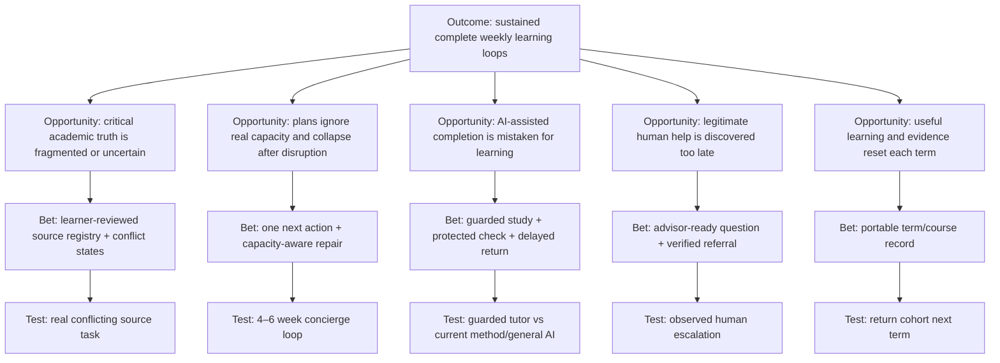
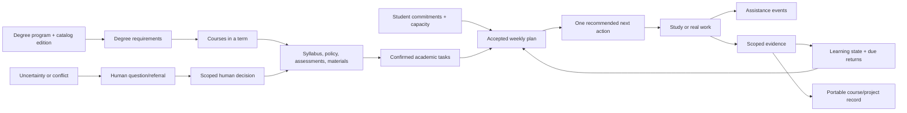
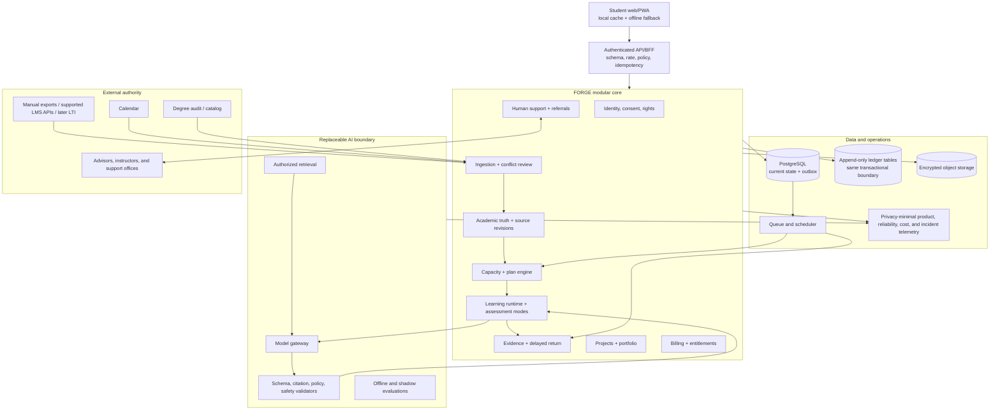

# FORGE University-First Product Rebase

## Research, strategy, requirements, architecture, and evidence-gated execution plan

**Status:** decision proposal; not an implementation, release, efficacy result, or compliance claim

**Prepared:** 30 July 2026

**Research accessed:** 30 July 2026

**Checked-out repository:** `agent/forge-local-refoundation-snapshot` at `cd84e20f6f78d68a430666c185b00efa99c49a87`

**Accepted remote baseline inspected:** `origin/main` at `c4abe33bc5bc611a02eded4288e2a2949a2808f3`

**Long-term aim:** make high-quality learning, tutoring, mentoring, and capability development broadly accessible without replacing learner agency, human responsibility, or proof

**Immediate research scope:** university students, beginning with one provisional adult cohort and one semester-long operating-loop hypothesis

**Reading map:** [decision and current truth](#1-executive-decision) · [student and market evidence](#3-research-synthesis-what-university-students-need) · [product and architecture](#6-product-definition) · [roadmap and requirements](#12-phased-roadmap) · [risks, sources, and final decision](#18-risk-register)

**Research extension:** [Student Community, Astra AI, and AI-Era Learning Research](STUDENT_COMMUNITY_ASTRA_AI_AND_FUTURE_RESEARCH.md) expands the forum and review listening, Astra AI forensic, age-stage safety boundaries, and five-to-ten-year learning horizon. It sharpens this plan but does not authorize implementation beyond the evidence gates below.

---

## 1. Executive decision

The long-range product direction is:

> **A student-owned learning and degree-navigation system that distinguishes confirmed requirements from uncertainty, records what the student can actually demonstrate, proposes a well-supported next action, explains why, and knows when a human must take over.**

The product loop is:

```text
institution-verified, course-published, and learner-connected requirements
  → a capacity-aware weekly plan
  → active study and real work
  → assistance withdrawal
  → demonstrated learning
  → transparent replanning
  → human escalation where a consequential decision requires it
  → a durable, portable, non-official learning, decision, and evidence record
```

The initial one-course promise must be narrower:

> **Every week, choose a well-supported next action, understand why it matters, and check what you learned—while reducing avoidable requirement misses and keeping source coverage, freshness, conflicts, and uncertainty visible.**

A provisional public position to test is:

> **See what matters next. Learn it. Check it. Carry it forward.**

This is a deliberate gstack scope posture:

- **Reduce the market promise:** do not launch as an all-knowing AI for an entire degree.
- **Expand selectively beneath the surface:** build the truth, provenance, evidence, continuity, rights, and recovery foundations that a trustworthy degree product requires.
- **Retain the long-range architecture:** every useful semester should compound into a multi-year record rather than become an isolated planner or chat history.

### 1.1 Provisional first cohort

The first discovery and private-alpha cohort should be:

> **Students aged 18 or older in the first or second year of a computing-related degree at one or two universities, taking at least four concurrent modules and balancing at least eight weekly hours of paid work, commuting, care, or another fixed commitment.**

The alpha would import a shallow, learner-confirmed commitment/deadline view from all current modules so capacity decisions do not ignore the rest of the term. Deep material ingestion, study support, and learning evidence would operate for one selected course only. Coverage would remain explicit; an omitted course item could not be represented as “all requirements confirmed.”

This is not a claim that computing students have the greatest need. It is the most testable initial segment because:

- their courses are prerequisite-heavy and require both conceptual learning and inspectable artifacts;
- their week contains repeated planning, study, assignment, exam, and project decisions;
- the accepted FORGE code already has relevant AI-literacy, source-reasoning, proportional-reasoning, evidence, and Project Sprint primitives;
- adult-only recruitment avoids silently pretending the current system can operate a minor-safety service;
- the team can observe whether the wedge generalizes before entering domains such as medicine, nursing, law, finance, or immigration where bad advice has higher consequences.

The cohort must be changed if recruitment access, source access, or observed pain is weak. Market size alone must not choose it.

### 1.2 The product is not

FORGE should not become:

- a chatbot home screen;
- a generic “second brain” that asks students to maintain a knowledge-management system;
- an upload-to-summary, flashcard, quiz, or podcast bundle;
- an LMS replacement or a prettier deadline dashboard;
- an assignment-answer engine, essay ghostwriter, or answer marketplace;
- an autonomous scheduler that silently changes a student’s commitments;
- an AI friend, therapist, synthetic mentor, or engagement companion;
- a hidden employability, intelligence, risk, or mastery score;
- an automated source of final degree, visa, finance, disability, disciplinary, health, or career decisions;
- a product that optimizes messages, time in app, streaks, or dependency.

### 1.3 What “complete” means

There are four different completion claims. They must never be collapsed:

| Claim | Honest definition |
|---|---|
| **One-course continuity alpha** | One adult student can create a real term, enter shallow commitments from current modules, import and confirm one selected course, recover it on another device, export it, and delete it. |
| **Command Loop alpha** | The same student can receive an inspectable next action, do active study, record an unassisted result or honest non-result, and repair the week. |
| **Tutor alpha** | Bounded live AI passes task-specific groundedness, policy, fallback, cost, and protected-check gates for the selected course. |
| **One-course term product candidate** | A defined cohort uses the one-course-deep/all-course-shallow loop through a meaningful part of a semester; feasibility, recurring value, and predeclared safety signals are estimated. |
| **Multi-course degree companion candidate** | Deep multi-course and degree-rule continuity has its own source authority, advisor, reliability, and longitudinal evidence. This is when “degree navigator” language can be evaluated. |
| **Paid student product** | Real willingness to pay, transparent billing, support, unit economics, and equitable ownership/access pass their own gates. |
| **Institution-ready** | The product additionally passes institution-specific privacy, security, procurement, accessibility, integration, support, availability, contractual, and AI-classification review. |
| **Long-range learning platform** | The product demonstrates that the university loop can generalize to more subjects, institutions, life stages, and human roles without weakening its evidence or protection model. |

“Built,” “deployed,” “used,” “liked,” “retained,” “improved learning,” and “institution-ready” remain separate claims.

---

## 2. Repository audit: where FORGE actually is

### 2.1 The repository has several different truths

The working directory is a nested Git repository at `education/`. The checked-out snapshot is not the newest accepted remote baseline.

| State | Exact locator | What it means | Decision |
|---|---|---|---|
| Historical public release | Source `04eab426…`; see [CURRENT_RELEASE.md](../operations/CURRENT_RELEASE.md) | An older public tuple. Its release record is `DEPLOYMENT_BLOCKED`, including unresolved provider/Git provenance. | Do not describe it as the current refoundation or university product. |
| Checked-out refoundation snapshot | `cd84e20f6f78d68a430666c185b00efa99c49a87` | The broad local learning-system refoundation plus a preserved evidence package. It is not deployed. | Preserve its unique documentation and evidence. Do not build a new product directly on this branch without reconciling upstream. |
| Accepted remote baseline | `origin/main@c4abe33bc5bc611a02eded4288e2a2949a2808f3` | Integrates the refoundation and the accepted browser-local Project Sprint slice. It is five commits ahead and three commits apart from the checked-out branch. | Use as the implementation base after an explicit integration inventory. |
| Experimental sprint-PMF line | `origin/codex/forge-sprint-pmf@7a5c249…` | A substantial product-reset experiment. Its direct tree differs from `origin/main` across 235 files, with more than 31,000 deletions; it is 24 commits ahead and five commits behind relative to their merge base. | Mine it for hypotheses, copy, and interaction ideas. Do not merge or promote it wholesale. |

The next implementation must begin in an isolated worktree from the accepted SHA, with a file-by-file preservation map for checked-out-only evidence and decisions. A broad rebase or branch replacement would risk losing validated product boundaries.

### 2.2 What the current foundation really provides

The existing repository is unusually strong on learning integrity and unusually incomplete as a university product.

| Existing capability | Actual state | University value | Current limit |
|---|---|---|---|
| Goal intake and path proposal | Implemented with strict schemas and explicit learner acceptance | A useful starting contract for goals and recommendations | No degree, term, course, syllabus, assessment, timetable, or policy context |
| Four reviewed Learning Worlds | Force and Motion, Proportional Reasoning, Learning with AI, and Primary-source Reasoning | Demonstrates deterministic learning sequences and bounded evidence | Four Worlds are not curricular breadth |
| Assistance governance | Attempt, support, withdrawal, independent transfer, and scoped evidence | Core of trustworthy tutoring | Not connected to ordinary university materials or assignments |
| Device-local continuity | Resumable sessions and browser-local evidence | Preserves learner ownership and graceful fallback | No cross-device recovery, durable identity, backup, or sync |
| Typed event/evidence spine | Versioned journey, assistance, proof, access, and rights vocabulary | Strong basis for audit and longitudinal evidence | Browser screens do not all replay from a durable live journal |
| Staged Supabase model | Forced-RLS, immutable evidence, grants, rights requests, source and capability records | Strong data architecture starting point | Not connected to a live project or application identity |
| Provider boundary | Bounded schemas, mocked adapters, deterministic fallbacks | Good AI containment | Public provider use is structurally disabled; no live credential evaluation |
| Source governance | Reviewed, versioned source packages and claims | Essential for course-grounded tutoring | No live course ingestion, rights pipeline, or learner review flow |
| Project contracts and accepted Project Sprint | Seven-day browser-local project work and a self-declared Proof Lab on `origin/main` | Valuable artifact/project module | Not a degree or semester operating system; proof is local and self-declared |
| Authoring and pilot surfaces | Fail-closed | Honest operating boundary | No live author, reviewer, cohort, entitlement, or incident operation |

The governing architecture is still the right foundation: [FORGE Architecture](../FORGE_ARCHITECTURE.md) specifies a modular monolith, deterministic authority, typed events, reviewed sources, bounded model providers, append-only evidence, and graceful fallbacks. [FORGE Database Architecture](../FORGE_DATABASE.md) already separates capability evidence from a single mastery score and deliberately excludes raw-chat surveillance.

### 2.3 What is not present

A static audit found no first-class university implementation for:

- a degree program, catalog year, academic term, or credit requirement;
- course enrollment, prerequisite, corequisite, substitution, or availability;
- syllabus versions, course policies, lectures, labs, seminars, readings, or attendance;
- assessments, rubrics, exams, grade boundaries, or academic-integrity modes;
- verified or course-published deadlines and calendars;
- student notes, questions, annotations, citations, or cross-course concept relationships;
- a capacity model including paid work, commute, care, disability, health, or energy constraints;
- professor, teaching-assistant, advisor, disability-service, careers-service, or student-support referrals;
- internships, placements, societies, projects, networks, and portfolio-to-career continuity;
- live identity, durable sync, backup, restoration, provider operations, payments, or student support.

The current product’s normative adult V1 is also institution-independent. [PRODUCT_REFOUNDATION.md](PRODUCT_REFOUNDATION.md) describes a learner who wants structure without enrolling in a full institution, and its narrow operational path is not a university-semester journey. This plan therefore proposes a product rebase and a new ADR, not a collection of features added to the current shell.

### 2.4 Reusable foundations

Retain and extend:

1. learner acceptance before a proposal becomes active;
2. deterministic state, permissions, evidence conditions, and side effects;
3. exact source, policy, content, and model versions;
4. explicit uncertainty and unavailable states;
5. assistance as provenance rather than shame;
6. a protected check after instructional help leaves, labeled by authority and conditions;
7. narrow claims and contradiction-preserving evidence;
8. learner-visible export, correction, revocation, and deletion;
9. a modular monolith until measured isolation or scale justifies separation;
10. authored and offline fallbacks when models, networks, or sources fail;
11. no persistent AI persona, streak, leaderboard, hidden score, or engagement optimization;
12. Project Sprint as one practical-work module rather than a competing product identity.

### 2.5 Technical and product debt to resolve before expansion

The audit also found:

- parallel public catalogs with different status vocabularies;
- apparently inactive route/component implementations that encode competing product truths;
- more than 12,000 lines across major CSS files and four root global stylesheets;
- navigation centered on `Home / Paths / Explore / Projects / Evidence / Profile`, not a university journey;
- broad tests that include inactive or conditional surfaces;
- Chromium-only Playwright projects;
- no coverage threshold;
- documentation counts that have drifted across evaluation artifacts.

The checked-in execution board records 936 application tests, 13 evaluator tests, 14 targeted browser passes, a 53-asset scan, and a disposable-database pass for its named candidate. Those are historical local evidence, not tests rerun in this research turn and not proof of student value, live-provider behavior, deployment, or efficacy. The preserved capture package similarly proves local rendered behavior only.

---

## 3. Research synthesis: what university students need

### 3.1 Evidence discipline

This plan uses:

- official reports, standards, primary surveys, controlled studies, systematic reviews, and meta-analyses for factual claims;
- official product pages for current capability and price facts;
- vendor studies with explicit sponsorship and self-report limitations;
- Product Hunt, app-store reviews, Trustpilot, Reddit, and TrustMRR as qualitative discovery signals only.

Forum posts are evidence that a described journey or sentiment exists. They are not prevalence estimates. Vendor traction and outcome claims are not causal evidence unless an independent design supports that interpretation.

The repo-local [research ledger](../../.codex/research/forge-university-second-brain-2026-8ad330c7.json) contains 40 dated source claims, answers all six research questions, and validates as `RESEARCH_READY`. That status means the research questions are documented; it does not mean the product hypotheses are proven.

### 3.2 Eight provisional jobs and risk hypotheses

The frequency and consequence labels below are planning hypotheses synthesized from external evidence. FORGE has not established their rank in its own target cohort. Phase −1 and Phase 1 must verify, reorder, split, or discard them.

| Student job | Provisional frequency | Provisional consequence if failed | Current workaround | Hypothesis to test |
|---|---:|---:|---|---|
| Know which requirements, courses, and decisions keep the degree valid | Termly with high-stakes exceptions | Very high | Catalog, degree audit, advisor, spreadsheets, peers | A versioned degree graph with source classes, alternatives, uncertainty, conflicts, and advisor confirmation |
| Know what changed and what matters next | Daily/weekly | High | LMS, email, calendar, group chat, memory | A single change/priority surface with source links, timestamps, conflicts, and sync health |
| Make a realistic plan and recover when life disrupts it | Weekly/daily | High | Planner, calendar, Notion, mental rescheduling | Capacity-aware plans, buffers, effort ranges, explainable repair proposals, and accept/edit/reject |
| Turn lectures, readings, and materials into understanding | Daily | High | Notes, videos, summaries, ChatGPT, flashcards | Preview, active capture, explanation, retrieval, misconception repair, and delayed return |
| Execute assignments and exams without losing learning or integrity | Weekly/termly | Very high | Rubric, generic task lists, AI chats, late help | Brief/rubric decomposition, assignment-specific AI policy, provenance, critique, revision, and teach-back |
| Know what is actually learned rather than merely completed | Weekly | High | Grades, practice scores, confidence, flashcards | Retrieval, explanation, transfer, delayed checks, confidence calibration, and bounded evidence |
| Find legitimate human help before a problem becomes a crisis | Episodic | Very high | Search, peers, advisor, disability office, tutor | Named, verified support routes and advisor-ready questions; no synthetic relationship |
| Turn degree work into experience, evidence, and future options | Monthly/termly | High | Careers site, societies, internships, portfolio tools | Projects, placement/network milestones, capability evidence, and a portable portfolio |

### 3.3 Degree planning appears contextual, not merely a recommendation list

A qualitative case study of [78 students and 33 advisors in one US community-college system](https://eric.ed.gov/?id=EJ1435729) found tension between students wanting direct answers and advisors emphasizing goals, work, family, transportation, and personal circumstances. This suggests testing scenario comparison rather than assuming a single “optimal” answer, but it does not establish a universal requirement for the initial computing cohort.

Every degree recommendation must expose:

- the catalog year and official rule;
- prerequisites, corequisites, credit and availability assumptions;
- the student constraints used;
- rejected alternatives and the reason;
- conflicts or missing facts;
- whether it is institution-verified, course-grounded, student-entered, or inferred;
- the named office or person who must confirm a consequential exception.

### 3.4 Usable capacity may differ materially from ideal plans

The [2026 Student Academic Experience Survey](https://www.hepi.ac.uk/reports/the-student-academic-experience-survey-2026/) covers 10,065 full-time UK undergraduates. It reports that 65% had paid work during term, independent study averaged 11.1 hours a week, and working students’ combined commitments averaged 44.2 hours. These self-reported UK figures will not generalize identically to every market. They show why FORGE should test whether credit hours and ideal weeks underrepresent usable capacity.

The capacity model must include:

- fixed timetable and deadlines;
- paid work, commute, care, worship, sport, placements, and other commitments;
- effort ranges rather than one false estimate;
- energy or accessibility constraints entered voluntarily;
- buffers for uncertainty and recovery;
- low-energy alternatives;
- explicit overload warnings without moral judgment.

### 3.5 Fragmentation is a plausible repeated pain, but aggregation can create dangerous false authority

A Pathify/College Pulse vendor-sponsored 2025 survey of [1,010 US students](https://www.educause.edu/about/corporate-participation/member-press-releases/new-survey-finds-fragmented-digital-systems-are-eroding-student-success) reported that 57% experienced stress from campus digital systems at least sometimes, 47% had missed a critical deadline, and 75% preferred a centralized platform. These are vendor-sponsored self-reports, not independent prevalence estimates. Low-confidence forum examples—such as an [adaptive-planner discussion](https://www.reddit.com/r/UniAdelaide/comments/1sacgfl/building_an_adaptive_study_planner_for_student/)—surface similar journey failures.

The answer is not to flatten every source into one AI memory. FORGE must retain:

- original source and exact link;
- imported-at and effective-at time;
- source revision or content hash;
- confidence and status;
- duplicate and conflict relationships;
- learner confirmation or correction;
- “stale,” “upstream unavailable,” and “requires human confirmation” states.

### 3.6 Planning maintenance and task initiation are separate problems

Student discussions show two precise failure modes:

- a missed study block creates enough manual replanning that the planner is abandoned;
- an overloaded student may understand the assignment yet still be unable to start the first useful action.

These are anecdotal signals, not prevalence claims. They still imply two distinct product modes:

1. **repair the plan:** explain what changed, propose the smallest safe reallocation, and show consequences;
2. **recovery action:** hide planning detail and offer one useful 5–20 minute move, plus legitimate institutional options such as tutor contact or an extension process.

The system must never diagnose ADHD or treat executive-function friction as laziness.

### 3.7 Learning evidence favors retrieval, spacing, transfer, and calibration

The evidence base supports several design hypotheses:

- A [meta-analysis of 29 studies](https://eric.ed.gov/?id=EJ1310148) found a substantial benefit for spaced retrieval over massed practice.
- A [2025 university experiment](https://www.nature.com/articles/s41539-025-00322-5) in one introductory programming course found that an intervention, which included a grade incentive, increased distinct practice days and improved exam performance.
- A [classroom meta-analysis](https://pubmed.ncbi.nlm.nih.gov/40564553/) found a moderate distributed-practice benefit across more than 3,000 learners.
- A [health-professions systematic review](https://pubmed.ncbi.nlm.nih.gov/37615780/) found benefits in a majority of eligible retrieval/distributed-practice experiments.
- A randomized [active-learning study](https://doi.org/10.1073/pnas.1821936116) involved 149 introductory-physics students, two class meetings, and immediate testing; students learned more while feeling they learned less.
- A small, single-session biology [metacognitive-feedback study](https://www.nature.com/articles/s41539-025-00311-8) reported improved retention, transfer, and confidence-correctness sensitivity at one university, but needs replication.

The spaced and retrieval evidence spans varied settings and does not prove semester efficacy for FORGE. It is strong enough to justify testing what a student can retrieve, explain, apply, and retain rather than treating generated notes, task completion, time spent, conversation length, or confidence alone as learning.

### 3.8 AI tutoring can help and harm

Two studies define the central design tension:

- A [2025 undergraduate physics crossover RCT](https://www.nature.com/articles/s41598-025-97652-6) with 194 eligible students covered two introductory-physics lessons and found that a purpose-built, pedagogy-informed AI tutor produced higher immediate post-test performance in less time than an active-learning class session. It did not prove delayed retention, broad transfer, or full-course efficacy.
- A [2025 PNAS randomized study](https://doi.org/10.1073/pnas.2422633122) with nearly 1,000 Turkish high-school mathematics students using a 2023-era GPT system found unrestricted assistance improved practice while harming later unassisted performance. A guardrailed tutor neutralized the later penalty but did not create a positive unassisted effect. Applying that mechanism to university learning is an inference requiring direct testing.

The supported intervention is not “add chat.” It is:

```text
student attempt
  → course-grounded question or attention cue
  → graduated hint
  → explanation only when allowed
  → student explain-back
  → unfamiliar or changed case without instructional help
  → delayed return
```

Accessibility remains available in protected work. Instructional assistance does not.

### 3.9 AI use is normal, but rules and effects remain contested

The sponsored, self-reported [HEPI Student Generative AI Survey 2026](https://www.hepi.ac.uk/reports/student-generative-ai-survey-2026/) surveyed 1,054 UK full-time undergraduates:

- 95% reported using AI in at least one way;
- 94% reported generative-AI use for assessed work;
- 12% reported directly including AI-generated text;
- 49% said AI improved their student experience;
- students also raised fairness, skill erosion, isolation, privacy, hallucination, employment, and cost concerns;
- 38% reported institution-provided AI tools and 37% agreed their institution encouraged AI use.

A separate study covering [95,513 students at 20 US public research universities](https://cshe.berkeley.edu/news/study-finds-widespread-generative-ai-use-among-college-students-signaling-urgent-need) used indirect questioning about the 2023–24 academic year and reports substantial disciplinary variation. It is large, but it is not a current global prevalence estimate.

FORGE needs institution-, course-, and assignment-specific policy cards:

- exact policy source and effective date;
- `allowed`, `ask`, `practice-only`, or `forbidden` modes;
- what the student must disclose;
- citation and provenance expectations;
- which evidence or revision history the student can export;
- no AI-detector verdict and no presumption of misconduct.

### 3.10 Accessibility, wellbeing, and human support are core product boundaries

The [EDUCAUSE accessibility analysis](https://www.educause.edu/ecar/research-publications/2023/students-and-technology-report-flexibility-choice-and-equity-in-the-student-experience/accessibility-in-teaching-and-learning), based on 1,951 respondents at ten US institutions, reports different modality preferences and lower technology satisfaction across several disability groups. A [US GAO report](https://www.gao.gov/products/gao-24-105614) documents barriers in awareness, self-advocacy, accommodations, and faculty response. These support testing accessible defaults that do not require diagnosis disclosure.

The [2024–25 Healthy Minds national report](https://healthymindsnetwork.org/wp-content/uploads/2025/09/2024-2025_HMS-National-Data-Report_Student.pdf) covers 84,735 adult students at 135 US institutions, but participating institutions were non-probability selected and the response rate was about 8%; its screening measures are not clinical diagnoses. [Gallup and Lumina’s 2026 report](https://www.gallup.com/file/analytics/709325/Lumina_Foundation-Gallup-State_of_Higher_of_Higher_Education_2026_Report.pdf) reports that one in three US enrolled adults across several postsecondary pathways considered stopping in the prior six months, with emotional stress, mental health, and cost prominent.

FORGE must provide:

- humane pacing and low-shame recovery;
- private, opt-in support preferences;
- verified campus/community help routes;
- an advisor-ready summary or question the student controls;
- persistent, user-invoked access to current verified support and emergency resources;
- no automatic crisis-language monitoring in alpha;
- no diagnosis, therapy, synthetic friendship, emotional-state profile, or promise of reciprocal care.

### 3.11 Career development should accumulate from year one

An official [2026 Office for Students study](https://www.officeforstudents.org.uk/publications/preparing-for-the-next-steps-after-higher-education-student-insight-report/) surveyed 1,671 recent graduates in England. Only half subjectively felt prepared for the next step; prominent barriers included finances, relevant experience, and professional networks. Associations with placements or connections are not causal. Building career continuity from year one is therefore a product hypothesis, not a demonstrated consequence of the survey.

The degree record should therefore preserve:

- capabilities connected to course and project evidence;
- projects, research, placements, societies, and contributions;
- feedback, revisions, and bounded self-reflection;
- network and mentor actions chosen by the student;
- a portable evidence portfolio;
- current, sourced career information with uncertainty.

It must not produce an opaque employability score or treat career suggestions as professional guarantees.

### 3.12 International and executive-function needs require direct discovery

International students may face unfamiliar academic terminology, assessment norms, language demands, local systems, finance, immigration, and visa questions. FORGE should test:

- plain-language explanation of local academic terms;
- multilingual comprehension without treating a translation as new authority;
- source-visible orientation to course and university processes;
- culturally legible onboarding and support routes;
- current human referrals for finance, immigration, and visa matters.

FORGE must never act as legal or immigration authority. Any future benchmark such as the commercial International Student Barometer is useful for discovery, not representative causal proof.

A 2026 qualitative [ADHD co-design preprint](https://arxiv.org/abs/2602.09381) with 20 diagnosed university students and five experts surfaces fragmentation, time calibration, decomposition, reflective execution, and dependence risks. It is exploratory evidence only. Default task visibility, realistic estimation, small recovery moves, and declining support should be tested without diagnosis, screening, or an ADHD profile.

### 3.13 Important workflow hypotheses remain under-evidenced

The current evidence does not yet justify strong requirements for:

- lecture capture and note-taking modality;
- rubric decomposition;
- automatic replanning;
- source-authority comprehension;
- human-referral success;
- multi-year portability;
- pricing;
- the computing-degree wedge;
- the best balance of peer, instructor, advisor, society, and campus-community pathways.

These belong in Phase −1 and Phase 1 experiments. The plan should preserve them as candidate opportunities, not use their presence to pre-approve a platform.

---

## 4. Market and competitor analysis

### 4.1 Category map

The university tool market is already split across:

| Category | Representative products | Job handled | Structural gap |
|---|---|---|---|
| General and course-grounded AI tutoring | ChatGPT Study Mode, AskSia, StudyFetch, Khanmigo | Explanations, questions, generated practice | Weak institution-verified degree truth, protected-check authority, escalation, and durable student-owned continuity |
| Source-grounded notebooks and research | NotebookLM, Perplexity Education Pro | Citation-backed answers and document synthesis | Document/session centered rather than degree-execution centered |
| Retention and study artifacts | Anki, RemNote, Quizlet, Knowt | Flashcards, recall, quizzes, notes | Setup burden or shallow evidence; weak degree and capacity context |
| Academic planning | MyStudyLife, Motion, Todoist, Notion | Calendar, tasks, rescheduling, custom systems | Manual academic modeling, opaque replanning, or maintenance burden |
| Institutional delivery | Canvas, Blackboard, Moodle, Brightspace | Course content, assignments, grades, announcements | Instructor/institution centered; fragmented and not a student-owned learning record |
| Institutional degree and advising | Stellic, DegreeWorks, Navigate360, Ellucian Student Success | Degree audit, pathways, planning, alerts, advising, appointments | Institution-bought and formal; limited protected learning and student portability |
| Unified student portals | Pathify and institution-specific portals | Tasks, alerts, search, groups, SIS/LMS/productivity integrations | Centralization and delivery do not by themselves establish source completeness, learning, or learner-owned continuity |
| Answers and documents | Chegg, Course Hero, StuDocu | Solutions, tutors, course artifacts | Accuracy, copyright, billing, and academic-integrity tension |
| Lecture and access support | Genio Notes | Capture, captions, outlines, accommodations | Often lecture-local and institution-access dependent |

### 4.2 Three closest comparator classes change the strategy

[AskSia](https://www.asksia.ai/) currently claims:

- Canvas, Blackboard, Brightspace, and other LMS connections;
- course-grounded tutoring with citations;
- notes, quizzes, flashcards, mock exams, and lecture capture;
- a knowledge graph and cross-course connections;
- weak-spot detection and proactive planning.

Its vendor-reported reach and outcomes are not independently established. Its [2026 research page](https://www.asksia.ai/research) describes 800 active students and 200,000 conversations, but the reported academic outcomes are compensated, self-reported perceptions and objective institutional pilots are still described as pending.

AskSia also exposes a concrete trust opening. A current [data-storage help article](https://www.asksia.ai/help/what-data-does-asksia-store) says it never trains on student materials, while its still-live [September 2023 Privacy Policy](https://www.asksia.ai/policies/privacy) says content may be used to improve services, including training models. FORGE should not exploit this as marketing theater; it should use it as a design requirement for one consistent, versioned, technically enforced data promise.

The implication is decisive:

> **LMS import, course-grounded chat, a knowledge graph, weak-spot detection, and proactive scheduling are not sufficient differentiation.**

Two institution-facing classes overlap other parts of the thesis:

- [Stellic](https://www.stellic.com/resources/higher-ed-buyers-guide-to-student-success-software) and [EAB Navigate360](https://eab.com/solutions/navigate360/) market student-facing degree planning, pathways, advising, alerts, and staff coordination.
- [Pathify](https://pathify.com/portal/) markets a consolidated portal spanning tasks, notifications, search, groups, and SIS/LMS/productivity integrations.

These vendor pages establish marketed comparator scope, not independent adoption or outcome evidence. No reviewed source demonstrates that these products supply FORGE’s guarded learning and named-condition protected-check loop, but they prevent the plan from treating degree authority, reconciliation, or human routing as uncontested white space.

The three mandatory substitution classes are therefore:

1. Astra/AskSia/generic AI for course learning;
2. Stellic/EAB/DegreeWorks for degree and advising authority;
3. Pathify/LMS + calendar for reconciliation and delivery.

### 4.3 Important product benchmarks

| Product | Current useful benchmark | What FORGE must learn |
|---|---|---|
| [ChatGPT Study Mode](https://help.openai.com/en/articles/11780217-study-mode) | Socratic prompts, layered explanations, knowledge checks, uploads, and personalization; official warning that it may err or give direct answers | Tutoring chat is a commodity; degree state and protected-check authority must live outside a conversation |
| [NotebookLM](https://blog.google/innovation-and-ai/models-and-research/google-labs/notebooklm-student-features/) | Source-grounded study guides, flashcards, quizzes, and citations | Grounded transformation is table stakes; organization, action, longitudinal state, and evidence remain open |
| [Khanmigo](https://support.khanacademy.org/hc/en-us/articles/25921448458893-What-features-are-available-in-the-Learner-Parent-and-Teacher-Khanmigo-subscription-plans) | Low-cost structured tutor connected to Khan Academy content | The learning sequence and history matter more than a blank assistant |
| [Anki](https://apps.ankiweb.net/) | Durable, customizable spaced repetition with offline ownership | Keep the learning value while hiding scheduling and card-maintenance burden |
| [RemNote](https://www.remnote.com/pricing) | Notes, flashcards, exam scheduling, and AI in one system | Integration is valuable; exposing knowledge-management complexity is not |
| [StudyFetch](https://www.studyfetch.com/?dontredirect=true) and [Quizlet](https://quizlet.com/upgrade?source=footer) | Broad study-format bundles | Generated study formats are utilities, not a durable product thesis |
| [MyStudyLife](https://mystudylife.com/) | Student-specific timetable, task, exam, reminder, and grade workflows | Academic objects matter; silent or stale deadline imports are unacceptable |
| [Motion](https://www.usemotion.com/pricing) | Adaptive task and calendar scheduling | Replanning must be transparent, editable, and driven by learning and authority state |
| [Notion Education](https://www.notion.com/help/notion-for-education) | Flexible student workspace with a strong free substitute | FORGE must arrive useful from real course state, not require workspace design |
| [Perplexity Education Pro](https://www.perplexity.ai/help-center/en/articles/12590157-what-is-education-pro) | Student-priced research and learning modes | Research belongs in the loop but cannot be the whole paid proposition |

### 4.4 Product Hunt and TrustMRR

Product Hunt inspection shows a saturated stream of content-transformation and planning launches: Turbo AI, Knowt, NotebookLM add-ons, Open Notebook, Overly, NotionFlashcard, Planana, and Planori. Launch comments commonly ask how a product differs from ChatGPT, or request import, export, synchronization, and organization. These are early-positioning signals, not proof of retention or product-market fit.

[TrustMRR](https://trustmrr.com/) did not surface a credible, directly comparable full-stack university degree companion. The inspected education listings were tiny or materially different. That negative result does **not** prove an open market; it only means TrustMRR cannot validate the thesis, pricing, retention, or TAM.

### 4.5 Candidate white space to falsify

FORGE can be meaningfully different only if it combines the following **and** students repeatedly choose the result over the three substitution classes:

1. **An authority-aware truth model**

   Institution rules, course facts, student intentions, AI inferences, human decisions, and demonstrated evidence are visibly different objects.

2. **Learning-quality evidence**

   Plans react to retrieval, explanation, transfer, delay, confidence calibration, and assistance—not clicks or generated content.

3. **Permissioned adaptation**

   Every important recommendation explains why, cites its inputs, shows consequences, and supports accept, edit, reject, undo, and history.

4. **Multi-year student ownership**

   Course state, misconceptions, strategies, decisions, projects, advisor exceptions, and portable evidence accumulate across terms.

5. **Human escalation and institutional humility**

   The system drafts good questions and routes the student to the right office; it does not fabricate authority.

6. **Trustworthy operations**

   Data promises, billing, limits, retention, export, deletion, source rights, incident response, and provider behavior match across product, policy, and code.

The absence of a sampled product that validates the entire combination is not demand proof. The combination may be absent because setup is intolerable, student demand is too weak, institutional data access is uneconomic, or support and liability overwhelm willingness to pay. Phase −1 and Phase 1 must try to prove those inverse hypotheses.

### 4.6 Monetization hypothesis, not a price decision

Current student anchors range from free substitutes to roughly:

- $4/month for Khanmigo’s US learner plan;
- about $3–$4/month annualized for Quizlet;
- about $30/year for MyStudyLife;
- $60/year for Todoist Pro;
- $96/year for RemNote Pro or StudyFetch’s annual plan;
- $10/month for Perplexity Education Pro;
- substantially more for AI-heavy or professional planning tiers.

Students also complain about stacking overlapping subscriptions. These prices are category anchors, not willingness-to-pay evidence for FORGE. The first packaging hypothesis to test is:

| Tier | Hypothesis |
|---|---|
| **Equitable core** | One active course or limited term, source-visible learner-confirmed commitments, basic capacity planning, essential accessibility, integrity record, ownership, retention, export, and deletion |
| **Student Plus** | Expanded compute, supported connectors, automation, multi-course capacity, and higher bounded AI use; never ownership or export of the student’s own record |
| **Institution-sponsored** | Only after objective learner evidence, privacy/security review, accessibility, support operations, and integration reliability; this is a separate product and sales motion |

Every paid test should include semester pause, visible usage limits, renewal reminders, easy cancellation, prorated or fair refund handling, and no hidden trial conversion. No advertising, data sale, or model training on student material should subsidize the price.

---

## 5. gstack challenge: choose the right product before building it

The planning process was checked against gstack at pinned commit [`a325940…`](https://github.com/garrytan/gstack/blob/a3259400a366593e0c909dd9ac3e59752efd2488/README.md).

Its practical operating sequence is:

```text
Think → Plan → Build → Review → Test → Ship → Reflect
```

The relevant reviews are [Office Hours](https://github.com/garrytan/gstack/blob/a3259400a366593e0c909dd9ac3e59752efd2488/office-hours/SKILL.md), [CEO review](https://github.com/garrytan/gstack/blob/a3259400a366593e0c909dd9ac3e59752efd2488/plan-ceo-review/SKILL.md), [engineering review](https://github.com/garrytan/gstack/blob/a3259400a366593e0c909dd9ac3e59752efd2488/plan-eng-review/SKILL.md), [design review](https://github.com/garrytan/gstack/blob/a3259400a366593e0c909dd9ac3e59752efd2488/plan-design-review/SKILL.md), specification, review, QA, shipping, and retrospective.

### 5.1 Nuclear scope challenge

The founder vision—support every person’s learning, tutoring, and mentoring—is a strong destination and a bad first backlog.

The unresolved demand questions are:

- Who has a repeated, consequential problem this semester?
- What stack do they already use, and what does maintaining it cost?
- Who would be genuinely upset if FORGE disappeared after four weeks?
- Which product behavior, not survey enthusiasm, would demonstrate that?
- What is the narrowest useful adoption a student can make this week?
- How does that wedge compound into the degree record rather than become a dead-end planner?

FORGE has not yet answered these questions with its own representative students or payment behavior. The plan therefore begins with observation and concierge operation, not scale development.

### 5.2 Three approaches

| Approach | Product | Advantages | Structural risk | Decision |
|---|---|---|---|---|
| **A. AI study suite** | Upload notes; get chat, summaries, flashcards, quizzes, and a planner | Fastest to explain and prototype | Directly crowded by ChatGPT, NotebookLM, AskSia, StudyFetch, Quizlet, and others; weak moat and learning proof | **Reject as the thesis.** These may become bounded utilities. |
| **B. Semester Command Loop** | Show the connected, learner-reviewed commitment state for one term, make a transparent weekly plan, move into active study, record a named-condition protected-check result, repair the plan, and escalate uncertainty | Repeated weekly value; testable in one term; reuses FORGE evidence principles; can compound into degree continuity | Requires source coverage, ingestion, identity, and operational quality before it feels trustworthy | **Recommend as the direction to falsify first.** |
| **C. Institution-first Degree OS** | Integrate degree audit, SIS, LMS, advising, learning analytics, portfolios, and institutional support from the start | Closest to the long-range dream and strongest access to institution-verified sources | Long procurement, heavy compliance/integration/support burden, premature admin product, and weak direct student validation | **Design for, defer building.** |

The accepted browser-local Project Sprint is a useful lateral module inside Approach B. It gives a student a seven-day artifact/proof path. It should become the “real work” branch of a course or term, not replace degree and learning continuity as the product center.

Phase −1 and Phase 1 must test two substantial products separately and together:

- connected-source coverage, planning, and recovery;
- guarded learning, independent checks, and delayed return.

The initial product may enter through either one if coupling them increases setup or weakens the visible advantage.

### 5.3 The 10× test

FORGE will not be 10× better because its answers are more fluent.

Its meaningful 10× hypotheses are:

- ten times less uncertainty about a deadline or rule's source class, freshness, coverage, and conflicts;
- a material reduction in weekly planning-maintenance time;
- recovery from disruption in minutes rather than abandoning the plan;
- evidence of learning that remains after AI leaves;
- one portable record across terms instead of restarting in each tool;
- faster connection to the correct human when software lacks authority.

These are hypotheses to measure, not present achievements.

The mandatory substitution question is:

> **Why would a student switch from AskSia, or from ChatGPT Study Mode + calendar + advisor, for the same real week?**

Compare setup time, time to useful action, source coverage and error detection, recovery burden, delayed unassisted learning, perceived control, and realized willingness to switch or pay. Stop if FORGE is only more rigorous while materially harder to use.

### 5.4 Future fit

The semester wedge compounds:

```text
one confirmed course
  → one trusted weekly loop
  → several courses in one term
  → cross-course concept and capacity relationships
  → catalog-year and degree requirement continuity
  → projects, placements, networks, and portable evidence
  → institution-sponsored access
  → adaptation to other life stages and learning contexts
```

The wedge fails future fit if its data is trapped in chat transcripts, flat tasks, generated notes, or an institution-owned profile the student cannot export.

### 5.5 Opportunity Solution Tree

The measurable product outcome is:

> **A defined adult student cohort repeatedly completes the connected-source review → chosen action → active learning → named-condition protected-check result → repair/return loop, while predeclared truth-error, agency, accessibility, and learning-harm signals remain within tested decision limits.**



Each solution bet remains replaceable. The opportunity and outcome survive if a specific interface or model approach fails.

---

## 6. Product definition

### 6.1 North Star outcome

> A student can make the next sound academic decision, take the next useful learning action, and later demonstrate what remains when help is removed—without losing sight of connected requirements, unresolved coverage, or their own constraints.

The North Star is not “all student information in one place.” Aggregation is useful only when it improves decisions and learning.

### 6.2 Core jobs to be done

The first product should support these statements:

1. **When my university information is spread across systems, help me see what changed and what is truly required so I do not miss a consequential commitment.**

2. **When my week is overloaded or disrupted, help me choose and repair a realistic plan without making planning another job.**

3. **When I sit down to study, take me directly into an active learning move grounded in my actual course—not an empty chat box.**

4. **When I use AI, help me learn and document assistance rather than merely complete the task.**

5. **When I am unsure about a degree rule, assessment policy, accommodation, or other consequential issue, help me ask the right human with the right evidence.**

6. **When a term ends, let the useful learning, decisions, projects, and evidence remain mine and carry forward.**

### 6.3 Six connected loops

The complete university product consists of six connected loops:

1. **Degree strategy**

   Goals, constraints, requirements, alternatives, uncertainty, and advisor checkpoints.

2. **Semester execution**

   Timetable, deadlines, commitments, capacity, transparent prioritization, and recovery.

3. **Course understanding**

   Materials, questions, active notes, explanations, retrieval, misconceptions, and delayed return.

4. **Assessment and integrity**

   Brief/rubric interpretation, milestones, allowed assistance, feedback, revision, provenance, and teach-back.

5. **Growth and support**

   Capability evidence, confidence calibration, accessibility, legitimate accommodations, and human help.

6. **Future transition**

   Projects, placements, societies, mentors, networks, portfolios, and reasoned career options.

The first alpha implements a thin but real path through loops 2–5 for one course. Degree strategy and future transition begin as bounded records and human handoffs, then deepen only after the weekly loop works.

### 6.4 Product principles

1. **Truth before automation.** Imported facts retain source, time, authority, and conflict state.
2. **The learner decides.** Consequential recommendations are proposals with alternatives and undo.
3. **One useful action before organization.** The system should reduce setup and workspace maintenance.
4. **Learning before assisted completion.** Productive effort, transfer, and delayed retrieval outrank fluency.
5. **AI is bounded infrastructure.** It does not own state, permissions, evidence, deadlines, or institutional facts.
6. **Human authority remains visible.** Software knows when it must produce a question or referral rather than an answer.
7. **Evidence is scoped.** One performance under named conditions is never a permanent trait or broad mastery claim.
8. **Support should withdraw.** The product should make the learner less dependent over time.
9. **Accessibility is a default.** Good modes do not depend on disclosing a disability.
10. **Ownership survives graduation.** Export and portability are core product behavior.
11. **Negative results are useful.** Confusion, failed transfer, rejected advice, and uncertainty remain inspectable.
12. **No engagement theater.** No streaks, fake urgency, guilt, ranking, or anthropomorphic attachment.

---

## 7. Conceptual model and authority system

This is a research appendix and conceptual product model, not an instruction to create tables. Only the thin one-course objects may become reviewed contracts after the Phase 1 demand gate. Existing FORGE vocabulary must be extended or migrated rather than duplicated.

### 7.1 Authority classes

Every consequential datum belongs to one visible class:

| Class | Examples | Who can create or confirm it | Product behavior |
|---|---|---|---|
| **Institution-verified** | Degree requirement, catalog rule, enrollment, official deadline, published policy | Direct authenticated institution authority or a named accountable institutional review | Highest displayed authority; retain catalog year, revision, source, effective date, and verified-at time; surface conflicts rather than overwrite |
| **Course-published** | Syllabus item, instructor announcement, lecture material, rubric, assignment policy | Direct authenticated course/LMS source or named instructor/course-team review | Cite exact source and revision; distinguish course material from institution policy |
| **Learner-connected source copy** | Uploaded syllabus, exported LMS calendar, screenshot, forwarded announcement | Student supplies the copy and confirms that extraction matches it | Preserve provenance and coverage limits; confirmation proves transcription/extraction, not current institutional authenticity or completeness |
| **Human decision** | Advisor-approved substitution, extension, disability accommodation, instructor clarification | Named authorized person or office; student may record it | Preserve date, scope, evidence, expiry, and “student-recorded/unverified” status until confirmed |
| **Student-entered** | Goals, available time, work schedule, preferences, private notes, chosen plan | Student | Treated as current intent or constraint, never as objective fact about ability |
| **AI or parser inference** | Extracted candidate deadline, concept relationship, estimated effort, suggested plan | Bounded model or deterministic parser | Always labeled as a proposal with source spans, calibrated reliability signal, rationale, and accept/edit/reject |
| **System-derived evidence** | Completed attempt, assistance provenance, retrieval result, delayed return | Deterministic runtime or governed evaluator | Names exact conditions and what remains untested; cannot silently become an institutional grade |

The product must never render these classes with the same visual or semantic authority.

A protected-check record proves only the conditions FORGE can actually enforce. It must export an evidence-authority class such as `honour_based`, `server_enforced`, or `human_observed`, name whether FORGE assistance was withheld, and avoid implying authorship or the absence of outside help unless a defensible observer or controlled environment establishes that narrower claim.

Source authenticity, extraction accuracy, learner confirmation, coverage completeness, freshness, and conflict state are separate dimensions. A student checking “this date was copied correctly” must not upgrade an incomplete PDF to “current institution-verified truth.” Reliability labels must come from tested source coverage and validator performance, not a model’s self-reported confidence.

### 7.2 Reuse-first mapping

Before any schema or TypeScript contract is approved, map the candidate concept to existing FORGE authority:

| Existing FORGE object or boundary | Candidate extension | Rule |
|---|---|---|
| `profiles`, `learner_profiles` | Adult student preferences and account continuity | Extend; do not create a parallel profile |
| `consent_records`, `learner_access_grants`, revocations | Data purposes, human access, research participation | Preserve append-only, scoped, visible authority |
| `data_subject_requests` | Export, correction, restriction, deletion | Use the existing audited rights workflow |
| `learning_programs`, `learning_goals` | Term, selected course, and learner goal | Decide through ADR whether these are specializations or linked new objects |
| `source_packages`, `source_items`, `source_claims` | Global reviewed-source authority and a controlled link from learner-scoped imports | Reuse the authority vocabulary and registry relationship, but do not store private learner copies in these tables unchanged |
| `capability_definitions`, `capability_contracts`, world releases | Course capabilities and reviewed learning flows | Preserve versioned, reviewed publication and narrow claims |
| `learning_session_runs` and current study-session contracts | Course study session | Adapt to an exact course/source/policy binding |
| `assistance_events`, `evidence_events`, `proof_schedules` | Course help, independent check, delayed return | Preserve the existing event/evidence spine |
| `learner_capability_states` | Current scoped learning projection | Rebuild from evidence; never store a permanent trait |
| `learner_artifacts` and Project Sprint objects | Assignment/project artifacts and revisions | Import through a reviewed adapter; no evidence upgrade from browser data |
| Provider authority and cloud-auth boundaries | Adult entitlement and live bounded AI | Replace only through a new server-owned authority; no environment-only activation |

The first post-demand code slice should be a side-effect-free `CourseSourceCandidate`/conflict contract with manual or ICS input and an adapter into existing goal/path continuity. It must not activate cloud auth, a provider, an external connector, or live student data.

The current source tables model globally reviewed curriculum and allow broad reads of published packages; they have no learner owner or tenant boundary. A private syllabus, LMS export, screenshot, or forwarded announcement therefore requires a separate learner-scoped copy/revision/candidate boundary with owner/tenant RLS, rights and retention class, import visibility, deletion semantics, and a controlled link to any global authority record. “One source model” means one conceptual authority system, not reuse of globally published tables for private content.

### 7.3 Candidate conceptual vocabulary

Only `AcademicTerm`, a shallow `CourseCommitment`, the selected `Course`, a learner-connected `SourceRevision`, `CoursePolicyCandidate`, `AssessmentCandidate`, `DeadlineCandidate`, `SourceCoverage`, `SourceConflict`, and their review decisions belong to the first thin contract. The broader vocabulary below is a future-options map to prevent dead ends, not an approved ontology.

#### Identity, ownership, and rights

- `StudentAccount`
- `StudentProfile`
- `ConsentDecision`
- `DataGrant`
- `DataSubjectRequest`
- `Device`
- `ImportConnection`

#### Academic truth

- `Institution`
- `CatalogEdition`
- `DegreeProgram`
- `DegreeRequirement`
- `RequirementOption`
- `AcademicTerm`
- `Course`
- `CourseEnrollment`
- `CoursePolicy`
- `SyllabusRevision`
- `TeachingEvent`
- `Assessment`
- `Rubric`
- `Deadline`
- `OfficialSource`
- `SourceRevision`
- `SourceConflict`

#### Planning and execution

- `CalendarCommitment`
- `CapacityWindow`
- `EffortEstimate`
- `StudyTask`
- `Plan`
- `PlanRevision`
- `Recommendation`
- `RecommendationDecision`
- `ChangeEvent`

#### Learning

- `Capability`
- `ConceptRelationship`
- `LearningMaterial`
- `MaterialAnnotation`
- `KnowledgeArtifact`
- `Question`
- `StudySession`
- `Attempt`
- `AssistanceEvent`
- `EvidenceEvent`
- `ReturnSchedule`
- `CapabilityProjection`

#### Assessment, projects, and future transition

- `AssignmentWork`
- `Artifact`
- `ArtifactRevision`
- `Project`
- `Contribution`
- `FeedbackRecord`
- `PortfolioItem`
- `ExperienceOpportunity`
- `CareerGoal`

#### Human support

- `SupportOffice`
- `HumanContact`
- `Referral`
- `AdvisorQuestion`
- `AdvisorDecision`
- `AccommodationRecord`

### 7.4 Core relationships



### 7.5 Recommendation contract

Every meaningful recommendation should contain:

```json
{
  "recommendation_id": "rec_...",
  "student_visible_action": "Run a 20-minute closed-book retrieval on linked-list invariants",
  "reason_codes": [
    "exam_in_9_days",
    "prerequisite_for_tomorrow_lab",
    "last_attempt_low_confidence"
  ],
  "sources": [
    {
      "source_id": "syllabus-cs102-v3",
      "span": "Assessment schedule, page 4",
      "authority": "LEARNER_CONNECTED_SOURCE_COPY",
      "retrieved_at": "..."
    }
  ],
  "student_constraints_used": ["20_minutes_available", "low_energy_mode"],
  "estimated_effort": {"minutes_low": 15, "minutes_high": 25},
  "reliability_band": "CALIBRATED_MODERATE",
  "coverage_status": "CONNECTED_SOURCES_ONLY",
  "uncertainties": ["exam topic weighting is not published"],
  "alternatives": ["review lab errors", "ask TA about weighting"],
  "consequences_if_deferred": ["moves next return to Saturday"],
  "allowed_decisions": ["accept", "edit", "snooze", "reject"],
  "created_by": "DETERMINISTIC_POLICY_WITH_BOUNDED_AI_RANKING",
  "policy_version": "..."
}
```

Acceptance, edit, rejection, snooze, and later undo are events. Rejection is useful preference evidence; it must not reduce a hidden score.

### 7.6 Learning and assessment modes

| Mode | Purpose | AI and instructional help | Evidence meaning |
|---|---|---|---|
| **Explore** | Build orientation and questions | Broad source-grounded assistance within safety policy | No capability claim |
| **Learn** | Change a model or acquire a method | Questions, examples, explanation, comparison, and graduated hints | Assisted learning record |
| **Practice** | Strengthen retrieval and application | Attempt first; hints and worked support after meaningful effort | Practice evidence with assistance provenance |
| **Protected check** | Test what remains without teaching help | No instructional assistance; accessibility and permitted tools remain | Scoped independent evidence |
| **Restricted assessment** | Respect a live course assessment’s rules | Only policy, logistics, or explicitly permitted support; no task-content assistance where prohibited | No FORGE learning claim unless a separate allowed check exists |

The policy engine defaults to `Restricted assessment` when permission is absent or unresolved. Only a current course-published or institution-verified policy, or a named accountable human decision within scope, may relax that mode. A `CoursePolicyCandidate` and learner confirmation prove only the candidate transcription; they cannot authorize assistance. FORGE must not infer that an LMS item is open to AI assistance, and unresolved cases must remain restricted with a human-escalation route.

### 7.7 Capability evidence, not a mastery percentage

Useful learning state contains:

- capability and exact version;
- task family and representation;
- immediate or delayed condition;
- assistance used since commitment;
- accessibility accommodations that did not supply the answer;
- result and evaluator;
- confidence before feedback;
- contradicting evidence;
- transfer breadth;
- expiry or review date;
- what remains untested.

Grades, assignment completion, attendance, notes generated, time spent, and chat history may be contextual records. None independently proves capability.

---

## 8. Experience architecture

### 8.1 The emotional and functional experience

At **five seconds**, the student should see:

- what changed;
- the one recommended next action;
- why it matters;
- how long it is likely to take;
- whether its source is current.

At **five minutes**, the student should be doing real study or work, not arranging a dashboard.

At **five weeks**, the system should have:

- more accurate effort estimates;
- a useful pattern of accepted and rejected recommendations;
- source-grounded course state;
- learning evidence and due returns;
- fewer manual planning steps;
- a clear record of unresolved issues and human decisions.

At **five years**, the student should own:

- a portable, non-official learning, decision, and evidence record;
- projects and feedback;
- strategies that worked under named conditions;
- advisor decisions and exceptions;
- a portfolio of evidence rather than an archive of AI conversation.

### 8.2 Primary information architecture

The interface should be a calm workspace, not a card-grid dashboard. The long-range information architecture is broader than the alpha navigation.

| Surface | Primary purpose |
|---|---|
| **Today** | One next action, changes requiring review, due work, due returns, and capacity; this is the default |
| **Term** | Courses, connected-source commitments, coverage, conflicts, load, and the accepted weekly plan |
| **Course** | Course truth, materials, questions, assessments, policies, learning map, and source health |
| **Study** | A focused active-learning session; chat is a secondary tool inside a governed sequence |
| **Work** | Assignment or project decomposition, artifacts, critique, revision, provenance, and the existing Project Sprint path |
| **Evidence** | Protected checks with explicit authority/conditions, delayed returns, bounded capability records, project evidence, and export |
| **Degree** | Requirements, options, decisions, advisor checkpoints, and long-range scenarios; introduced gradually |
| **Support & settings** | Human referrals, accessibility preferences, integrations, privacy, export, deletion, billing, and status |

The alpha should expose only:

- **Today**
- **Course**
- **Study / Work**
- **More**

Term load, evidence, support, and settings appear contextually inside those surfaces. Degree and portfolio do not receive permanent navigation until repeated use proves their value. The full degree graph belongs in a later responsive detail surface, not a compressed home dashboard.

### 8.3 First-use journey

The first useful session should not ask the student to model an entire degree.

1. **Choose one deep course and one immediate outcome.**

2. **Enter the next seven days of fixed commitments from every current module.**

3. **Use a sample or temporary local preview before creating an account.**

4. **Create an adult-entitled account before real durable coursework is stored.**

5. **Import one selected-course syllabus/calendar or enter the essential facts manually.**

6. **Show deterministic/manual extraction candidates with exact source spans, coverage limits, and freshness.**

7. **Ask the student to confirm, correct, or reject transcription and policy candidates without implying institutional verification.**

8. **Capture available capacity and produce one explainable weekly plan.**

9. **Open the first useful action immediately.**

Target: a student reaches a real, grounded next action in less than 15 minutes during moderated alpha. That is a hypothesis to test, not a released SLA.

#### Alpha continuity capability matrix

| Mode | Storage and authority | Guarantees |
|---|---|---|
| **Sample/local preview** | Temporary device-local sample or learner file; no durable identity | No cross-device recovery, connector, background sync, or full backup; clear local deletion |
| **Private adult alpha account** | Server-owned adult entitlement and reviewed durable course record | Cross-device replay, export, deletion, backup/restore, support, and incident boundary for the pilot |
| **Full local-only product** | Future option | Not P0; must not be implied equivalent to cloud continuity |

### 8.4 Typical weekly journey

```text
Monday review
  → inspect source changes and conflicts
  → confirm capacity and critical commitments
  → accept or edit a weekly plan

Daily return
  → see one next action and rationale
  → study, work, or contact a human
  → capture only useful evidence and change

Disruption
  → show what moved and why
  → propose the smallest safe repair
  → accept, edit, reject, or choose recovery mode

End of week
  → run one unassisted or delayed check
  → compare confidence and performance
  → preserve questions and open risks
  → prepare next week
```

### 8.5 Assignment journey

1. Import the brief, rubric, deadline, and exact AI/integrity policy.
2. Separate confirmed requirements from ambiguous language.
3. Create milestones: interpret, research, outline, draft, critique, revise, submit, teach back.
4. Connect every research claim to a source.
5. Record assistance and student decisions without saving unnecessary raw prompts.
6. Require the student to revise and explain important choices.
7. Before submission, show policy compliance, missing citations, unresolved requirements, and source status.
8. After submission, schedule a short independent explain-back or application task.

FORGE may help create a learner-owned draft where allowed. It must never claim a grade, submit without explicit confirmation, fabricate a citation, or tell a student an integrity review will certainly accept the work.

### 8.6 Recovery journey

When a student is behind:

- state the situation without shame;
- identify the next irreversible deadline;
- show which work can be reduced, deferred, or questioned;
- offer one small useful action;
- show official extension, mitigation, tutor, advisor, disability, finance, or wellbeing routes where relevant;
- create a concise, editable message or advisor question;
- require the student to choose whether to send it;
- never contact anyone or change the official record autonomously.

### 8.7 Degree-decision journey

For a consequential choice:

1. Show the official rule and catalog edition.
2. Show known student goals and constraints used.
3. Compare two or more viable scenarios.
4. Show missing data and possible exceptions.
5. Label every inference.
6. Produce an advisor-ready question and evidence bundle.
7. Let the student record the human decision with scope and date.

No “AI says you should change majors” surface should exist.

---

## 9. Complete state and failure design

Every major flow must specify loading, empty, partial, stale, conflict, denied, upstream-error, recovery, success, and undo behavior.

| State | Required behavior |
|---|---|
| **No source connected** | Let the student enter a minimal course manually; explain what will remain unverified |
| **Source coverage unknown** | State exactly which connected sources and date range were inspected; never imply omitted upstream items do not exist |
| **Partial syllabus extraction** | Present extracted and missing fields separately; do not manufacture completion |
| **Partial pagination or sync** | Mark the import incomplete, exclude it from “review complete,” and show the unresolved page/range |
| **OCR or translation is plausible but wrong** | Keep source image/text side by side, label transformation, allow correction, and never upgrade authority |
| **Conflicting deadlines** | Show both sources, authority, timestamp, and consequences; require learner or human resolution |
| **Stale source** | Keep the last confirmed value with a visible stale marker; do not silently refresh authority |
| **Upstream may have changed but exposes no signal** | Show “freshness unknown,” last manual check, and a direct source link |
| **LMS/calendar access denied** | Preserve local data, explain the missing scope, and provide manual import; never loop on consent |
| **Connector revoked** | Stop sync, retain permitted student-owned records, show last successful sync, and offer deletion |
| **Upstream outage** | Use last confirmed read-only data, prevent risky writes, and show status and retry |
| **Time-zone, DST, or recurrence conflict** | Show both local and source time, recurrence rule, and affected events; require explicit resolution |
| **Course dropped, withdrawn, cross-listed, or renamed** | Preserve history, stop recommendations, and require an explicit course-status transition |
| **AI unavailable** | Continue deterministic plan, authored practice, manual source navigation, and local notes |
| **AI output fails schema or citation** | Discard it; show a neutral fallback or ask the student to inspect the source |
| **Provider/model change** | Run the release evaluation before enabling the new version; show material behavior or policy changes |
| **Source rights unclear** | Store metadata or learner-owned reference only; do not redistribute the content |
| **Assessment policy unknown** | Default to restricted assistance and create an instructor question |
| **Policy remains unknown before submission** | Keep content assistance restricted; show the source gap and student-controlled human route without inventing permission |
| **Capacity overload** | Show the conflict and options; never pretend every task fits |
| **No feasible plan fits an irreversible deadline** | Say no feasible plan exists, compare tradeoffs, and surface legitimate human options |
| **Recommendation rejected** | Preserve the reason if the student chooses to give one; offer an alternative without penalty |
| **Protected check interrupted** | Mark incomplete, not failed; allow a fresh version without reusing exposed instructional content |
| **Cross-device edit conflict** | Preserve both revisions, explain the conflict, and support explicit merge |
| **Account recovery compromise** | Revoke sessions/connectors, notify through reviewed channels, preserve audit, and enter incident recovery |
| **Notification delivery failure** | Never treat delivery as completion; show in-app status and retain the source commitment |
| **Support office is stale or unreachable** | Mark the route unverified, show last review date, and provide a general institution contact path |
| **Group assignment contains collaborator data** | Require purpose and permission, minimize collaborator content, and exclude it from personal learning profiles |
| **Payment or entitlement mismatch during active study** | Preserve work and export; show the account issue without locking the learner out of owned data |
| **Export requested** | Produce a readable package plus machine-readable manifest, source versions, and checksums |
| **Deletion requested** | Show scope and consequences, verify identity, complete an auditable rights workflow, and retain only legally necessary tombstones |
| **Student opens urgent support** | Show jurisdiction- and institution-verified emergency/campus resources and encourage immediate human contact; do not monitor ordinary free text or continue as a counselor |

These states belong in the product specification and test plan before implementation, not after bugs reveal them.

---

## 10. Technical architecture

### 10.1 Architecture decision

Retain a **modular Next.js monolith with workers, PostgreSQL, an append-only evidence/event ledger, object storage, and a bounded model gateway**.

The web/PWA cache, offline queue, and cross-device conflict behavior below are target architecture. The current app has browser-local continuity; it does not yet have a tested offline multi-device merge system.

The current legal event runtime accepts only `world_run` and `world_package` aggregates. Before promising replay, undo, or append-only audit for term, course, source, plan, or decision state, an ADR must choose one of two paths:

1. define additive aggregate/event families with schema versions, allowed writers, projectors, v1/v2 replay, rollback, and migration tests; or
2. use owner-scoped ordinary current-state tables and explicitly narrow replay, undo, and audit claims until that event authority exists.

No phase may imply that the existing event spine already supports university aggregates.

Do not begin with:

- microservices;
- an autonomous multi-agent mesh;
- direct model access to the database, LMS, email, calendar, or submission tools;
- a vector database as the canonical record;
- raw chat transcripts as longitudinal memory.

Split deployment only when measured scale, isolation, residency, or institutional contracts require it.

### 10.2 Logical system



PostgreSQL is the one transactional source of truth. Canonical event append, current-state projection update, and outbox insertion must commit in one reviewed transaction or RPC; the ledger box is a logical set of append-only tables, not a separately dual-written database. Object storage receives only controlled references whose database transaction can be reconciled.

The accepted browser-local Project Sprint store remains a proposal source until a reviewed adapter maps it into existing `Project`, artifact, event, and evidence authority. Import cannot upgrade self-declared browser data into verified evidence.

### 10.3 Deterministic authority

Deterministic code owns:

- identity, consent, access, sharing, and rights;
- source authority and conflict state;
- accepted deadlines and policy versions;
- plan activation, revision, and side effects;
- assessment mode and allowed assistance;
- evidence conditions and claim projection;
- whether a connector may read or write;
- export, deletion, billing, and notification rules.

AI may:

- extract candidate facts with source spans;
- classify or relate course material;
- propose effort ranges and plan alternatives;
- ask questions, explain, compare, generate practice, and critique within policy;
- summarize structured records for the student or a human they choose.

AI may not:

- invent or overwrite a fact from a higher-authority source class;
- activate a plan without learner action;
- unlock a protected-check record;
- decide an institutional exception;
- infer or diagnose mental health, disability, personality, motivation, or employability;
- contact humans or execute external writes without a separate, explicit confirmation boundary;
- turn its own output into learning evidence.

### 10.4 Ingestion and synchronization order

#### Stage 0 — learner-controlled files

- syllabus PDF/document;
- ICS calendar;
- CSV/manual deadlines;
- learner-selected course files;
- exact source spans and a review screen;
- no background institutional access.

#### Stage 1 — read-only connectors

- a supported student-authorized calendar API;
- manual LMS export or an explicitly supported read-only vendor API;
- file storage chosen explicitly by the student;
- connection scope, health, last sync, and revocation visible.

#### Stage 2 — institution-mediated integration and program data

- [LTI 1.3 and LTI Advantage](https://www.1edtech.org/standards/lti/lti-advantage-adoption) launch/integration after an institution relationship;
- degree audit and catalog feed;
- institution-reviewed policies;
- roster/role data only where institution sponsorship and contracts justify it;
- advisor decision records.

LTI is not a normal direct-to-student OAuth connector. It uses institution/platform-mediated registration and OAuth 2.0, JWT, and OpenID Connect patterns. OneRoster is primarily a K–12 exchange standard, so it is not the main university path.

#### Stage 3 — carefully authorized writes

Calendar event creation, draft email, LMS actions, or submission must each have:

- an explicit preview;
- exact target;
- exact data;
- source and reason;
- student confirmation at execution time;
- idempotency and audit;
- undo where the upstream supports it.

Autonomous submission, enrollment, withdrawal, or advisor messaging is out of scope.

### 10.5 Course-grounded AI

The retrieval path must:

1. authorize the student and course;
2. retrieve only eligible source revisions;
3. separate source data from instructions to resist prompt injection;
4. include exact citations and source status;
5. constrain output to a task schema and course policy;
6. validate citations, unsupported claims, and prohibited assistance;
7. abstain when authority or evidence is insufficient;
8. record bounded model, policy, and citation provenance;
9. avoid storing raw provider payloads in the learner record;
10. degrade to source navigation and authored learning flows.

Evaluation sets must cover:

- deadline and policy extraction;
- citation existence and entailment;
- answer groundedness;
- conflicting and stale sources;
- prompt injection in uploaded/LMS content;
- inappropriate assessment assistance;
- hallucinated degree or career advice;
- refusal and human escalation;
- multilingual and accessibility behavior;
- latency, cost, timeout, and provider outage;
- contamination of protected checks.

### 10.6 Data promise

FORGE should make one versioned promise across product, code, terms, provider contracts, and operations:

- no advertising or sale of student data;
- never train internal or external models on private operational student content or activity;
- separately contributed research datasets require an independent, revocable research protocol and are not a secondary use of operational content;
- no raw-chat archive as the default memory;
- no emotion, personality, “learning style,” or hidden risk profile;
- purpose-limited collection and retention classes;
- learner-visible source, memory, assistance, access, and recommendation history;
- self-service export, correction, connector revocation, and deletion;
- explicit capability labels for temporary local preview versus durable adult-account operation;
- provider and subprocessor list with effective dates;
- readable change notices and no silent retroactive use expansion.

This promise must be enforced by technical tests and procurement controls, not only copy.

### 10.7 Security and privacy foundation

Before durable alpha:

- an explicit replacement for the structurally disabled cloud-auth boundary, reviewed so environment variables alone still cannot activate authority;
- named-operator issuance through an approved, privacy-minimizing age-assurance/recruitment process; a server-owned purpose/cohort-scoped adult-pilot entitlement with expiry and revocation; CAPTCHA or appropriate bot defense; distributed rate/abuse controls; and phishing-resistant account authentication where available;
- forced-RLS two-account isolation and tenant tests;
- server-only service credentials;
- encryption in transit and at rest;
- least-privilege connector scopes;
- signed uploads, malware scanning, file-type and size boundaries;
- source-rights and retention decisions;
- idempotent event writes and reconciliation;
- backup, restore, key rotation, audit access, and incident playbooks;
- privacy requests with measurable completion;
- provider retention/training settings verified;
- secrets and private pilot content excluded from public builds;
- kill switches for provider, connector, content version, and recommendation classes.

Independent research-ethics review and a participant data-management plan are required before real coursework, accommodation, or wellbeing data enters research. Recruitment through instructors must avoid grading relationships or coercion. Formal accommodation data should be minimized, segregated, purpose-limited, role-limited, and retained only when necessary; accessible defaults should not require diagnosis.

The [US Department of Education’s FERPA material](https://studentprivacy.ed.gov/ferpa) is relevant when institutions disclose education-record data to a provider. It requires controlled, purpose-limited arrangements; this plan is not a FERPA compliance opinion.

The [EU AI Act](https://digital-strategy.ec.europa.eu/en/faqs/navigating-ai-act) can classify educational systems that evaluate outcomes or materially steer education as high-risk depending on intended purpose and use. Legal classification and documentation must occur before FORGE makes progression or evaluative decisions in the EU.

India has notified the [Digital Personal Data Protection Rules 2025](https://www.meity.gov.in/documents/act-and-policies/digital-personal-data-protection-rules-2025-gDOxUjMtQWa) with phased implementation. An India launch needs counsel-reviewed notices, rights, retention, processor, security, and child-data decisions.

GDPR, state student-privacy laws, consumer protection, copyright, institutional policy, accessibility law, and research ethics also require jurisdiction-specific review. Product design cannot self-certify legal compliance.

### 10.8 Accessibility and inclusive operation

Target [WCAG 2.2](https://www.w3.org/TR/WCAG22/) Level AA while separately satisfying institution- and jurisdiction-specific requirements. Do not claim conformance until complete-process testing passes.

Required evidence includes:

- semantic structure and screen-reader task completion;
- keyboard-only operation and visible focus;
- 320 CSS pixel reflow;
- zoom and magnification;
- reduced motion and no motion-dependent meaning;
- captions, transcripts, and text/audio/visual alternatives;
- high-contrast and non-color status communication;
- accessible authentication;
- timing control and interruption recovery;
- voice control, switch, and mobile assistive-technology checks;
- Chromium, WebKit/Safari, and Firefox;
- low-bandwidth, intermittent, and offline behavior;
- multilingual comprehension tests;
- representative disabled students and manual assistive-technology sessions.

WCAG alone does not solve cognitive accessibility. Reduce memory load, expose one action, preserve context, use plain language, support adjustable density, and make error recovery calm and reversible.

### 10.9 Observability and research without surveillance

Operational telemetry may measure:

- connector health, sync lag, stale data, and conflict resolution;
- connected-source corrections and critical-source errors;
- plan creation, edit, rejection, repair, and undo;
- time to a useful action and planning-maintenance time;
- model groundedness, abstention, latency, and cost;
- export, deletion, support, and incident completion;
- accessibility failures in product tasks.

Consented research data may separately measure:

- learning mode, assistance, independent checks, and delayed returns;
- task-level learning and calibration outcomes;
- group differences across predeclared, minimized research variables.

Disability, language, international status, work/commute load, and outcome-gap analysis must not become default operational learner profiles. Research consent, access, retention, withdrawal, and reporting are separate from product analytics.

Do not collect:

- keystroke surveillance;
- raw private notes for product analytics;
- inferred emotion, personality, motivation, or disability;
- precise location without a specific student-selected feature;
- engagement telemetry whose purpose is maximizing time in app.

Use the [NIST AI Risk Management Framework and Generative AI Profile](https://www.nist.gov/itl/ai-risk-management-framework) to structure AI risks, tests, documentation, monitoring, and incident response.

---

## 11. Execution strategy

### 11.1 Program rules

1. **One accepted source tree.** Every implementation packet names an exact accepted SHA, worktree, owner, files, tests, and claim ceiling.
2. **One product truth.** Normative spec, ADRs, route map, design system, test inventory, and release record must agree.
3. **One primary outcome per phase.** A phase exits on observable student behavior and risk evidence, not feature count.
4. **Research precedes irreversible architecture.** Manual or concierge operation should test the workflow before automation.
5. **Read-only precedes write.** Imports and previews come before external changes.
6. **Deterministic fallback precedes provider activation.** The product must remain honest and useful when AI is unavailable.
7. **Rights precede retention.** Export, correction, revocation, and deletion must exist before sensitive durable data grows.
8. **Assessment policy precedes tutoring.** Assistance cannot be activated without knowing the mode.
9. **Operations precede cohort access.** Recruitment, consent, compensation, support, incident authority, and stop authority must be named.
10. **Local evidence does not promote production.** Build, test, screenshot, pilot, learning, and deployment gates stay separate.

### 11.2 Critical path

```text
safe repository inventory
  → 5–10 observed student workflows + substitution test
  → accept, narrow, repair, or reject the wedge
  → provisional rebase packet + exact technical baseline
  → full discovery + concierge feasibility
  → normative product decision
  → reuse-first authority and domain contracts
  → durable identity and rights
  → learner-reviewed source ingestion
  → capacity-aware weekly loop
  → governed study and a named-condition protected check
  → bounded live model operation
  → real-semester validation
  → multi-course/degree continuity
  → institution readiness
```

AI tutor development is not on the earliest critical path. Trustworthy course truth and repeated weekly action are.

---

## 12. Phased roadmap

Durations are indicative planning ranges for a focused team, not delivery promises. Academic calendars, recruitment, legal review, external integration access, and evidence can extend them. A failed gate triggers repair, scope reduction, or stop—not automatic progression.

Every quantitative gate must be executable before exposure begins: exact denominator, attrition and missing-data handling, baseline/comparator, minimum exposure, adjudication, effect or non-inferiority margin, confidence/precision rule, and the result that causes `proceed`, `repair`, `narrow`, or `stop`. “No observed failure” is not proof of zero risk. A single observed severe failure may stop a feature, while the unseen-risk ceiling must be handled with preregistered task counts and interval/risk-tolerance rules.

### Phase −1 — Pre-commit observation and substitution gate

**Indicative duration:** 1–2 weeks

**Outcome:** accept the problem direction for deeper research, narrow it, repair it, or reject it before normative or architectural commitment.

#### Work

- Perform a read-only inventory of the current repository, accepted remote baseline, current release, and experimental branches.
- Before any participant observation, obtain independent approval for a minimum-risk protocol covering adult eligibility, consent, minimization, compensation, withdrawal, non-coercion, recordings/notes, retention, access, deletion, incidents, and participant support. Until that boundary is approved, use only synthetic or participant-redacted workflow reconstructions.
- Observe five to ten target students completing a real weekly workflow with their existing LMS, calendar, notes, AI, and human support.
- Reconstruct one missed or changed commitment, one disrupted plan, one difficult learning session, and one unclear policy.
- Run the mandatory substitution test against:
  - AskSia where available;
  - ChatGPT Study Mode + current calendar + advisor;
  - the student’s normal stack.
- Validate that the team can recruit the provisional cohort and access sufficient learner-controlled sources.
- Test academic truth/recovery and guarded learning/protected checking separately and together.
- Do not change normative product documents, retire routes, create a physical ontology, enable cloud/provider authority, or begin feature implementation.

#### Decision gate

Proceed to Phase 0 only if:

- a repeated, consequential workflow problem is observed rather than merely stated;
- at least one visible advantage is plausible against the substitution stack;
- source access and adult recruitment are operationally feasible;
- the first course/all-course-shallow boundary is understandable;
- no discovered constraint invalidates the safety or ownership model.

This is a directional qualitative gate, not product-market-fit evidence.

### Phase 0 — Prepare a provisional rebase packet and safe baseline

**Indicative duration:** 1–2 weeks

**Outcome:** one provisional university-first packet and one safe technical baseline, without superseding current normative FORGE authority.

#### Work

- Freeze and inventory:
  - checked-out `cd84e20…`;
  - accepted `origin/main@c4abe33…`;
  - current public release record;
  - experimental `forge-sprint-pmf` and pilot-mapping branches.
- Create an isolated university-rebase worktree from the accepted remote SHA.
- Preserve checked-out-only evidence and documentation without merging branch history broadly.
- Draft for later approval:
  - provisional university-first product constitution;
  - proposed ADR for the Semester Command Loop and authority classes;
  - reuse/migration map from existing FORGE objects and events;
  - thin candidate contracts only;
  - assessment/AI-integrity modes;
  - data-purpose and retention map;
  - route/component retirement map;
  - test ownership map;
  - claim ladder and release gates.
- Decide the first country, two candidate universities, degree family, recruitment channel, and adult-only rule.
- Record proposed README, product-spec, execution-board, control-room, architecture, and release changes; do not apply normative supersession yet.
- Keep this comprehensive report as a decision proposal and research appendix. Prepare, but do not yet authorize, the smaller artifacts that would govern execution after the Phase 1 demand gate: a founder decision memo, an evidence/source appendix, one normative product specification, focused ADRs, and an owned execution board. No implementation packet should treat the full research narrative as its specification.
- Rebaseline installation, lint, typecheck, unit/evaluator, build, database contract, and browser tests on the exact new base.
- Capture desktop, 320px, keyboard, reduced motion, and current route evidence.
- Do not deploy, migrate a live database, enable a provider, or import real student data.

#### Exit gate

- One accepted SHA and clean ownership map.
- Conflicts between the hypothesis and existing constitution are explicit rather than silently resolved.
- Proposed active/retired surfaces are mapped, not yet removed.
- Full baseline evidence is current for the exact SHA.
- Research and pilot protocols identify owner, consent, compensation, data handling, incident authority, and stop authority.

#### Stop conditions

- Current-only evidence cannot be preserved safely.
- Product leadership will not choose a provisional segment, one term, and one jurisdiction for research.
- Existing routes must remain simultaneously normative product surfaces.

### Phase 1 — Demand discovery and concierge operation

**Indicative duration:** 4–6 weeks

**Outcome:** observed, repeated demand for the weekly loop and a falsifiable product contract.

#### Recruitment

Conduct 30–40 structured interviews across:

- first and second year;
- commuter and residential students;
- paid work and care commitments;
- first-generation and international students;
- registered and unregistered disability/access needs;
- ADHD and executive-function needs without diagnostic screening by FORGE;
- direct task co-design with screen-reader users and learners with dyslexia, hearing or motor disabilities, or episodic illness where safely recruitable; report task/condition evidence, not subgroup prevalence;
- varied confidence, performance, and AI-use patterns;
- at least two course structures and two universities.

Thirty to forty interviews cannot establish saturation across every intersection listed above. Define two or three primary contrasts with explicit quotas; include other participants only to test transferability. Recruit 12–20 adults for a four- to six-week concierge **feasibility and acceptability** study. Do not call it semester value evidence and do not use under-18 participants.

#### Research methods

- Observe the actual weekly stack: LMS, calendar, email, messaging, notes, AI, flashcards, and people.
- Ask participants to reconstruct a missed deadline, a disrupted week, an unclear policy, and a difficult learning decision.
- Time the maintenance burden.
- Trace the source of every critical fact.
- Run concept tests for:
  - Today/one-next-action;
  - source-confirmation and conflict review;
  - capacity-aware replanning;
  - attempt/hint/protected-check sequence;
  - human escalation;
  - exportable term record.
- Concierge-operate one weekly plan and learning review before automating it.
- Test academic truth/recovery and guarded learning/protected checking separately, then together.
- Compare the same real week against AskSia or the best available substitute and ChatGPT Study Mode + calendar + advisor.
- Test willingness to pay using purchase-intent and price-sensitivity methods; do not rely on “would you use this?”
- Obtain independent research-ethics review and approve the participant data-management plan before real coursework, accommodation, or wellbeing data is collected.

#### Questions that must be answered

- Which problem recurs at least weekly and has a meaningful consequence?
- Which facts can students access reliably?
- What setup do they tolerate?
- Which recommendations do they accept, edit, reject, or ignore?
- Does one next action reduce burden or feel controlling?
- Does source authority increase trust and correction?
- Do students complete active study or return to generic answer tools?
- Which human referrals are useful and reachable?
- Who would be very disappointed if the concierge disappeared, and why?
- What does the weekly operation cost in human time?

#### Preregistered demand gate

Before recruitment, specify:

- enrolled/intention-to-treat denominator and attrition treatment;
- minimum weekly exposure, exam/break-week handling, and missing-data rules;
- coached versus unprompted actions;
- operator minutes and escalation intensity;
- baseline or removal/comparison period;
- exact use, maintenance-time, real-action, removal, switching, and payment decision thresholds;
- independent source-truth and learning adjudication;
- separate direct-student willingness-to-pay from institution procurement interest.

Only after the locked gate passes should the university-first constitution, ADR, thin contracts, route retirement, and execution board supersede current normative documents.

#### Falsification

Reduce or abandon the wedge if:

- students’ existing LMS/calendar/AI stack handles the job with little burden;
- source confirmation makes onboarding intolerable;
- repeated use depends on a human concierge that cannot be productized affordably;
- students value assignment completion but reject protected learning;
- no reachable segment shows retention or payment behavior;
- data access is too brittle to make critical information safer than the status quo.

### Phase 2A — Adult entitlement, rights, and durable replay

**Indicative duration:** 4–6 weeks

**Outcome:** an explicitly entitled adult participant can safely own, recover, export, and delete a minimal durable course shell across devices.

#### Build

- Resolve the event-authority ADR first: either add versioned term/course/source/plan/decision families with writer, projector, replay, rollback, and migration tests, or use owner-scoped current-state tables and remove broader replay/undo claims from this phase.
- Replace the structurally disabled cloud-auth boundary through a reviewed server-owned adult-pilot entitlement service; environment variables alone remain unable to activate it.
- A named authorized research operator issues the entitlement only after the approved age-assurance and recruitment process. Record the assurance method/class, verifier, cohort and purpose, issue/expiry time, and revocation state while minimizing or avoiding retention of raw identity evidence. Self-attestation, account creation, email possession, or client state cannot mint verified-adult authority.
- Adult identity, CAPTCHA or appropriate bot defense, distributed abuse controls, session security, recovery, and account deletion.
- Keep the temporary local preview separate; do not build a full local-only/cloud-parity product.
- Implement only the minimal term, shallow course commitment, and selected-course shell mapped to existing FORGE objects.
- Connect the reviewed staged Supabase/RLS foundation to the application in a new authorized environment.
- Implement readable and machine-readable export.
- Implement correction, deletion, backup, restore, cross-device replay, and account-recovery incident handling.
- Add privacy-minimal support and incident reporting.

#### Verification

- Two-account and tenant isolation.
- Negative tests proving that self-attestation, ordinary account identity, email possession, client state, and expired/revoked recruitment records cannot mint or retain adult-pilot authority.
- Expired/revoked grant tests.
- Backup/restore rehearsal.
- Export completeness and deletion-order tests.
- Browser, accessibility, interrupted-write, and cross-device replay tests.
- No raw-chat, emotion, or unbounded provider payload store.

#### Exit gate

One student can:

1. receive an operator-verified, purpose/cohort-scoped, server-owned adult-pilot entitlement;
2. create one term shell and selected course;
3. recover the same minimal record on another device;
4. export it;
5. delete it through the reviewed rights workflow.

### Phase 2B — Learner-reviewed academic-source ingestion

**Indicative duration:** 4–6 weeks

**Outcome:** the adult participant can review connected-source coverage and safely turn manual/ICS input into shallow current-module commitments plus one selected-course record.

#### Build

- Side-effect-free `CourseSourceCandidate`, `SourceCoverage`, revision, duplicate, conflict, and decision contracts mapped to the existing source registry.
- Manual commitment entry and ICS import for all current modules.
- Manual selected-course import plus client-local or bounded-transient PDF/document parsing.
- Until durable object storage is separately approved, keep source bytes client-local where feasible or in a file-size/type-limited isolated transient parser; destroy uploaded bytes, render artifacts, and temporary work files at request completion. Persist only permitted candidate fields, source-page/span locators, a source digest, and a minimal redacted excerpt when the rights/retention policy allows it. Require reattachment when the original must be reviewed again.
- Deterministic parsing or concierge-assisted transcription only; no live model extraction before Phase 4 provider authority.
- Exact source spans, connected-source coverage, freshness, correction, and audit history.
- Encrypted object handling only after rights, malware, retention, deletion, and research-data controls pass.

#### Verification

- Source revision, coverage, conflict, duplicate, and idempotency tests.
- Partial pagination, OCR, time-zone/DST, recurrence, malformed, and adversarial-file tests.
- Transient-upload byte/render cleanup, permitted-derived-field, digest/reattachment, and crash/timeout cleanup tests.
- Independent gold-standard adjudication for critical candidate facts.
- Explicit proof that learner confirmation changes extraction status, not source authenticity.

#### Exit gate

The participant can:

1. enter shallow commitments for all current modules;
2. import one selected-course source;
3. inspect connected coverage and freshness;
4. confirm, correct, or reject candidate transcription;
5. preserve unresolved conflicts;
6. export and delete the resulting record.

Any unmarked fabricated deadline, policy, or degree fact is a stop-ship defect.

### Phase 3 — Semester Command Loop alpha

**Indicative duration:** 6–10 weeks

**Outcome:** the connected-source course state produces a useful weekly proposal and moves directly into active study.

#### Design gate before UI implementation

Produce annotated desktop and 320px mockups plus keyboard, screen-reader order, focus, reduced-motion, and uncertain/stale semantics for:

- Today;
- source conflict;
- unknown coverage;
- no feasible plan;
- missed-week recovery;
- restricted assessment;
- AI/provider unavailable;
- export/deletion.

Run observed task walkthroughs and resolve the named failure states before coding the primary surface.

#### Build

- Today workspace with one recommended action, rationale, source status, effort range, and alternatives.
- Capacity model with fixed commitments, available windows, effort ranges, buffer, and low-energy mode.
- Accepted weekly plan with revision history.
- Missed-work repair and one-action recovery.
- Course workspace:
  - material;
  - questions;
  - annotations;
  - learning tasks;
  - assessment and policy;
  - source health.
- Focused study session:
  - preview;
  - attempt;
  - explanation or hint where allowed;
  - explain-back;
  - independent check;
  - delayed return.
- Confidence-before-feedback and calibration view.
- A bounded deterministic checklist adapter for decomposing one learner-confirmed brief and rubric; no generative content, multi-assessment automation, or policy relaxation.
- A reviewed adapter to the accepted browser-local Project Sprint as an optional selected-course real-work path; no cross-term portfolio, verified-authorship, or upgraded evidence claim.
- A small, cohort-reviewed static referral directory and advisor-ready question/export; no institution-wide directory, live availability, case routing, or outcome guarantee.
- In-app due visibility only. External push/email notifications are deferred until scheduler/outbox, timezone/DST, permission, deduplication, delivery-status, quiet-hours, opt-out, and failure gates are designed and tested.
- Authored/deterministic learning flows; live generative tutoring remains off.

#### Alpha operation

Use the 12–20 adult concierge cohort or a new consented cohort under the approved ethics/data plan. Run moderated onboarding and weekly support. Record coached versus unprompted use, operator minutes, escalation intensity, and every source, plan, accessibility, and recovery failure.

#### Exit gate

- The preregistered enrolled-denominator rule for operating one real course over four weeks is met; attrition and coaching are reported.
- The median first useful action and weekly maintenance time meet preregistered targets.
- Students use study/recovery actions, not only the planning surface.
- The independently adjudicated critical-fact error estimate and interval remain within the preregistered pilot decision limit; any observed severe unmarked error stops the affected feature.
- All recommendations are inspectable, editable, rejectable, and undoable.
- The protected-check exposure set contains no observed instructional-help leak; a single observed leak stops the feature, while the tested denominator and unseen-risk limit are reported.
- Each tested accessibility task, browser, and assistive-technology result is reported without a population-wide accessibility claim.

### Phase 4 — Grounded tutoring and protected checking

**Indicative duration:** 6–10 weeks

**Outcome:** bounded AI shows a task-specific benefit signal without becoming authority or creating a predeclared unassisted-learning harm signal.

#### Build

- Server-owned provider authority, budgets, quota, abuse control, and receipts.
- Course-authorized retrieval with source versioning and rights policy.
- Bounded schemas for:
  - syllabus/material extraction;
  - source-grounded explanation;
  - Socratic questions;
  - hint generation;
  - practice generation;
  - misconception comparison;
  - rubric critique where allowed;
  - plan alternatives;
  - human-question drafting.
- Citation validator, policy validator, prompt-injection defenses, abstention, and authored fallback.
- Model and prompt version registry.
- Evaluation runner with frozen fixtures and live-credential canaries.
- Cost/latency routing and visible user limits.
- Assistance provenance and protected-mode closure.

#### Required evaluation

Create blinded, reviewed sets from actual pilot course material. Measure:

- critical-fact extraction precision and recall;
- citation existence and entailment;
- unsupported factual claims;
- policy and mode adherence;
- answer leakage in protected/restricted modes;
- refusal and human escalation;
- prompt injection and data exfiltration;
- immediate, delayed, and transfer learning;
- confidence calibration;
- provider failure and fallback;
- latency and cost per completed learning loop;
- consented research outcomes across predeclared accessibility and language conditions.

Compare the guarded FORGE sequence against:

- the participant’s existing study method;
- generic ChatGPT Study Mode or equivalent;
- source-only/manual study where feasible.

#### Exit gate

- No severe authority or assessment-policy failure is observed across the preregistered task and adversarial families; any observed severe failure stops the affected feature, and the exposure denominator plus interval/risk ceiling are reported.
- No instructional help is observed in the preregistered protected-check exposure set; a single observed leak stops the feature.
- Citation and groundedness meet exact preregistered thresholds, denominators, and adjudication rules by task class.
- One preregistered primary benefit endpoint passes: either delayed-unassisted superiority, or materially lower time-to-criterion while delayed-unassisted performance meets its non-inferiority margin. Specify the benefit margin, non-inferiority margin where used, power or precision rule, attrition, missing-data handling, and multiplicity before exposure; otherwise usefulness remains unresolved.
- Fallback remains usable during provider outage.
- Cost and latency fit a named tested packaging and support scenario.

A positive immediate score alone does not pass this phase.

### Phase 5 — Real-semester product validation

**Indicative duration:** one full academic term, normally 10–14 weeks

**Outcome:** estimate recurring value, feasibility, and predeclared safety signals over real academic conditions. This cohort cannot establish population efficacy, absence of rare harm, or equity across every subgroup.

#### Cohort

- 30–50 consented adult students;
- two universities;
- at least two course structures;
- two or three predeclared primary contrasts; other characteristics are exploratory transferability observations rather than powered subgroup claims;
- explicit compensation, support, incident, withdrawal, and data-deletion procedures;
- independent ethics review, a participant data-management plan, and non-coercive recruitment outside grading relationships.

#### Measures

- independently adjudicated connected-source critical-deadline precision, recall, coverage, and corrections;
- missed consequential deadlines;
- planning-maintenance time;
- time to first useful action;
- plan accept/edit/reject/repair patterns;
- recovery after a missed session or disruption;
- active study versus organizational use;
- unassisted immediate and delayed retrieval;
- application/transfer;
- confidence calibration;
- appropriate human help-seeking and resolution;
- task-level accessibility completion/failure for the tested participants and conditions;
- week 4, 8, and end-of-term retention;
- willingness to pay, cancellation, and support burden;
- provider cost, latency, and incident rate.

#### Research design

- Pre-register primary outcomes and exclusions.
- Specify exact denominators, intention-to-treat handling, missing-data rules, minimum exposure, exam/break-week treatment, withdrawal, and adverse-event definitions.
- Separate descriptive use, self-report, correlation, and causal claims.
- Report each weekly-loop component separately and add a predeclared external learning endpoint.
- Use diary and interview data to explain mechanisms.
- Run bounded randomized micro-experiments only where they do not interfere with course obligations.
- Freeze comparator product/model version, prompt, account tier, and test date; specify randomization unit, carryover/contamination handling, power or precision goal, and repeated-outcome correction.
- Use independent scoring and adjudication for learning, connected-source accuracy/coverage, and severe failures.
- Keep grade data optional and treat it as noisy context, not the sole learning outcome.
- Do not advertise efficacy before independent review supports the exact claim.

#### Exit gate

- The exact preregistered retention and weekly-loop estimates meet their proceed rule beyond the novelty period.
- Connected-source accuracy, coverage, conflict detection, and maintenance burden meet the preregistered comparator effect/precision rule.
- Recovery meets its named denominator, exposure, and comparison rule.
- Tested learning tasks show no predeclared harm signal within the reported effect estimate and confidence interval; absence of population or rare harm is not claimed.
- Task-level accessibility results for each tested condition meet their predeclared completion rule; no broad disability-population claim is made.
- Support, reliability, privacy, and unit-economics estimates meet named proceed thresholds.

If only highly coached participants succeed, remain a concierge service or redesign rather than declaring product-market fit.

### Phase 6 — Multi-course and degree continuity

**Indicative duration:** one to two additional terms

**Outcome:** the successful course loop compounds across a term and begins trustworthy degree strategy.

#### Expand

- Several concurrent courses and cross-course capacity.
- Concept and capability relationships across courses.
- Catalog edition, degree requirements, options, prerequisites, and scenarios.
- Advisor decisions, exceptions, and confirmation workflow.
- Supported student-authorized calendar and read-only vendor LMS APIs with health and conflict logs; institution-mediated LTI remains Phase 7.
- Additional course archetypes and representation needs.
- Projects, placements, societies, research, and portfolio continuity.
- Year-one career goals and evidence, not final-year job-board behavior.
- Multi-term archive, transfer, and student-controlled portability.

#### Exit gate

- Multi-course planning meets a preregistered explainability and maintenance-burden comparison rule.
- Degree scenarios meet the independently reviewed fixture rule; this proves fixture agreement, not operational institution authority.
- Every consequential uncertainty produces a human confirmation path.
- Term-to-term usefulness and portability meet named return-cohort thresholds.
- Expansion meets predeclared non-inferiority or harm-signal limits for the learning loop and connected-source accuracy/coverage.

### Phase 7 — Institution-ready product

**Start only after student-product evidence.**

**Outcome:** a distinct institution-sponsored operating model.

#### Required work

- Institutional discovery with advisors, faculty, accessibility, privacy, security, IT, procurement, academic integrity, and student representatives.
- SSO and LTI 1.3/LTI Advantage integration.
- Data-processing agreements, subprocessor terms, retention/residency, breach and support obligations.
- Security program and appropriate independent assurance.
- HECVAT or current equivalent procurement package.
- Accessibility conformance report/VPAT where applicable, plus real task evidence.
- Role, roster, course, and institution boundaries.
- Institution-configured policies without reducing student visibility or ownership.
- Support SLAs, status page, change management, rollback, and incident communication.
- Faculty/advisor surfaces only for student-authorized, purpose-limited data.
- No surveillance, risk ranking, hidden intervention score, or automatic adverse decision.

Institution-sponsored access is not “add an admin dashboard.” It changes contracts, authority, support, deployment, and risk.

### Phase 8 — Expand beyond university

The universal vision should be approached as a sequence of new authority and safety problems:

- adult reskilling and professional learning;
- apprenticeships and workforce transitions;
- secondary students with guardian and school authority;
- younger learners with developmentally appropriate content, verified adults, safeguarding, and restricted contact;
- lifelong projects, communities, mentors, and public learning resources.

Any minor-facing program inherits ADR-005 in full: child assent and guardian/school authority remain separate; server authority needs scope, expiry, revocation, recovery, and appeal; under-13 operation is guardian-managed and curated; and consent alone does not authorize cloud identity/evidence, open-web retrieval, managed-provider calls with learner data, sharing, or interpersonal contact. Those features remain separately gated and off by default.

Do not copy the university degree model into these contexts. Reuse the learning constitution—learner action, bounded AI, reviewed sources, assistance withdrawal, protected checking, evidence, rights, and human responsibility—while building new domain and protection contracts.

---

## 13. Prioritized requirements

### P0 — required for a private university alpha

| Requirement | Acceptance evidence |
|---|---|
| Demand gate | Phase −1 and Phase 1 substitution, recruitment, source-access, use, switching, and falsification rules pass before normative approval |
| One normative university product spec and ADR | Approved objects, authority classes, modes, non-goals, failure states, and claim ladder |
| Safe accepted baseline | Exact SHA, clean worktree, preservation map, current full verification |
| Adult identity and continuity | Named operator and approved age-assurance process; server-owned purpose/cohort-scoped entitlement with issue, expiry, and revocation; self-attestation cannot mint authority; abuse controls, disabled-boundary replacement, two-account isolation, recovery, cross-device replay, and backup/restore; local preview remains separate |
| Event-authority choice | ADR chooses versioned university aggregate/event families with writers/projectors/replay/rollback/migration tests, or owner-scoped current-state tables with replay/undo/audit claims narrowed accordingly |
| Rights and data promise | Purpose map, consent where required, export, correction, revocation, deletion, provider settings |
| Thin reuse-first term/course/source model | Existing-object mapping plus a learner-owned/tenant-scoped private source boundary separate from globally published source tables, with RLS, rights/retention/visibility/deletion rules, controlled authority links, typed contracts, and migration tests |
| Learner-reviewed ingestion | Deterministic/manual ICS and manual import plus client-local or bounded-transient PDF handling, byte/render cleanup, permitted derived fields/digests, source spans, coverage, duplicate/conflict handling, correction, and no fabricated completeness |
| Capacity-aware weekly plan | Rationale, effort range, constraints, alternatives, accept/edit/reject/snooze/undo/history |
| Today and recovery | One next action, source status, low-energy option, missed-work repair, human route |
| Active study runtime | Attempt, graduated support, explain-back, protected check, delayed return |
| Academic-integrity modes | Exact policy source, allowed/ask/practice-only/forbidden behavior, provenance |
| Evidence | Scoped conditions, assistance, confidence, contradiction, transfer, delay, and export |
| Accessible complete processes | WCAG target plus manual AT, 320px, keyboard, reduced motion, browser and low-bandwidth evidence |
| Operational AI boundary | Disabled until provider authority, evaluation, budget, fallback, and incident gates pass |
| Pilot operation | Independent ethics review; recruitment, consent, compensation, data management, support, incident, stop, withdrawal, and non-coercion protocol |
| Observability | Truth errors, plan decisions, learning/proof, cost/reliability, rights, incidents; no surveillance |

### P1 — post-alpha capabilities, each with its own claim gate

Where a behavior has a bounded deterministic adapter in Phase 3, P1 means operational expansion beyond that adapter; it is not a second copy of the alpha requirement.

- multiple concurrent courses;
- supported read-only calendar and vendor LMS API; institution-mediated LTI stays Phase 7;
- durable, source-grounded multi-assessment assignment/rubric workflow beyond the one-brief checklist adapter;
- source-grounded live tutoring;
- scheduled cross-course calibration and delayed-return planning beyond the selected-course deterministic sequence;
- institution-reviewed advisor, instructor, accessibility, careers, and support directories with ownership, freshness, availability, and escalation operations beyond the static cohort directory;
- durable Project Sprint and cross-term evidence-portfolio integration beyond the browser-local selected-course adapter;
- subscription, semester pause, usage, renewal, cancellation, and refund operation only for the paid-product claim;
- WebKit/Firefox and broader assistive-technology support;
- privacy/security/accessibility independent reviews;
- support tooling, status, incident communication, and cost controls;
- full-term validation and post-term portability.

### P2 — defer until evidence and authority exist

- complete degree-audit and SIS integration;
- autonomous external writes;
- institutional analytics and admin surfaces;
- peer matching, mentor marketplace, or open communication;
- live lecture recording and broad copyrighted-content ingestion;
- employability scoring or automated opportunity ranking;
- visa, finance, health, disciplinary, or accommodation decision engines;
- under-18 cloud accounts;
- family/guardian operations;
- credential or accreditation claims;
- cross-jurisdiction launch;
- “learn anything” catalog expansion.

Some P2 items may never be appropriate.

---

## 14. Measurement and decision system

### 14.1 Primary product outcome

Use a plain, auditable measure:

> **Weekly complete learning loop rate:** the share of enrolled participants who review or revise connected-source state, accept or edit a realistic action, do active study or real work, record a named-condition protected-check result or honest non-result, and repair or carry forward the plan.

A pass is not required. An honest failed retrieval followed by a sound next decision is a complete loop.

This is an operational composite, not a learning outcome. Use the enrolled/intention-to-treat denominator, report every component separately to prevent survivor bias, and add an independently scored external learning endpoint. Measure sustained completion at week 4, week 8, and term end. Do not optimize it through nagging or gamification.

### 14.2 Outcome measures

#### Academic truth and execution

- connected-source critical deadline/policy precision, recall, and coverage against an independently audited gold-standard set;
- source staleness and conflict age;
- missed consequential commitments;
- planning-maintenance minutes;
- time to next useful action;
- effort-estimate calibration;
- repair success after disruption;
- recommendation accept/edit/reject and reason.

#### Learning

- unassisted immediate retrieval;
- delayed retrieval;
- explanation quality;
- changed-case transfer;
- confidence-correctness calibration;
- assistance level needed;
- contradiction and misconception repair;
- return completion by meaningful practice day.

#### Agency and trust

- comprehension of why a recommendation appeared;
- percentage of consequential actions explicitly confirmed;
- undo and correction success;
- export and deletion completion;
- source and AI-label comprehension;
- predeclared assistance/dependence measures;
- human-escalation completion under a validated scoring rule.

#### Accessibility and equity

- consented research task completion by predeclared access need, device, bandwidth, language, work/commute load, and other minimized variables;
- time and error gaps;
- accommodation/help-route success;
- paid-feature exclusion;
- support burden.

#### Business and operations

- week 4, 8, and term retention;
- willingness to pay and realized conversion;
- cancellation, pause, renewal, refund, and billing complaints;
- AI and infrastructure cost per complete weekly loop;
- support contacts and resolution;
- connector and provider reliability;
- incident rate and resolution.

Before preregistration, define and validate scoring rules for explanation quality, transfer, dependence, source authority comprehension, escalation success, and severe-failure adjudication. Labels alone are not metrics.

### 14.3 Guardrail and stop metrics

Stop or disable the affected feature for:

- an unmarked false critical deadline, policy, degree rule, or human decision;
- instructional help leaking into protected or restricted work;
- evidence or grade claims beyond their conditions;
- a severe tenant, connector, or provider data isolation failure;
- source material used beyond its rights or retention;
- a deletion/export process that does not complete as promised;
- accessibility failure that blocks a core process;
- coercive or misleading recommendation behavior;
- a user-invoked urgent-support flow routes into AI counseling or stale/unverified resources;
- provider cost or latency making the paid promise misleading.

### 14.4 Metrics explicitly rejected as North Stars

- daily active users;
- time in app;
- messages sent;
- notes or flashcards generated;
- tasks checked off;
- “AI interactions”;
- streaks;
- grades alone;
- one global mastery score;
- self-reported helpfulness without behavior or learning evidence.

---

## 15. Experiment portfolio

### Experiment 0 — Existing-stack substitution

**Question:** Why switch from AskSia or ChatGPT Study Mode + calendar + advisor?

**Method:** same observed real week, frozen comparator version/tier/date, with and without FORGE concierge support.

**Measures:** setup time, time to useful action, connected-source coverage/error detection, recovery burden, delayed unassisted learning, perceived control, switching intent, and realized payment action.

**Kill:** FORGE is more rigorous but materially harder without a predeclared outcome advantage.

### Experiment 1 — Concierge Semester Command Loop

**Question:** Does a connected-source weekly loop solve enough repeated pain to change behavior?

**Method:** 12–20 adults, four to six weeks, manually operated plan and weekly review.

**Measures:** maintenance time, source corrections, completed actions, recovery, removal disappointment, support cost.

**Kill:** weak repeated use, no meaningful loss on removal, or human operation is economically irreducible.

### Experiment 2 — One action versus academic dashboard

**Question:** Does a single rationalized action reduce initiation time and planning burden?

**Method:** task-based prototype plus field crossover.

**Measures:** time to action, completion, plan edits, perceived control, important information missed.

**Risk:** oversimplification can hide conflicts.

### Experiment 3 — Authority and conflict interface

**Question:** Can students understand institution-verified, course-published, learner-connected, personal, human-decision, and inferred states?

**Method:** test real conflicting deadlines/policies and corrections.

**Measures:** correct authority judgment, correction success, trust calibration.

**Kill:** students cannot detect or resolve conflicts reliably.

### Experiment 4 — Capacity-aware replanning

**Question:** Does effort range plus real constraints improve plan survival?

**Method:** compare current method, ideal-time plan, and capacity-aware plan.

**Measures:** estimate error, abandoned plans, repair time, overload, completion.

**Risk:** the system may feel controlling or expose sensitive constraints.

### Experiment 5 — Guarded tutor versus general AI

**Question:** Does attempt/hint/explain/protected-check improve delayed learning without harming agency?

**Method:** preregistered course-specific comparison with immediate, delayed, and transfer measures.

**Measures:** learning, time, confidence calibration, assistance, source errors.

**Kill:** assisted performance rises while delayed unassisted performance falls.

### Experiment 6 — Human escalation

**Question:** Does an advisor-ready question improve legitimate help-seeking?

**Method:** simulate and then observe real low-risk referrals with consent.

**Measures:** contact completion, response quality, resolution, student control.

**Risk:** wrong office, privacy leakage, or implied authority.

### Experiment 7 — Pricing and equitable core

**Question:** Which value supports payment without excluding essential learning and access?

**Method:** price sensitivity, choice experiment, real checkout intent, semester pause, and sponsor interviews; include the provisional $6–$10/month and $49–$69/year anchors only as test cells, not recommendations.

**Measures:** realized conversion, cancellation, willingness by segment, cost-to-serve.

**Rule:** essential integrity, accessibility, rights, student-owned record retention/export, and connected-source status cannot become coercive paywalls. Report direct-student willingness separately from institution procurement interest.

### Experiment 8 — Longitudinal value

**Question:** Does prior-term memory improve a later term?

**Method:** return cohort; compare new-course setup, effort estimates, retrieval, project evidence, and decisions.

**Measures:** setup reduction, useful carryover, stale-memory corrections, portability.

**Kill:** accumulated data becomes clutter, misclassification, or a fixed learner label.

---

## 16. Business and go-to-market plan

### 16.1 Keep student ownership fixed; test distribution

Student ownership is a governance principle, not a payer decision. Phase −1 and Phase 1 should keep three distribution hypotheses open:

| Hypothesis | Advantage | Risk to test |
|---|---|---|
| **Direct student, manual import** | Fast learning cycle and direct observation | Weak official coverage, acquisition cost, setup burden |
| **Institution-sponsored, student-controlled** | Better authority access and equitable funding | Procurement delay, surveillance pressure, student trust |
| **Narrow department/course partnership** | High-quality source access and bounded cohort | Local customization, instructor dependency, limited generalization |

Choose from observed access quality, acquisition, rights, support, switching, and payment evidence. No distribution route may weaken student visibility, export, correction, or deletion.

### 16.2 Initial recruitment and possible direct-student acquisition

Recruit through:

- course and department societies;
- computing clubs and maker communities;
- student unions and course representatives;
- tutoring/learning support centers;
- disability and accessibility communities with appropriate partnership;
- first-generation, commuter, and international student groups;
- project showcases and portfolio communities.

Do not scale paid acquisition before week-8/term retention and cost-to-serve are understood.

### 16.3 Product-led entry

The free entry should solve a real job:

1. import one course;
2. review connected-source coverage and important deadline/policy candidates;
3. create one realistic week;
4. begin one study action;
5. export the result.

Do not gate safety, source-status visibility, core accessibility, integrity records, ownership, retention, export, or rights behind payment.

### 16.4 Pricing research

Test:

- monthly versus academic-term pricing;
- semester pause;
- multi-course versus AI-usage value;
- low-income and regional pricing;
- university or scholarship sponsorship;
- clear bounded model usage rather than “unlimited” language.

Do not choose annual pricing simply to improve cash flow if students need term-based control.

### 16.5 Unit economics

Track:

- model cost by task class;
- retrieval and storage cost;
- support and source-correction time;
- connector maintenance;
- onboarding and rights-operation cost;
- refund and payment costs;
- accessibility and compliance operations.

Use deterministic derivations, caching of safe reusable transformations, small models for bounded extraction/ranking, and stronger models only where evaluation demonstrates value. Cost routing must never silently lower the safety or groundedness contract.

Before any paid alpha, approve a reproducible feasibility model:

```text
net term revenue
  = collected price
  − VAT/tax, store/payment fees, discounts, refunds,
    chargebacks, and failed-payment loss

term contribution
  = net term revenue
  − model, infrastructure, support, source-correction,
    and other variable safety/operations cost

maximum CAC
  = conservative contribution inside the chosen payback window
  × explicit risk buffer
```

Predeclare the minimum gross-margin range, acceptable payback window, creator CAC ceiling, free-core cost ceiling, maximum model cost per completed loop, maximum manual/support minutes per retained student-week, peak-exam support SLA and staffing, monthly burn, committed runway, and academic-calendar cash-flow assumption. Include participant compensation and legal, security, accessibility, insurance, and research-operations costs rather than treating them as free founder labor.

Stop or reprice if the useful free core and approved safety/support level cannot fit a realistic term price, if peak support becomes unsafe, or if acquisition pays back only under unproven renewal.

### 16.6 Institution path

An institution proposition should eventually be:

> Give every student a transparent, accessible weekly learning loop grounded in your course and degree truth—without turning their private learning record into surveillance.

Institution value may include:

- fewer avoidable missed requirements;
- better advisor questions;
- accessible learning support;
- transparent AI-integrity assistance;
- student-owned evidence and transition support.

Do not promise retention, attainment, cost savings, or closing equity gaps until the exact institution deployment has evidence.

### 16.7 Market-sizing work still required

No TAM should be asserted from Product Hunt, TrustMRR, vendor traction, or broad higher-education enrollment alone.

Build a bottom-up model after discovery:

- reachable students in the selected country and degree family;
- percentage with the repeated pain and accessible source stack;
- realistic free-to-paid conversion;
- price and scholarship mix;
- model/support cost;
- term retention;
- institution sponsor economics;
- integration and sales cycle.

---

## 17. Team and operating model

### 17.1 Minimum accountable team

The table defines accountabilities, not seven automatic hires. Before each phase, name which person holds each hat, their time allocation and monthly cost, specialist spend, conflicts of duty, and the threshold at which one person may no longer combine research consent/support, product decision, security review, or outcome adjudication.

| Role | Primary accountability |
|---|---|
| Founder/product lead | Segment, promise, scope, tradeoffs, claims, pricing, and external authority |
| Technical lead | Accepted baseline, architecture, data integrity, integrations, provider boundary, release |
| Product designer | Calm interaction model, complete states, accessibility, responsive behavior, design system |
| Learning/assessment lead | Learning sequences, course modes, proof validity, evidence claims, efficacy design |
| User researcher/pilot operator | Recruitment, consent, field research, concierge operation, support, synthesis |
| Privacy/security lead | Data map, threat model, rights, vendor review, incidents, institutional readiness |
| Student advisory group | Ongoing challenge from diverse lived experience; not a ceremonial panel |
| Part-time legal/accessibility specialists | Jurisdiction, contracts, AI classification, copyright, accessibility evidence |

### 17.2 Working rhythm

- Weekly student observation or pilot review.
- Weekly source-truth and critical-error review.
- Biweekly product/engineering/design review against the exact spec.
- Phase-end independent review across completeness, consistency, clarity, scope, feasibility, security, learning validity, and operations.
- Monthly claim-language and risk review.
- Retrospective after every pilot or release: what was expected, observed, wrong, and changed.

### 17.3 Engineering packets

Each implementation packet should:

- name the exact accepted SHA and worktree;
- own a narrow set of files;
- state behavior and non-goals;
- map happy, empty, partial, stale, conflict, denied, error, recovery, and undo paths;
- include unit, integration, browser, accessibility, security, and model-eval evidence as relevant;
- name migrations, feature flags, monitoring, rollback, and stop conditions;
- produce one independently reviewable commit;
- avoid touching production, live databases, providers, or external cohorts without explicit authority.

---

## 18. Risk register

| Risk | Likelihood | Impact | Mitigation | Stop/disable trigger |
|---|---:|---:|---|---|
| Scope explosion across planner, tutor, LMS, advisor, mentor, careers, and notes | High | High | One cohort, one-course-deep/all-current-courses-shallow boundary, P0/P1/P2 requirements | More than one primary promise or uncontrolled parallel surfaces |
| One-course depth creates a false full-workload picture | High | High | Shallow learner-confirmed commitments from every current course, explicit unknown coverage, and no “all clear” state | A recommendation hides or contradicts an omitted course commitment |
| Wrong deadline, policy, or degree advice | Medium | Critical | Separate source class, authenticity, extraction reliability, coverage, freshness, conflict, learner confirmation, and human decision | Any severe unmarked false fact |
| Chosen distribution cannot obtain trustworthy source access | High | High | Test direct student, institution-sponsored student-controlled, and narrow partnership routes before selection | Setup or source maintenance erases the switching advantage |
| AI improves completion while weakening learning | Medium | Critical | Attempt first, graduated help, protected check, delayed/transfer evaluation | Delayed unassisted performance falls |
| Academic-integrity violation | Medium | Critical | Assignment-specific mode, source policy, refusal, provenance, no auto-submit | Content help leaks into restricted work |
| Sensitive student-data harm | Medium | Critical | Minimize, isolate, encrypt, export/delete, no training, incident controls | Tenant leak, unfulfilled rights, policy/code mismatch |
| Minor or vulnerable-user exposure | Medium | Critical | Adult-only pilot, age boundary, separate future safety program | Under-18 data enters adult cloud path |
| Copyright or recording rights failure | Medium | High | Rights metadata, learner-owned references, consent, no assumed LMS reuse right | Unlicensed redistribution or recording |
| Brittle connectors create false confidence | High | High | Read-only, health, timestamps, idempotency, manual fallback, conflict log | Silent stale or incomplete sync affects plan |
| Accessibility becomes an afterthought | Medium | High | Complete-process acceptance, manual AT, disabled student research | Core task blocked or paid tier required |
| Planning becomes procrastination | Medium | High | One action, minimal setup, maintenance measure, recovery mode | Planning time rises or study action falls |
| Recommendations erode autonomy | Medium | High | Rationale, alternatives, accept/edit/reject/undo/history | Students cannot explain or meaningfully override |
| Human escalation is wrong or unreachable | Medium | High | Reviewed directory, scope, status, local institution owner | Wrong office or false authority harms a case |
| Wellbeing feature becomes synthetic therapy | Medium | Critical | Referral-only boundary, no diagnosis/profile/attachment | Product counsels or implies reciprocal care |
| Provider cost, latency, or outage breaks value | High | High | Budgets, routing, caching, fallbacks, visible limits | Cost invalidates price or fallback unusable |
| Existing UI/code truths diverge further | High | High | Retirement map, one catalog, design-system consolidation, active-test map | New feature depends on inactive duplicate surface |
| Claims outrun evidence | High | Critical | Claim ladder, preregistration, independent review, exact cohort wording | Marketing implies efficacy, compliance, or institution readiness |
| Billing destroys trust | Medium | High | Clear terms, reminders, pause, cancellation, refunds | Hidden trial/renewal or material complaint pattern |
| Longitudinal memory becomes a permanent label | Medium | High | Scoped evidence, contradiction, expiry, correction, export/delete | Old inference drives current decision without review |

---

## 19. Immediate next steps: first ten working days

### Days 1–2 — make the work safe and researchable

1. Name one founder/product decision owner and one independent research owner.
2. Freeze new feature work.
3. Complete a read-only inventory of:
   - checked-out `cd84e20…`;
   - `origin/main@c4abe33…`;
   - current public release;
   - experimental branches;
   - checked-out-only evidence.
4. Keep `forge-sprint-pmf` reference-only.
5. Prepare the Phase −1 observation guide, substitution tasks, adult screener, consent, compensation, data handling, withdrawal, incident, and non-coercion boundaries.
6. Obtain independent approval for the minimum-risk participant-observation protocol before any participant activity. If approval is not available by Day 2, pause the participant calendar while synthetic or participant-redacted reconstruction and repository work continue. Do not collect real coursework, accommodation, wellbeing, recordings, or identifiable workflow notes outside the approved boundary.

### Days 2–5 — run the pre-commit gate

1. After protocol approval, observe five to ten target students using their actual stack.
2. Run the same-week substitution test against AskSia where available and ChatGPT Study Mode + calendar + advisor.
3. Test:
   - academic truth/recovery alone;
   - guarded learning/protected checking alone;
   - the combined loop.
4. Validate recruitment, source access, and one-course-deep/all-course-shallow comprehension.
5. Test all three distribution hypotheses: direct student, institution-sponsored student-controlled, and department/course partnership.
6. Log every setup step, source gap, support request, and visible switching advantage.

### Day 5 — decide the direction

Choose one:

- `accept for deeper discovery`;
- `narrow`;
- `repair and rerun`;
- `reject`.

Do not call this product validation or build authorization.

### Days 6–8 — if the direction passes, prepare the provisional packet

1. Create an isolated research/rebase worktree from exact `origin/main@c4abe33…`.
2. Preserve this proposal and checked-out-only evidence through an explicit file inventory, not a broad branch merge.
3. Run the full baseline suite and rendered checks on that exact SHA.
4. Produce:
   - existing-object/event-to-university mapping;
   - proposed active/retired route, component, catalog, CSS, and test map;
   - provisional authority/mode/data/claim packet;
   - annotated low-fidelity mockups for critical states.
5. Do not supersede normative FORGE documents or implement physical schemas.

### Days 8–10 — prepare full Phase 1 discovery

1. Recruit the 30–40 interview pool using two or three primary quota contrasts.
2. Recruit 12–20 adults for the four- to six-week feasibility study.
3. Freeze the full research protocol, exact denominators, missing-data rules, comparator, adjudication, and proceed/repair/narrow/stop thresholds.
4. Separate direct-student payment research from institution procurement research.
5. If the later demand gate passes, make the first implementation slice the side-effect-free `CourseSourceCandidate`/coverage/conflict contract with manual or ICS input and an adapter to existing goal/path continuity.

The first ten days should produce better decisions and safer authority—not a chatbot demo.

---

## 20. Contradictions, uncertainties, and evidence still required

### 20.1 AI can improve assisted performance and still damage learning

The undergraduate physics RCT supports a carefully designed tutor. The secondary-mathematics RCT shows that unguarded GPT can make practice look better while later unassisted performance becomes worse. Both can be true because the intervention, population, task, timing, and outcome differ.

**Resolution:** FORGE must evaluate each bounded learning mode on delayed, unassisted, and transfer outcomes. No general “AI tutor works” claim is justified.

### 20.2 Students want ease, but effective learning can feel difficult

Students will reasonably value speed, clarity, and reduced administration. Active learning and retrieval can feel less fluent even when learning is better.

**Resolution:** remove administrative friction while explaining and preserving productive cognitive effort. Measure learning, agency, and burden separately.

### 20.3 Students want one system, but centralized data can create false certainty

Fragmentation is painful. A central interface can silently hide conflicting or stale sources.

**Resolution:** centralize the decision surface, not epistemic authority. Preserve sources, revisions, conflicts, and human confirmation.

### 20.4 Students want recommendations, but academic decisions are contextual and high-stakes

A helpful direct answer may be exactly what a student asks for. The same answer can be wrong if work, finances, prerequisites, catalog rules, disability, visa status, or institutional exceptions are missing.

**Resolution:** reasoned alternatives, visible assumptions, and advisor-ready escalation. FORGE should reduce the cost of human advice rather than impersonate it.

### 20.5 Personalization needs memory; privacy and autonomy require restraint

Longitudinal value depends on carrying forward useful context. A permanent learner profile can become invasive, stale, or self-fulfilling.

**Resolution:** retain purpose-limited facts, decisions, scoped evidence, and student-chosen preferences; expose, expire, correct, export, and delete them. Do not infer permanent traits.

### 20.6 Students may seek companionship; the product must not simulate a relationship

HEPI reports some students use AI for advice, companionship, or loneliness, with mixed perceived effects.

**Resolution:** humane language, body-doubling or study logistics where useful, and real human connection. No persona, reciprocal attachment, therapy, or “always there for you” claim.

### 20.7 Student ownership does not determine distribution

Direct-to-student operation can speed learning, while institutions or departments may provide better source coverage and equitable funding. Either route can preserve or violate student ownership.

**Resolution:** keep ownership, visibility, correction, export, and deletion fixed; test direct student/manual import, institution-sponsored student-controlled access, and department/course partnership before selecting distribution.

### 20.8 A low student price conflicts with expensive AI and support

Free general AI, NotebookLM, Notion Education, and low-cost study tools anchor expectations. Source correction, integrations, support, learning design, and strong models cost more than a simple chat wrapper.

**Resolution:** validate the non-AI loop, use deterministic/authored behavior, route models by measured value, expose limits, and test sponsor models. Do not promise unlimited use before unit economics.

### 20.9 Current repository evidence is strong but does not answer the product question

The existing engineering evidence supports local behavior, not university demand, live operations, or learning outcomes.

**Resolution:** preserve it and build on its contracts, while requiring new discovery, live authority, and semester evidence.

### 20.10 Unresolved decisions

The following are intentionally open:

| Decision | What resolves it |
|---|---|
| First country and institutions | Recruitment access, source availability, legal/operational review, and partner willingness |
| Exact first computing course family | Interviews, accessible course materials, repeat pain, and measurable learning tasks |
| Final cohort size and study design | Research lead, power/precision needs, academic calendar, budget, and ethics review |
| Exact demand thresholds | Preregistered protocol before participant data |
| Final price and equitable core | Real purchase intent, cost-to-serve, regional context, and inclusion analysis |
| LMS/calendar connector | Target institutions, API/LTI access, security review, and student value |
| Provider/model mix | Task-specific evaluation, privacy terms, latency, and cost |
| Whether degree advice triggers high-risk AI duties | Intended-use classification and jurisdiction-specific legal review |
| Copyright/lecture capture scope | Rights analysis, instructor/institution agreements, and learner consent |
| Whether learning improves | Preregistered, reviewed, delayed and transfer evidence in the exact product context |
| Whether a full-degree product retains value | Multi-term return study after the one-course loop works |
| Whether institution sales are viable | Student evidence, procurement interviews, security/accessibility package, and sales-cycle economics |

No phase may convert an unresolved item into a product claim.

---

## 21. Source notes

| Source | Population, sample, and method | Claim used | Sponsor, geography, or limitation |
|---|---|---|---|
| [HEPI Student Generative AI Survey 2026](https://www.hepi.ac.uk/reports/student-generative-ai-survey-2026/) | 1,054 full-time UK undergraduates; self-report survey | Current AI use, assessed-work use, experience, guidance, and concerns | HEPI/Kortext research; UK and self-report limit generalization |
| [HEPI Student Academic Experience Survey 2026](https://www.hepi.ac.uk/reports/the-student-academic-experience-survey-2026/) | 10,065 full-time UK undergraduates; self-report survey | Paid work, independent study, and total commitment context | HEPI/Advance HE research; UK and self-report, not a global workload estimate |
| [Gallup/Lumina State of Higher Education 2026](https://www.gallup.com/file/analytics/709325/Lumina_Foundation-Gallup-State_of_Higher_of_Higher_Education_2026_Report.pdf) | Large US survey program covering enrolled adults and other higher-education populations; use each analysis's stated denominator | Stop-out consideration and emotional, mental-health, and cost pressures | Lumina-sponsored; enrolled-adult definitions differ from conventional undergraduates |
| [Healthy Minds 2024–25 National Data Report](https://healthymindsnetwork.org/wp-content/uploads/2025/09/2024-2025_HMS-National-Data-Report_Student.pdf) | 84,735 adult students at 135 US institutions; roughly 8% response; participating institutions were not a probability sample | Depression, anxiety, loneliness, help-seeking, and service context | Screenings are not diagnoses; nonresponse and institution selection constrain prevalence claims |
| [Ellucian Student Voice Report 2025](https://www.ellucian.com/assets/en/industry-reports/student-voice-report-2025.pdf) | More than 1,500 US learners; vendor survey | Unclear pathways, financial uncertainty, and stop-out support needs | Ellucian-sponsored; directional discovery evidence only |
| [Student and advisor course-planning study](https://eric.ed.gov/?id=EJ1435729) | 78 students and 33 advisors; qualitative case study in one US community-college system | Contextual advising and direct-answer tension | One institutional system; useful for mechanism and questions, not prevalence |
| [EDUCAUSE member press release on fragmented systems](https://www.educause.edu/about/corporate-participation/member-press-releases/new-survey-finds-fragmented-digital-systems-are-eroding-student-success) | 1,010 US college students; vendor/College Pulse survey described in a member press release | Stress, missed critical deadlines, and preference for a central surface | Pathify-sponsored; wording, self-report, and promotional context require caution |
| [Undergraduate physics AI-tutor RCT](https://www.nature.com/articles/s41598-025-97652-6) | 194 eligible undergraduates; crossover randomized comparison across two introductory physics lessons | A purpose-built structured tutor can improve immediate learning and reduce time in that setting | Narrow lessons and immediate outcomes; no broad delayed-efficacy or product-retention claim |
| [Generative-AI guardrails RCT](https://doi.org/10.1073/pnas.2422633122) | Nearly 1,000 Turkish secondary-mathematics students; randomized field experiment using 2023-era GPT systems | Unguarded GPT can raise assisted practice performance while harming later unassisted performance; guardrails can reduce that harm | School-age, country, subject, and model vintage limit direct product transfer |
| [Spaced retrieval meta-analysis](https://eric.ed.gov/?id=EJ1310148) | 29 studies; meta-analysis | Spaced retrieval outperforms massed practice across the analyzed evidence | Intervention and population heterogeneity; not a FORGE efficacy result |
| [Distributed practice classroom meta-analysis](https://pubmed.ncbi.nlm.nih.gov/40564553/) | More than 3,000 learners across 22 reports and 31 effects; classroom meta-analysis | Moderate classroom benefit and a higher-education signal | Moderator evidence is limited and implementations vary |
| [Health-professions retrieval/distributed-practice review](https://pubmed.ncbi.nlm.nih.gov/37615780/) | 56 eligible studies containing 63 experiments; systematic review | Benefits across a majority of eligible health-professions experiments | Domain-specific and heterogeneous designs |
| [Medical-education spaced-practice meta-analysis](https://pubmed.ncbi.nlm.nih.gov/41601436/) | 14 studies and 21,415 learners; meta-analysis | Positive average effect with heterogeneity | Medical education only; long-term and implementation evidence remain limited |
| [Distinct practice-days experiment](https://www.nature.com/articles/s41539-025-00322-5) | One introductory-programming course; field intervention tied to a grade incentive | Increasing distinct practice days was associated with better course practice and exam performance | Single-course implementation; incentive and local context may drive effects |
| [Active learning versus feeling of learning](https://doi.org/10.1073/pnas.1821936116) | 149 students in two introductory-physics class meetings; randomized crossover | Actual learning and perceived fluency can diverge | Immediate, course-specific study; not a general mandate for every interface |
| [Metacognitive chatbot feedback study](https://www.nature.com/articles/s41539-025-00311-8) | 87 students at one Shanghai university; single-session biology task | Possible gains in retention, transfer, and confidence calibration from metacognitive feedback | Small, single-university, single-session study requiring replication |
| [EDUCAUSE accessibility analysis](https://www.educause.edu/ecar/research-publications/2023/students-and-technology-report-flexibility-choice-and-equity-in-the-student-experience/accessibility-in-teaching-and-learning) | 1,951 respondents at 10 US institutions; student technology survey | Disability-related technology satisfaction and modality differences | US participating institutions; supports inclusive defaults, not a diagnosis or universal preference |
| [US GAO postsecondary disability report](https://www.gao.gov/products/gao-24-105614) | Official synthesis using national surveys, administrative material, and stakeholder groups | Awareness, self-advocacy, accommodation, and faculty-response barriers | US policy context; does not specify the right product workflow |
| [Office for Students graduate next-steps study](https://www.officeforstudents.org.uk/publications/preparing-for-the-next-steps-after-higher-education-student-insight-report/) | 1,671 recent graduates in England; 2026 insight study | Preparedness, experience, finance, and network barriers after study | England and subjective preparedness; reported associations are not causal |
| [Berkeley-led multi-university AI-use study summary](https://cshe.berkeley.edu/news/study-finds-widespread-generative-ai-use-among-college-students-signaling-urgent-need) | 95,513 students across 20 US public institutions; indirect-questioning study from 2023–24 | Widespread use and disciplinary variation | Summary page only; use the paper for exact estimates or causal interpretation |
| [ADHD co-design preprint](https://arxiv.org/abs/2602.09381) | 20 diagnosed university students and five experts; qualitative co-design | Fragmentation, time calibration, decomposition, reflection, and dependence risks worth testing | Preprint, small exploratory sample, and diagnosis-specific context; no product-prevalence claim |
| [AskSia product](https://www.asksia.ai/) | Official product documentation; no independent sample | LMS import, grounded tutor, knowledge graph, weak spots, and planning | Vendor capability claims; verify against the exact tier, institution, and date |
| [AskSia research](https://www.asksia.ai/research) | Vendor analysis of 800 active users and 200,000 conversations plus compensated self-report | Usage patterns and claimed user outcomes | Not an independent causal study; objective pilots are described as pending |
| [AskSia data help](https://www.asksia.ai/help/what-data-does-asksia-store) and [privacy policy](https://www.asksia.ai/policies/privacy) | Direct comparison of current vendor policy surfaces | A help-page no-training statement conflicts with broader training language in the dated privacy policy | Product/legal interpretation requires exact effective dates and counsel |
| [ChatGPT Study Mode](https://help.openai.com/en/articles/11780217-study-mode) | Official product documentation; no independent sample | Socratic features, uploads, personalization, and stated limitations | Capability description, not independent learning or retention evidence |
| [NotebookLM student features](https://blog.google/innovation-and-ai/models-and-research/google-labs/notebooklm-student-features/) | Official product announcement; no independent sample | Source-grounded study artifacts and citations | Vendor capability source, not outcome evidence |
| [Khan Academy AI tutor learnings](https://blog.khanacademy.org/how-khan-academy-is-building-a-better-ai-tutor-our-most-recent-learnings/) | Vendor experimentation report | Structured tutoring history and product-experiment lessons | Useful design precedent, not independent causal validation of FORGE |
| [Product Hunt study-assistant search](https://www.producthunt.com/search?q=ai%20study%20assistant) | Dated category discovery across launches and comments | Content-transformation and planner category saturation; positioning objections | Self-selected launch ecosystem; no prevalence, revenue, retention, or efficacy inference |
| [TrustMRR](https://trustmrr.com/) | Dated search for a directly comparable verified-revenue product | No useful comparable sample was validated in this pass | Negative discovery result; absence is not evidence that no market exists |
| [FERPA official material](https://studentprivacy.ed.gov/ferpa) | Official US Department of Education guidance | Education-record and third-party-access boundaries | US-specific and not legal advice; applicability depends on role and deployment |
| [EU AI Act guidance](https://digital-strategy.ec.europa.eu/en/faqs/navigating-ai-act) | Official European Commission guidance | Educational evaluation or steering may be high-risk depending on intended purpose | Classification is use-, role-, and jurisdiction-specific; requires legal review |
| [WCAG 2.2](https://www.w3.org/TR/WCAG22/) | W3C Recommendation | Accessibility target and conformance model | Conformance does not cover every cognitive, language, or situational access need |
| [NIST AI RMF](https://www.nist.gov/itl/ai-risk-management-framework) | Voluntary US risk-management framework | Governance, mapping, measurement, and management structure | Framework adoption is not a safety or compliance claim |
| [LTI 1.3/LTI Advantage](https://www.1edtech.org/standards/lti/lti-advantage-adoption) | Primary 1EdTech standards material | Institution-mediated, standards-based LMS integration direction | Does not grant access, rights, or operational readiness by itself |
| [India DPDP Rules 2025](https://www.meity.gov.in/documents/act-and-policies/digital-personal-data-protection-rules-2025-gDOxUjMtQWa) | Official MeitY rules | Current phased Indian data-protection framework | Counsel must map commencement, role, purpose, age boundary, and actual data flows |
| [gstack README](https://github.com/garrytan/gstack/blob/a3259400a366593e0c909dd9ac3e59752efd2488/README.md) | Pinned repository documentation | Think, Plan, Build, Review, Test, Ship, Reflect | Operating method, not market evidence |
| [gstack Office Hours](https://github.com/garrytan/gstack/blob/a3259400a366593e0c909dd9ac3e59752efd2488/office-hours/SKILL.md) | Pinned method source | Demand reality, status quo, desperate specificity, narrow wedge, observation, and future fit | Applied here as a falsification framework |
| [gstack CEO review](https://github.com/garrytan/gstack/blob/a3259400a366593e0c909dd9ac3e59752efd2488/plan-ceo-review/SKILL.md) | Pinned method source | Scope challenge, multiple approaches, 10× test, and independent review | Applied here as a decision discipline, not evidence of demand |

### Forum and review material

Reddit, Product Hunt comments, app-store ratings, and Trustpilot reviews informed qualitative journey and trust questions. They were not used to estimate prevalence, effectiveness, retention, or market size. Promotional posts and self-selected complaints were treated with especially low confidence.

---

## 22. Decision record

The recommended decision is:

1. **Accept the university-student problem direction for Phase −1 falsification, not the rebase or build.**

2. **Use “Semester Command Loop” only as an internal hypothesis and test the public position rather than adopting either as product truth.**

3. **Provisionally recruit adults in first- or second-year computing and test one-course-deep/all-current-courses-shallow operation; change the cohort or boundary if observation, recruitment, or source access contradicts it.**

4. **Test the planning/truth loop and the guarded learning/protected-checking loop separately, together, and against AskSia plus ChatGPT Study Mode + calendar + advisor.**

5. **Keep direct-student, institution-sponsored student-controlled, and department/course-partner distribution open until observed access, trust, setup, switching, and payment evidence select among them.**

6. **Only if Phase −1 passes, use `origin/main@c4abe33…` as the provisional technical baseline in an isolated worktree after preserving checked-out-only evidence; do not merge the experimental reset wholesale.**

7. **Only if the full Phase 1 demand gate passes, authorize the normative rebase, split this report into governing artifacts, and sequence the first side-effect-free connected-source contract before live generative tutoring.**

8. **Retain the protected FORGE learning loop and Project Sprint as reusable components, without upgrading local/self-declared evidence into verified learning.**

9. **Do not deploy, migrate, enable providers, collect unapproved real coursework, recruit minors, or make efficacy, compliance, institution-readiness, or product-market-fit claims from this plan.**

The best version of FORGE is not the app that does the most for a student.

It is the system that makes the student’s degree easier to navigate, their work easier to begin and recover, their learning harder to fake—including to themselves—and their evidence more useful after the software is gone.
