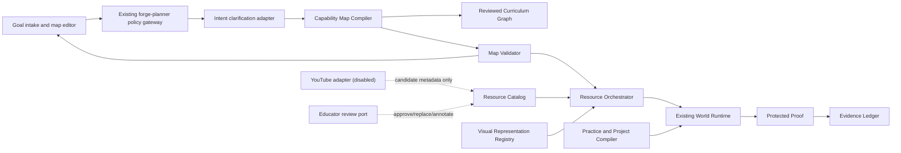

# FORGE Wave 6 — Practical Capability Maps and Governed Resource Orchestration

**Status:** Proposed successor wave; architecture and planning only

**Date:** 23 July 2026

**Authority:** Principal acceptance required before any packet is dispatched

**Predecessor:** Wave 5 accepted implementation and principal review at an exact immutable SHA

**North Star:** A consenting adult can turn a practical learning goal into an editable, source-visible capability map; follow a reviewed multimodal route; complete an authentic project; and produce bounded independent and delayed evidence without FORGE pretending an unknown topic is already a validated course.

## 1. Outcome and acceptance boundary

Wave 6 adds the missing layer between “What do you want to learn?” and a registered FORGE World:

```text
intent
  → transparent capability-map proposal
  → deterministic validation and learner edit
  → reviewed resource/project route
  → active multimodal learning
  → support withdrawal
  → unfamiliar proof and return
```

The first release target is a **closed, server-entitled, externally recruited 18+ cohort using a reviewed catalog** over a small, named set of practical capability maps. An `adult` audience field, checkbox, device profile, or self-attestation is not adult authority. `PilotEntitlementV1` is a server-issued, account-bound, purpose-bound grant with cohort, issuer, issued-at, expiry, revocation, and policy-version fields. The route, API, metadata worker, and embed policy all revalidate it. Until that authority and its negative tests pass, the work remains internal/fixture-only with no learner-facing external call. The wave does not authorize open-web discovery for minors, automatic course publication, high-stakes assessment, homeschool operation, live cloud evidence, or a “learn anything” efficacy claim.

Wave 6 is done only when:

- the new contracts are versioned, validated, and adversarially tested;
- one adult route works through map editing, reviewed resources, project, cold transfer, and return scheduling;
- external-resource state and failure behavior are visible and fail closed;
- every video-dependent operation has a reviewed alternative whose construct effect is explicit; the same capability claim is available only when that alternative is construct-preserving;
- provider and discovery features remain off by default;
- model assistance cannot publish, approve, certify, or upgrade evidence;
- current accepted Worlds and evidence behavior remain conformant;
- the principal publishes an exact-SHA scoped decision.

## 2. Architecture summary

Wave 6 remains inside the modular Next.js monolith. New interfaces are pure or fixture-backed before any external connector is enabled.



### 2.1 Module boundaries

| Module | Owns | Must not own |
| --- | --- | --- |
| Existing planner/policy gateway | Current unknown-topic, audience, route, and side-effect policy before any new compiler | A second bypassing router or review authority |
| Intent clarification adapter | Learner wording, practical target, constraints, reversible preferences | A diagnosis, fixed learning style, proof decision, or independent intake policy |
| Capability Map Compiler | Structured proposal over reviewed graph nodes plus explicit candidate/gap records | Curriculum publication, learner ranking, evidence upgrade |
| Map Validator | Schema, graph identity, prerequisites, cycle rules, audience/access policy, proof presence | Pedagogical truth not represented in reviewed inputs |
| Resource Catalog | Versioned candidate/reviewed records and lifecycle state | Open-ended recommendation feed or source authority |
| Resource Orchestrator | Deterministic eligibility/filtering and transparent route explanations | Hidden personalization, engagement optimization, automatic review |
| External adapters | Sanitized discovery and provider metadata under disabled-by-default authority | Raw learner text, transcript scraping, media download, publication |
| Visual Registry | Reviewed representations, alternatives, assumptions, validator/source bindings | Generated illustration as empirical evidence |
| Practice/Project Compiler | Reviewed activity templates, constraints, artifact/proof contracts | Autonomous high-stakes grading |
| Educator review port | Approve, replace, annotate, request review, inspect bounded evidence | Covert surveillance or silent claim upgrade |
| Existing World runtime | Deterministic learning and support-withdrawal execution | Arbitrary external code or resource authority |

## 3. Boundary and non-goals

### 3.1 In scope

- adult learner-goal intake and practical target clarification;
- versioned, editable capability-map contracts;
- explicit reviewed, candidate, unavailable, and gap states;
- resource-observation and review contracts;
- fixture-backed YouTube metadata adapter with production authority disabled;
- reviewed video card plus active checkpoint and a reviewed alternative with construct status;
- representation registry and accessibility alternatives;
- practical project and independent-proof binding;
- educator review interface contracts;
- adult pilot UI and browser evidence;
- offline evaluation, red-team fixtures, cost/workload instrumentation;
- documentation, threat model, operational runbook, and rollback gate.

### 3.2 Explicit non-goals

- open web or video search for minors;
- a child-facing conversational agent;
- automated source, safety, rights, accessibility, or curriculum approval;
- generated-video publication;
- transcript scraping or audiovisual download;
- engagement-based ranking, autoplay, comments, recommendations, or ads as product features;
- a universal learning-style classifier;
- autonomous high-stakes grading, credentials, admissions, employment, or equivalence decisions;
- live mentor marketplace or unsupervised people contact;
- production cloud evidence, verified guardian operations, or legal homeschool mode;
- broad “learn anything,” mastery, efficacy, teacher-replacement, or school-replacement claims;
- deployment, provider enablement, or new external data collection without a separately accepted release packet.

## 4. Canonical contracts

### 4.1 `LearningIntent`

```ts
interface LocalLearningIntentCaptureV1 {
  schemaVersion: "local-learning-intent-capture.v1";
  intentId: string;
  learnerWords: string;
  optionalPrivateNotes?: string;
  storage:
    | { mode: "ephemeral-session" }
    | {
        mode: "learner-encrypted-device";
        electionActionRef: string;
        retentionUntil: string;
      };
  createdAt: string;
}

interface LearningIntentV1 {
  schemaVersion: "learning-intent.v1";
  intentId: string;
  sanitizedIntentDigest: `sha256:${string}`;
  intentSummary: string;
  sanitizationPolicyRef: {
    id: string;
    version: string;
    digest: `sha256:${string}`;
  };
  learnerPreviewReceipt: {
    receiptId: string;
    acceptedDigest: `sha256:${string}`;
    acceptedUses: Array<"internal-map" | "model-proposal" | "external-discovery">;
    acceptedAt: string;
  };
  desiredAction: string;
  practicalOutcome?: string;
  priorExperience?: "new" | "some" | "experienced" | "unspecified";
  depth: "orient" | "working" | "deep" | "frontier";
  timeBudget?: {
    minutesPerSession?: number;
    sessions?: number;
  };
  routePreferences: Array<
    "overview" | "demonstration" | "text" | "worked_example" |
    "simulation" | "practice" | "project" | "human"
  >;
  constraints: {
    audience: "adult";
    language: string;
    bandwidth?: "low" | "standard";
    device?: "phone" | "tablet" | "desktop" | "print";
    materialClasses?: Array<
      "none" | "paper" | "common-household" | "computer" |
      "specialist-reviewed" | "unknown"
    >;
    accessTokens?: Array<
      "captions" | "transcript" | "audio-description" | "screen-reader" |
      "keyboard-only" | "reduced-motion" | "low-vision" |
      "low-bandwidth" | "print-route"
    >;
  };
  createdAt: string;
}
```

Raw `learnerWords` and private notes remain a separate learner-owned local or encrypted-private record and are never rewritten in place. They are not part of a map package, provider request, log, analytics event, review record, or educator export by default. The learner previews and explicitly accepts the deterministic redacted summary before an authorized model or external discovery receives it. The retained map stores only `intentId`, a sanitized digest, and the accepted summary. An explicit learner election may persist the raw capture under a separately versioned data class with purpose, location, retention, export, deletion, and encryption controls; it never becomes reviewer or provider context automatically. Sensitive-topic routes remain internal/reviewed unless a later policy packet authorizes a specific disclosure.

Route preferences are reversible interface choices, not inferred traits. Access needs use closed tokens; free-form disability, health, family, or material circumstances remain local-only unless the learner separately elects a named purpose-bound share.

`constraints.audience` describes the intended presentation contract only. It grants no external model, source, media, cloud, share, or contact authority. Any later external call requires a separate server-owned entitlement for a closed verified adult cohort; absent that authority, policy permits only S0/S1 internal and fixture behavior.

### 4.2 `CapabilityMapPackage`

```ts
interface CapabilityMapPackageBaseV1 {
  schemaVersion: "capability-map.v1";
  mapId: `capability-map.${string}`;
  version: string;
  mapDigest: `sha256:${string}`;
  audience: "adult";
  intentRef: {
    intentId: string;
    sanitizedIntentDigest: `sha256:${string}`;
  };
  intentSummary: string;
  targetCapabilityRefs: Array<{
    curriculumNodeId: string;
    capabilityId: string;
    capabilityVersion: string;
    derivedAvailability: "released" | "review-candidate" | "identified-gap";
    releasedWorldAuthority?: CallerAssertedReleasedWorldAuthorityV1;
  }>;
  nodes: CapabilityMapNodeV1[];
  edges: CapabilityMapEdgeV1[];
  routeOptions: RouteOptionV1[];
  projectBindings: ProjectBindingV1[];
  proofBindings: ProofBindingV1[];
  explicitGaps: MapGapV1[];
  sourceAuthorityEvaluations: SourceAuthorityEvaluationV1[];
  createdFrom: {
    curriculumGraphRef: {
      id: string;
      version: string;
      digest: `sha256:${string}`;
      policyRef: {
        id: string;
        version: string;
        digest: `sha256:${string}`;
      };
      sourceAuthorityRefs: Array<{
        packageId: string;
        packageVersion: string;
        packageDigest: `sha256:${string}`;
        minimumEvaluatedAsOf: string;
      }>;
    };
    graphValidationReceiptDigest: `sha256:${string}`;
    modelProposal?: ModelProposalReceiptV1;
  };
}

interface MapScopedDecisionRefV1 {
  decisionId: string;
  reviewerIdentityRef: string;
  reviewerGrantRef: string;
  scope: "domain-capability" | "learning-sequence" | "access" | "safety-rights";
  outcome: "accepted" | "rejected" | "withdrawn";
  inputDigest: `sha256:${string}`;
  evidenceDigest: `sha256:${string}`;
  decidedAt: string;
  expiresAt: string;
  independence: "independent" | "declared-conflict";
  supersedesDecisionId?: string;
}

interface MapReviewRecordRefV1 {
  id: string;
  version: string;
  digest: `sha256:${string}`;
  scopedDecisionIds: [string, ...string[]];
  reviewedAt: string;
  expiresAt: string;
}

type CapabilityMapPackageV1 =
  | (CapabilityMapPackageBaseV1 & {
      reviewState: "candidate";
      publication: { status: "unpublished" };
    })
  | (CapabilityMapPackageBaseV1 & {
      reviewState: "reviewed";
      mapReviewRecordRef: MapReviewRecordRefV1;
      publication: { status: "unpublished" };
    })
  | (CapabilityMapPackageBaseV1 & {
      reviewState: "reviewed";
      mapReviewRecordRef: MapReviewRecordRefV1;
      publication: {
        status: "published";
        publicationEventRef: string;
        publisherAuthorityRef: string;
        publishedAt: string;
        expiresAt: string;
      };
    })
  | (CapabilityMapPackageBaseV1 & {
      reviewState: "rejected";
      rejectionDecisionRef: MapScopedDecisionRefV1;
      publication: { status: "unpublished" };
    })
  | (CapabilityMapPackageBaseV1 & {
      reviewState: "withdrawn";
      withdrawalDecisionRef: MapScopedDecisionRefV1;
      publication: { status: "unpublished" };
    });
```

The map digest covers the canonical payload except `mapDigest`. `CurriculumGraphPackageV1`, `CallerAssertedReleasedWorldAuthorityV1`, and the source-authority replay types are imported from the accepted curriculum/source contracts; Wave 6 does not retype weaker lookalikes. Exact graph digest, policy digest, source-authority replay, capability version, complete World binding, reviewed entitlement/age/depth sets, release event, publication policy, and `availabilityStatus: "available"` are mandatory; string IDs alone never establish authority. Every node distinguishes `reviewed_capability`, `candidate_capability`, `concept`, `representation`, `practice`, `project`, `proof`, and `gap`. Candidate nodes never masquerade as reviewed curriculum. A reviewed map is still unassignable until a separate authenticated publication event exists and every released capability projection remains current.

### 4.2.1 `CapabilityMapPatch`

```ts
interface CapabilityMapPatchV1 {
  schemaVersion: "capability-map-patch.v1";
  patchId: string;
  baseMapRef: {
    mapId: `capability-map.${string}`;
    version: string;
    mapDigest: `sha256:${string}`;
  };
  operations: Array<
    | { op: "set-route-preference"; routeId: string; rank: number }
    | { op: "select-optional-node"; nodeId: string; selected: boolean }
    | { op: "request-reviewed-alternative"; nodeId: string; reasonToken: string }
    | { op: "propose-target-change"; targetCapabilityRef: string }
    | { op: "propose-prerequisite-change"; edgeId: string; action: "add" | "remove" }
    | { op: "propose-project-change"; projectBindingRef: string }
    | { op: "propose-proof-change"; proofBindingRef: string }
  >;
  learnerActionRef: string;
  createdAt: string;
  revalidation:
    | { outcome: "same-reviewed-package-route"; receiptDigest: `sha256:${string}` }
    | { outcome: "candidate-revision-required"; candidateMapRef: string }
    | { outcome: "rejected"; orderedReasonCodes: string[] };
}
```

Only route order and already-reviewed optional-node selection may remain on the same reviewed package, and both still revalidate. A target, required-prerequisite, project, proof, or authority-bearing edit always creates a new candidate revision. A learner patch never mutates or republishes the reviewed source package.

### 4.3 `ResourceObservation`

```ts
interface ResourceObservationCommonV1 {
  schemaVersion: "resource-observation.v1";
  resourceId: string;
  observedAt: string;
  creator: string;
  title: string;
  language: string;
  contentType: "text" | "video" | "audio" | "interactive" | "dataset" | "image";
  durationSeconds?: number;
  captions: {
    presence: "available" | "unavailable" | "unknown";
    languages: string[];
    source: "human" | "automatic" | "mixed" | "unknown";
    accuracyReview: "not-reviewed" | "accepted" | "rejected";
    descriptiveTranscript: "available" | "unavailable" | "unknown";
  };
  transcriptUse: "authorized" | "metadata_only" | "not_available";
  rightsSignals:
    | {
        status: "known";
        useBasis: string;
        attributionRequired: "yes" | "no";
        commercialInfluence: "present" | "absent" | "unknown";
        rightsReviewRef: string;
      }
    | {
        status: "unknown";
        commercialInfluence: "present" | "absent" | "unknown";
      };
  embedStatus: "allowed" | "not_allowed" | "unknown";
  ageSignals: {
    madeForKids: "true" | "false" | "unspecified";
    ageRestriction: "none-observed" | "restricted" | "unknown";
    manualAudienceReview: "not-reviewed" | "accepted" | "rejected";
  };
  trackingAndAds: {
    thirdPartyDataFlow: "present" | "absent" | "unknown";
    adsMayAppear: "yes" | "no" | "unknown";
    paidPlacement: "present" | "absent" | "unknown";
  };
  regionSignals: {
    mode: "allowed-list" | "blocked-list" | "unrestricted-observed" | "unknown";
    countryCodes: string[];
  };
}

type ResourceObservationV1 =
  | (ResourceObservationCommonV1 & {
      authorityKind: "internal-package";
      provider: "forge";
      packageRef: {
        id: string;
        version: string;
        digest: `sha256:${string}`;
      };
      contentDigest: `sha256:${string}`;
      retentionClass: "immutable-package";
    })
  | (ResourceObservationCommonV1 & {
      authorityKind: "external-provider-metadata";
      provider: "youtube" | "oer" | "institution" | "learner_supplied";
      externalId: string;
      canonicalUrl: string;
      providerMetadataVersion?: string;
      observationRecordDigest: `sha256:${string}`;
      reviewSignalDigest: `sha256:${string}`;
      retentionClass: "provider-metadata-ttl";
      refreshOrDeleteAt: string;
    });
```

An internal package is content-addressed under existing publication/source authority. For an external item, `observationRecordDigest` covers the complete time-bounded observation record, including timestamps; `reviewSignalDigest` covers only the canonical review-relevant content and policy signals and excludes refresh timestamps. Routine refresh can therefore preserve a review when the review signals remain exact, while any material signal change invalidates it. Neither digest is immutable identity of remote audiovisual content.

The full provider response and refreshable metadata live in a deletable TTL observation store, not the immutable event journal. The journal may retain only a policy-safe audit receipt—internal resource ID, provider class, allowed digests, event time, eligibility transition, actor/authority reference, and later refresh/delete/tombstone outcome—after provider fields that must be refreshed or deleted are removed.

### 4.4 `ResourceReview`

```ts
interface ResourceScopedDecisionRefV1 {
  decisionId: string;
  reviewerIdentityRef: string;
  reviewerGrantRef: string;
  scope: "learning-fit" | "accessibility" | "age-safety" | "rights-commercial";
  outcome: "accepted" | "rejected";
  inputDigests: Array<`sha256:${string}`>;
  evidenceDigest: `sha256:${string}`;
  decidedAt: string;
  expiresAt: string;
  independence: "independent" | "declared-conflict";
  supersedesDecisionId?: string;
}

type SourceUseV1 =
  | {
      mode: "not-source-authority";
      prohibitedClaimUses: string[];
    }
  | {
      mode: "bound-source-authority";
      sourceRequirement: Extract<
        SourceRequirementV1,
        { mode: "bound-source-authority" }
      >;
      sourceAuthorityEvaluation: SourceAuthorityEvaluationV1;
    };

interface ResourceReviewBaseV1 {
  schemaVersion: "resource-review.v1";
  resourceId: string;
  observationRef:
    | {
        authorityKind: "internal-package";
        packageRef: {
          id: string;
          version: string;
          digest: `sha256:${string}`;
        };
        contentDigest: `sha256:${string}`;
      }
    | {
        authorityKind: "external-provider-metadata";
        reviewSignalDigest: `sha256:${string}`;
      };
  capabilityRefs: Array<{
    curriculumNodeId: string;
    capabilityId: string;
    capabilityVersion: string;
  }>;
  pedagogicalRoles: Array<
    "orient" | "demonstrate" | "worked_example" | "compare" |
    "practice_setup" | "project_reference" | "source"
  >;
  sourceUse: SourceUseV1;
  prerequisiteIds: string[];
  learningOperation:
    | {
        mode: "instructional";
        activeCheckpointIds: [string, ...string[]];
      }
    | {
        mode: "source-only";
        activeCheckpointIds: [];
      };
  audience: "adult";
  riskFlags: Array<
    "none-observed" | "sensitive-topic" | "physical-risk" |
    "tracking" | "advertising" | "sponsorship" | "age-unknown" |
    "rights-unknown" | "region-unknown" | "access-gap" |
    "active-content" | "reported-incident"
  >;
}

type ResourceReviewV1 =
  | (ResourceReviewBaseV1 & {
      reviewState: "candidate";
      scopedDecisionRefs?: ResourceScopedDecisionRefV1[];
      alternativeRoutes?: Array<{
        routeId: string;
        accessEffect: "construct-preserving" | "construct-changing";
        reviewedCapabilityRef: string;
      }>;
    })
  | (ResourceReviewBaseV1 & {
      reviewState: "reviewed";
      scopedDecisionRefs: [
        ResourceScopedDecisionRefV1,
        ...ResourceScopedDecisionRefV1[]
      ];
      alternativeRoutes: [
        {
          routeId: string;
          accessEffect: "construct-preserving" | "construct-changing";
          reviewedCapabilityRef: string;
        },
        ...Array<{
          routeId: string;
          accessEffect: "construct-preserving" | "construct-changing";
          reviewedCapabilityRef: string;
        }>
      ];
      reviewRecordDigest: `sha256:${string}`;
      publisherAuthorityRef: string;
      reviewedAt: string;
      expiresAt: string;
    })
  | (ResourceReviewBaseV1 & {
      reviewState: "rejected";
      scopedDecisionRefs: [
        ResourceScopedDecisionRefV1,
        ...ResourceScopedDecisionRefV1[]
      ];
      alternativeRoutes?: Array<{
        routeId: string;
        accessEffect: "construct-preserving" | "construct-changing";
        reviewedCapabilityRef: string;
      }>;
      rejectedAt: string;
      rejectionDecisionId: string;
    });
```

Eligibility is a derived projection, never a stored review state. It requires a matching current observation, a reviewed non-expired record, every policy-required independent scoped decision, a current source-authority replay when `sourceUse` is bound, audience/access entitlement, an active checkpoint where the resource is instructional, and at least one reviewed alternative whose construct effect is explicit. `incident_hold`, `expired`, `withdrawn`, `superseded`, `eligible`, and `ineligible` are event-derived lifecycle/eligibility projections over immutable review revisions. Model output cannot create an accepted decision, reviewer grant, source authority, publisher authority, lifecycle transition, or eligibility result.

### 4.4.1 Deterministic route selection

```ts
interface ResourceSelectionPolicyV1 {
  schemaVersion: "resource-selection-policy.v1";
  policyRef: { id: string; version: string; digest: `sha256:${string}` };
  capabilityRef: string;
  pedagogicalRole: ResourceReviewBaseV1["pedagogicalRoles"][number];
  requiredAccessTokens: NonNullable<LearningIntentV1["constraints"]["accessTokens"]>;
  maximumItems: number;
  orderedCriteria: Array<
    "reviewed-fit-band" | "access-match" | "construct-preservation" |
    "provider-diversity" | "freshness" | "stable-resource-id"
  >;
}

interface ResourceRouteChoiceV1 {
  eligibleSnapshotDigest: `sha256:${string}`;
  policyRef: ResourceSelectionPolicyV1["policyRef"];
  orderedResourceIds: string[];
  reasonCodesByResource: Record<string, string[]>;
  learnerSelectedResourceId?: string;
  fallbackResourceIds: string[];
}
```

Selection operates only over the current eligible snapshot. Capability, pedagogical role, source use, access needs, construct status, freshness, diversity, and stable deterministic tie-breaks are visible. Search/provider rank, views, likes, watch time, predicted engagement, sponsorship, paid placement, and model preference are prohibited inputs. Where multiple eligible routes remain, the learner receives a bounded choice plus a plain-language “why this resource” explanation; failure selects a reviewed fallback rather than silently widening discovery.

### 4.5 `RepresentationPackage`

Declares concept binding, representation kind, observation/simulation/analogy status, assumptions, variables/units, source or validator identity, controls, synchronized text/table alternative, access review, and expiry.

### 4.6 `PracticalProjectPackage`

Declares target capabilities, authentic audience or consequence, materials and no-cost alternative, safety controls, milestones, artifacts, provenance fields, AI-permitted operations, critique roles, revision rules, individual defence, cold-transfer binding, and return interval.

## 5. State machines

### 5.1 Capability map

```text
drafted → validated → learner_edited → revalidated → reviewed → published
   ↘ invalid          ↘ invalid                     ↘ rejected
reviewed/published → expired | withdrawn | superseded
published + current graph/source/World/project/proof authority → eligible → assignable
published + any invalidated dependency → ineligible
```

Review alone never creates assignment. Only a separately published map with a current deterministic eligibility projection and `available` released dependencies is assignable in the pilot. Learner edits to optional route order and preferences revalidate automatically; edits that alter target capabilities, required prerequisites, project, or proof create a new candidate revision.

### 5.2 External resource

```text
discovered → observed → candidate → reviewed → eligible
                       ↘ rejected
reviewed/eligible → expired | withdrawn | superseded | incident_hold
incident_hold → new_observation_and_review_revision | withdrawn
```

Remote playback success does not refresh review. Metadata refresh, review expiry, and reported content drift are distinct events.

### 5.3 Learning route

```text
proposed → learner_accepted → active → project_ready → proof_ready
active ↔ route_repair
proof_ready → proof_active → bounded_result → return_scheduled
proof_active → invalidated
return_scheduled → return_due → retained | repair_needed | untested
```

Instructional help is unavailable during `proof_active`; accessibility remains.

### 5.4 Writer and authority matrix

| State/event | Permitted writer | Authority required | Explicitly unable to authorize |
| --- | --- | --- | --- |
| `learning_intent.created|clarified` | learner/device route | learner action; S1 local | external access, map review, publication |
| `capability_map.proposed|validation_failed|learner_edited` | compiler/learner route | schema and deterministic graph validation | reviewed, published, eligible, or assignable state |
| `capability_map.reviewed|rejected|withdrawn|superseded` | review service | authenticated scoped reviewer grants plus immutable input revision | browser, model, local journal replay |
| `capability_map.published` | publisher service | separate authenticated publisher authority and accepted current reviews | author self-approval or client assertion |
| `resource.observed|refresh_due|deleted|tombstoned` | connector/metadata worker | server connector authority and provider-policy schedule | review or resource eligibility |
| `resource.reviewed|rejected|incident_held|withdrawn` | source/content review service | authenticated scoped decisions; high-risk dual approval | model, curator self-approval, learner client |
| `resource.assigned` | route service | current matching review, observation signals, map publication, and audience/access entitlement | stale cache, forged event, client assertion |
| learning attempts and local evidence | current World/device runtime | existing bounded S1 learner authority | curriculum/resource/map review |
| proof/evidence upgrade | canonical validator/projector only | existing proof and evidence contract | resource playback, project completion, reviewer opinion |

The canonical event envelope records decisions but does not create their authority. Every privileged projection revalidates actor class, scoped grant, immutable input revision, ordered decisions, deterministic replay, current dependency state, and tenant where applicable. Forged, reordered, cross-tenant, or local `reviewed`, `assigned`, or `published` events MUST fail to create catalog eligibility or runtime assignment.

## 6. Packet W6-0 — Authority, data, event-compatibility, and threat preflight

**Goal:** Make Wave 6 dispatchable without pretending new event names, adult metadata, or prose controls inherit authority from the current runtime.

The accepted journal currently admits only the reviewed `world_run` and `world_package` aggregate families. The new event names in this plan are a target vocabulary, not legal current events. W6-0 must either define additive aggregate families with exact schemas and transition projectors or keep the new operations in a separate fixture-only journal until that event change is accepted.

```ts
interface PilotEntitlementV1 {
  schemaVersion: "pilot-entitlement.v1";
  entitlementId: string;
  subjectAccountId: string;
  cohortId: string;
  purpose: "wave6-reviewed-adult-pilot";
  eligibilityBasisRef: string;
  issuerAuthorityRef: string;
  policyRef: { id: string; version: string; digest: `sha256:${string}` };
  issuedAt: string;
  expiresAt: string;
  revokedAt?: string;
  revocationReason?: string;
}
```

The eligibility-basis record belongs to the closed-cohort operator, not to client metadata. It records the approved 18+ recruitment/consent process without exposing identity evidence to the learning route. The entitlement is never accepted from a request body, profile field, query string, cookie assertion, or model output.

W6-0 may validate this interface with synthetic subjects and a fixture issuer, but that is not operative adult authority. Live entitlement issuance and every learner-facing S1E route additionally depend on the existing adult authentication, tenancy isolation, abuse controls, recovery, and configured-project integration gate passing at an exact SHA. Until then, W6-A through W6-E remain local/fixture work and W6-F/W6-C external behavior remains disabled.

**Required artifacts:**

1. data-flow and trust-boundary diagram covering local capture, sanitized intent, map proposal, resource metadata TTL store, immutable audit receipts, browser/player, model jobs, reviewer/publisher services, educator export, and evidence;
2. field-level inventory with purpose, sensitivity, owner, local/cloud/provider destination, logs, encryption, retention, export, deletion, backup, and model eligibility;
3. `PilotEntitlementV1`, writer/authority matrix, no-self-approval rule, scoped reviewer grants, publisher separation, revocation, tenant isolation, and cache-invalidation contract;
4. threat model covering minor bypass, direct/deep-linked API/embed access, prompt injection, malicious URLs and active content, provider drift, reviewer compromise, proof contamination, unsafe physical projects, and stale rollback;
5. additive event decision covering aggregate names, schema registry, event-envelope version, transition tables, projector versions, migration, old-reader/new-writer behavior, new-reader/old-event replay, unknown-event rejection, and rollback;
6. exact dependency mapping from program goals `PG0`–`PG9` to delivery gates `DG0`–`DG10`; the two namespaces MUST NOT be abbreviated as the same `G#`;
7. predeclared pilot thresholds for review minutes per resource/map, queue age, correction SLA, re-review load, incident/on-call capacity, per-capability cost, accessibility debt, and the error-budget conditions that freeze expansion.

**Stop-ship tests:**

- query, profile, cookie, local-storage, route parameter, or self-attested audience mutation cannot create `PilotEntitlementV1`;
- anonymous, logged-out, revoked, expired, wrong-purpose, wrong-cohort, wrong-tenant, deep-link, stale-tab, and direct-API/embed access all fail before an external request;
- learner/model/client/local-journal events cannot project review, publication, assignment, sharing, or proof authority;
- every accepted v1 fixture replays byte-for-byte or to the documented canonical projection under the new reader;
- an old reader fails safely on a new aggregate and an older deployment cannot resurrect a withdrawn resource, deleted provider record, incident hold, or revoked decision;
- provider TTL deletion reaches cache, outbox, analytics, backup/restore workflow, and exports while an allowed tombstone remains auditable;
- hostile URL, redirect, DNS/IP, file, HTML, iframe, and prompt-injection fixtures cannot create network, tool, credential, publication, evidence, or renderer authority.

No implementation packet after W6-0 is dispatchable until the principal accepts this preflight at an exact SHA. W6-H later repeats the threat and operational audit against the integrated system; it is not a substitute for W6-0.

## 7. Packet W6-A — Intent and capability-map contracts

**Goal:** Create pure versioned contracts and validation for adult learning intent and editable capability maps.

**Likely ownership:**

- `src/forge/learning-intent.ts`
- `src/forge/capability-map.ts`
- `src/forge/capability-map-validation.ts`
- `src/forge/__tests__/capability-map.test.ts`
- authored fixtures under `src/forge/fixtures/`

**Required work:**

1. define exact v1 schemas and closed vocabularies;
2. route every request through the accepted `src/lib/forge-planner/**` policy gateway, then adapt its bounded output into the map compiler; do not introduce a second intake/router that bypasses current unknown-topic or audience policy;
3. bind reviewed nodes to immutable curriculum-graph and World package identities;
4. preserve candidate/gap states without generating fake reviewed identifiers;
5. validate edges, cycles, disconnected goals, required proof, project bindings, and intended adult presentation;
6. produce deterministic, ordered validation errors;
7. support learner route edits without mutating the reviewed source package;
8. serialize/export a human-readable map and machine-readable package.

**Stop-ship tests:**

- unknown topic cannot become a reviewed map;
- missing graph version or node identity fails closed;
- model prose cannot bypass schema or review state;
- skipped required prerequisite explains the consequence or rejects the route;
- no proof binding means no assignable map;
- cyclic prerequisites fail;
- unreviewed map cannot reach runtime;
- output remains stable under repeated validation and replay.
- every UI, direct API, and replay entry reaches the existing planner/policy gateway before compilation.

## 8. Packet W6-B — Resource catalog and lifecycle authority

**Goal:** Define candidate/reviewed separation and a provider-neutral resource lifecycle before live discovery exists.

**Likely ownership:**

- `src/forge/resources/contracts.ts`
- `src/forge/resources/catalog.ts`
- `src/forge/resources/eligibility.ts`
- `src/forge/resources/review.ts`
- `src/forge/resources/__tests__/`
- `docs/FORGE_RESOURCE_POLICY.md`

**Required work:**

1. implement `ResourceObservationV1`, `ResourceReviewV1`, review decisions, and event vocabulary;
2. separate pedagogical role from source/claim authority;
3. require a reviewed alternative with explicit `construct-preserving` or `construct-changing` status, age/risk, rights, accessibility, observation, expiry, and reviewer identity;
4. make eligibility a deterministic pure function;
5. implement deterministic bounded route selection, stable tie-breaks, provider diversity, learner choice, visible reason codes, and fallback;
6. model edit, withdrawal, supersession, incident hold, region, captions, embed, and expiry;
7. add export and audit projections without storing raw learner queries;
8. author one reviewed video fixture and one rejected/expired fixture.

**Stop-ship tests:**

- candidate item cannot be assigned;
- reviewed projection fails when any policy-required scope is missing, empty, conflicted, self-approved, expired, bound to the wrong input digest, or not independent where independence is required;
- a review against a prior review-signal digest cannot authorize materially changed metadata;
- expired, missing, region-ineligible, inaccessible, or incident-held resources fail closed;
- `embedStatus: "not_allowed"` cannot select embed delivery, while a separately reviewed HTTPS link-out may remain eligible;
- video without a reviewed alternative and declared construct effect fails;
- a pedagogically clear but source-ineligible item cannot authorize a factual claim;
- provider/search popularity, views, engagement, sponsorship, paid placement, or model preference cannot influence ordering;
- repeated selection over the same eligible snapshot is stable, every item has visible reason codes, and provider failure chooses only a pre-reviewed fallback;
- ad/tracking disclosures remain visible;
- revoked review cannot survive replay or cache.

## 9. Packet W6-C — Disabled YouTube discovery adapter

**Goal:** Prove policy-compliant metadata mapping and failure behavior using fixtures or a local fake, with production network authority absent.

**Likely ownership:**

- `src/lib/resource-providers/youtube/contracts.ts`
- `src/lib/resource-providers/youtube/adapter.ts`
- `src/lib/resource-providers/youtube/policy.ts`
- `src/lib/resource-providers/youtube/__fixtures__/`
- `src/lib/resource-providers/youtube/__tests__/`

**Authority invariant:** no `YOUTUBE_API_KEY`, raw learner query, provider call, transcript download, media download, or public endpoint is added in this packet.

**Required work:**

1. map official API fixtures into provider-neutral observations;
2. reject unknown or policy-critical missing fields;
3. sanitize a capability-bound discovery query contract;
4. implement 30-day metadata refresh/delete scheduling semantics;
5. model quota, unavailable, region, age, captions, made-for-kids, embed, and edit-risk behavior;
6. enforce no autoplay and click-to-load embed configuration as a pure UI policy object;
7. prove that FORGE adds no feed, comments, autoplay, engagement ranking, player overlay, control/branding suppression, or transcript/media retrieval operation; disclose that the official player may still display provider-controlled related videos and ads;
8. require a privacy policy with a Google privacy link, per-item YouTube attribution, current player client identity plus `origin`/referrer configuration, provider minimum player size, and a quarterly terms/policy revalidation owner.

**Stop-ship tests:**

- provider credential cannot be accepted from browser or `NEXT_PUBLIC_*`;
- adapter does not accept raw learner prose or personal data;
- stale provider metadata is not eligible;
- missing child/audience policy signals fail closed;
- no method can download captions or media;
- fixture changes invalidate the prior review-signal digest;
- provider outage degrades to reviewed internal alternatives.
- `autoplay=0`, no iframe request before explicit click, standard controls/branding, and no CSS or overlay interference are proven;
- related-video or ad surfaces are not claimed to be suppressible; when they violate the route boundary, the route uses a disclosed link-out or licensed/internal alternative.

## 10. Packet W6-D — Visual Representation Registry

**Goal:** Make demonstrations, simulations, diagrams, and generated visual drafts inspectable and accessible.

**Likely ownership:**

- `src/forge/representations/contracts.ts`
- `src/forge/representations/registry.ts`
- `src/forge/representations/validation.ts`
- `src/components/forge/RepresentationFrame.tsx`
- `src/forge/representations/__tests__/`

**Required work:**

1. distinguish observation, measurement, simulation, diagram, reconstruction, and analogy;
2. require source or validator identity, assumptions, variables/units, and omitted factors;
3. require a synchronized text/table alternative and record whether it preserves or changes the assessed construct;
4. support keyboard, pause/step/reset, reduced motion, color-independent meaning, and 320 CSS px;
5. keep generated media in candidate state unless reviewed;
6. bind each representation to a learner action and capability node.

**Stop-ship tests:**

- generated image/video cannot become observation or empirical evidence;
- missing reviewed alternative or missing construct status fails;
- motion-only or color-only meaning fails;
- deterministic simulation state, numeric output, graph, and text alternative disagreeing on a frame fails;
- expired or withdrawn representation fails closed.

## 11. Packet W6-E — Practice and Practical Project Compiler

**Goal:** Bind each pilot map to active practice, authentic production, critique, independent defence, and delayed return.

**Likely ownership:**

- `src/forge/projects/contracts.ts`
- `src/forge/projects/compiler.ts`
- `src/forge/projects/validation.ts`
- `src/forge/practice/contracts.ts`
- `src/forge/projects/__tests__/`

**Required work:**

1. create project modes: build, investigate, repair, design, explain, perform, contribute;
2. constrain the first pilot to a named low-risk authored allowlist; unknown materials and electrical, chemical, biological, medical, food-safety, weapons, power-tool, height, fire, vehicle, and self-harm categories are denied until a specialized authority packet exists;
3. require capability prerequisites, constraints, materials/no-cost alternative, named safety reviewer, supervision level, substitutions, stop conditions, incident response, milestones, artifacts, provenance, critique, revision, defence, and proof;
4. separate learner, collaborator, AI, and reused contributions;
5. route revealed prerequisite gaps back to targeted repair;
6. generate no autonomous score or mastery claim;
7. schedule delayed return based on reviewed policy, not model confidence.

**Stop-ship tests:**

- attractive group artifact cannot establish individual capability;
- AI-produced protected operation invalidates that proof attempt;
- missing materials alternative blocks common-entitlement assignment;
- any project outside the fixed low-risk allowlist, with unknown materials, missing safety authority, or a prohibited hazard cannot be compiled;
- project completion without defence/transfer creates no capability claim;
- return due can end as `untested`, not silently retained.

## 12. Packet W6-F — Adult map and route experience

**Goal:** Deliver one coherent adult route through the existing FORGE visual and runtime constitution.

The normative production references are [`docs/FORGE_DESIGN_SYSTEM.md`](../FORGE_DESIGN_SYSTEM.md), [`docs/FORGE_DESIGN_FIDELITY_LEDGER.md`](../FORGE_DESIGN_FIDELITY_LEDGER.md), and the live [FORGE design gallery](https://forge-design-lab.priyansh-rana.chatgpt.site/). A worker may extend those semantics for new domain representations; it may not substitute dashboard/course/LMS chrome, a persistent chat shell, rewards, or a second visual language.

**Likely ownership:**

- new route such as `app/paths/[mapId]/page.tsx`
- map editor and resource components under `src/components/forge/`
- route controller under `src/lib/forge-paths/`
- browser tests under `tests/e2e/`

**Required screens:**

1. learner intent and practical outcome;
2. candidate draft map with explicit authored, fixture, graph-derived, or later model-proposal provenance;
3. transparent prerequisite, optional, gap, project, and proof nodes;
4. learner edits with consequences;
5. learner's initial mechanism, strategy, or plan in their own words;
6. exactly two uncertain plausible readings of that model, a visible point of disagreement, and a domain-appropriate separating observation, test, comparison, critique, or execution;
7. reviewed route and source/resource cards;
8. active video or visual checkpoint outside the provider player;
9. learner reconstruction, practice, and practical project;
10. explicit AI/support withdrawal;
11. unfamiliar transfer;
12. bounded result and return schedule.

**Experience rules:**

- one dominant decision per viewport;
- no persistent chat, feed, badge, streak, or mastery meter;
- learner-authored text remains amber; reviewed transformation and evidence remain cyan;
- dense instrumentation appears only when needed;
- external provider, tracking, ads, review date, and alternative route remain legible;
- the exactly-two compiler preserves learner words, never assigns probabilities or diagnoses, and lets the learner correct or reject an interpretation before the separating experience;
- provider playback is never gated by a FORGE checkpoint; the active operation is adjacent to and outside the official player;
- no generic `Continue`; actions name the operation;
- complete keyboard path, 320 CSS px, reduced motion, zoom/reflow, and screen-reader semantics.

**Stop-ship tests:**

- an unknown/candidate map cannot look reviewed;
- a failed video or provider cannot strand the route;
- watched/completed state cannot upgrade evidence;
- `proof_authority: "honour_based"` is displayed for the pilot; FORGE claims only that in-product interpretation, resource, experiment-selection, and hint support was removed;
- proof entry unmounts resource/player and solution-bearing state, disables model/resource endpoints for the route, and preserves accessibility; direct endpoint, back/reload/cache/replay/postMessage, stale-tab, and second-route tests cannot restore in-product help;
- delete/export and evidence boundaries remain intact;
- current four Worlds retain existing conformance.

## 13. Packet W6-G — Educator review port

**Goal:** Establish a learner-visible local co-review/export contract for teacher or tutor augmentation without inventing remote identity, sharing, or surveillance authority.

**Likely ownership:**

- `src/forge/educator/contracts.ts`
- `src/forge/educator/policy.ts`
- `src/components/forge/educator/`
- fixtures and policy tests

**First scope:**

- synthetic fixtures, same-device co-view, or a learner-generated export only;
- inspect a candidate map and make learner-visible advisory annotations or change proposals;
- use synthetic reviewer identities/grants only to exercise approve/reject/replace state in contract tests; a same-device role declaration or export recipient has no catalog review, publication, assignment, or proof authority;
- propose route, representation, project, and return changes that the adult learner can see, accept, reject, or contest;
- inspect only the bounded attempts, support, gaps, and evidence conditions the adult learner selected for this co-view/export;
- export a learner-visible preparation or evidence packet.

**Non-scope:**

- private learner monitoring;
- raw-chat access;
- emotion/attention inference;
- hidden ranking;
- silent evidence upgrade;
- unrestricted contact or people matching;
- remote educator access, silent map/evidence-policy overwrite, or any claim that review opinion upgrades proof.

A later operative review or remote educator port requires the separately accepted reviewer identity/grant/tenant service, verified role and qualification, purpose/item scope, adult learner consent, expiry, revocation, row-level isolation, audit, appeal, and two-account negative tests. No educator can satisfy every source, access, safety, rights, and publication decision alone. It remains a separate S3 packet.

**Required measurement:** total preparation, verification, correction, setup, training, and follow-up time.

## 14. Packet W6-H — Evaluation, final threat model, and operations

**Goal:** Repeat the threat model against the integrated candidate and establish evidence and recovery before any external connector or broader audience is enabled.

W6-H is the wave's integration/release packet. The separately owned one-pass SOL Ultra review in [`PRINCIPAL_PRODUCTION_AUDIT_MANDATE.md`](./PRINCIPAL_PRODUCTION_AUDIT_MANDATE.md) audits the broader real-world product at the frozen planning SHA and returns recommendations only; it cannot substitute for or grant W6-H release authority.

**Required artifacts:**

- threat model for prompt injection, source poisoning, provider drift, malicious metadata, child exposure, tracking, evidence manipulation, reviewer compromise, and dependency outage;
- connector runbook with key authority, quota, refresh/delete, incident hold, kill switch, and rollback;
- resource and review error-budget policy;
- adult-pilot protocol and preregistered claim language;
- named human-research owner and a documented ethics/IRB determination where applicable, with consent/withdrawal, compensation and coercion review, exclusion criteria, privacy/data use, adverse-event/escalation, and publication rules;
- accessibility and low-bandwidth test protocol;
- provider/model upgrade evaluation suite;
- cost and reviewer-workload ledger;
- correction and learner-notification flow;
- exact `DG#` delivery-gate and `C#` claim-disposition packet stating which evidence is local, configured-service, browser/manual-access, operational, human-study, or still missing; only the principal can publish its disposition.

**Release blockers:**

- no named incident owner or kill switch;
- no exact-SHA rollback rehearsal or connector kill-switch/provider-outage drill;
- no provider data-refresh/delete operation;
- no representative keyboard/reduced-motion/320px evidence;
- no manual screen-reader/assistive-technology session, caption-language/quality review, audio-description decision, or construct-equivalence evidence;
- no source-lifecycle or content-drift tests;
- no independent proof or delayed-return plan;
- no measured total reviewer/educator cost;
- no predeclared review-capacity, queue, cost, correction-SLA, and error-budget thresholds;
- no applicable ethics/IRB determination or no operational consent/withdrawal/adverse-event process before learner outcome or retention data is collected or published;
- no proof that withdrawal, incident holds, provider-deletion tombstones, and review revocations remain monotonic across forward/backward schema compatibility and code rollback;
- any public copy implying universal course validity, mastery, child readiness, homeschool readiness, or accredited evidence.

## 15. Tool and side-effect register

| Tool/operation | Class | Permitted in first packet | Required authority and evidence |
| --- | --- | --- | --- |
| Pure map compile/validate | deterministic local | Yes | Reviewed immutable graph input; schema tests |
| Fixture resource discovery | deterministic local | Yes | Named fixture identity; no network |
| Reviewed HTTPS link-out | third-party navigation/tracking | Checked-in fixture only | Current review, `PilotEntitlementV1`, visible destination/disclosure, safe external-link attributes, no server fetch |
| Live YouTube search/list | external read, quota/data exposure | No | `PilotEntitlementV1`, separate connector approval, server credential, query minimization, policy runbook |
| YouTube embed playback | third-party network/tracking | No in contract packets; later pilot only | Eligible reviewed resource, `PilotEntitlementV1`, explicit click, disclosures, reviewed alternative, origin/referrer/CSP/privacy review |
| Model map proposal | external model | No by default | Existing server-owned provider authority plus task eval, schema validation, adult consent, data minimization |
| Model explanation/visual draft | external model | No by default | Draft-only review state; source, safety, access, cost, and retention controls |
| Curriculum/resource publication | durable privileged write | No automatic path | Named human reviewers and publisher; immutable revision; audit event |
| Evidence write | learner-owned local append | Existing bounded path only | Valid event, explicit assistance, no raw response |
| Cloud sync/share | external durable write | No | Separate accepted identity, consent, privacy, deletion, tenancy, and release packet |
| Mentor/teacher contact | external human side effect | No | Verified role, consent, purpose, time window, safeguarding, expiry |

All new external side-effect classes require a kill switch, bounded timeout, explicit error surface, idempotency where relevant, audit event, and recovery path.

The first pilot accepts checked-in fixtures and reviewed HTTPS link-outs only. It permits no learner-supplied URL execution, arbitrary iframe/script/HTML, remote file preview, download execution, or server-side URL fetch. A later fetcher is a separate packet requiring protocol and host allowlists, redirect validation, DNS/IP and rebinding defenses, egress policy, size/MIME limits, malware scanning, timeouts, CSP/sandbox controls, and browser external-link protections.

## 16. State, memory, and context budget

### 16.1 Stored state

The first pilot stores only:

- selected reviewed map and version;
- accepted sanitized intent summary and digest, never raw prose by default;
- learner map edits expressed as a patch;
- current route position;
- bounded attempt/evidence events already permitted by the local ledger;
- resource observation and review identities;
- project artifact references selected by the learner;
- return date and bounded result.

It does not store raw chat, raw learner intent/private notes by default, full external search history, watch behavior beyond required route-state operation, emotional inference, personality, attention tracking, or hidden profile features. A field-level W6-0 inventory controls every later persistence exception and its export/delete/backup behavior.

### 16.2 Model context

A proposal call, if later authorized, receives:

- the learner-previewed sanitized intent and closed constraint tokens;
- bounded reviewed graph neighborhood;
- allowed project/proof vocabularies;
- current source/resource identifiers where needed;
- strict output schema and task-specific safety policy.

It does not receive the full learner history, unrelated evidence, raw guardian notes, private teacher comments, or all catalog content.

Any model job that processes external or learner-controlled text runs with no tools, provider credentials, direct network, publication writer, review writer, evidence writer, or policy-mutation capability. External strings remain tainted through prompting, output parsing, rendering, and logging. Exact returned IDs must belong to the supplied bounded neighborhood; deterministic authorization runs after model output.

### 16.3 Context budgets

- graph neighborhood and resource candidates are deterministically bounded;
- retrieval has fixed top-k, byte, node, edge, per-source character, concurrency, retry, latency, and spend limits;
- quoted source text is minimized and provenance retained;
- prompt injection strings remain data, never tool instructions;
- validation occurs outside the model;
- retry count is bounded, and failure degrades to a deterministic reviewed route or an explicit gap.

## 17. Failure modes and degradation

| Failure | Required behavior |
| --- | --- |
| Unknown or ambiguous intent | Ask one concrete clarification or produce an exploratory candidate map with gaps; never invent reviewed coverage |
| Model unavailable or invalid | Use deterministic reviewed template or explain that a map proposal is unavailable |
| Resource missing or changed | Hold eligibility, switch to reviewed alternative, preserve reason and prior observation |
| Captions/access route missing | Do not assign video; offer a reviewed alternative and disclose whether the evidence construct changes |
| Provider quota/outage | No retry storm; use cached authorized metadata only within policy or internal alternatives |
| Source disagreement | Keep disagreement visible and route to inquiry; no majority-vote truth |
| Project materials unavailable | Compile reviewed no-cost/no-travel alternative or mark unavailable |
| AI or FORGE support used during proof | Mark the protected attempt contaminated; preserve it as learning evidence without shame. The browser pilot remains `honour_based` and claims only in-product withdrawal |
| Review backlog | Freeze publication/assignment rather than relax review |
| Incident or unsafe content | Immediate incident hold, alternative route, notification where required, review and documented closure |
| Local evidence write failure | Do not imply persistence; offer export/retry and keep learning route usable |
| External terms change | Disable connector pending policy review |

## 18. Evaluation plan

### 18.1 Contract and adversarial evaluation

- schema mutation and property tests;
- graph cycle, identity, version, gap, and candidate/review separation;
- provider drift, stale review, withdrawal, region, age, ads/tracking, embed, and captions fixtures;
- prompt injection in intent, resource metadata, titles, descriptions, and source text;
- hostile URLs, redirects, DNS/IP targets, active HTML/files, Unicode controls, markdown, logs, and error sinks;
- model invalid JSON, fabricated IDs, prohibited claims, and review-forging attempts;
- forged local review/publication/assignment events, cross-tenant replay, stale entitlements, and old/new event-reader compatibility;
- project safety, material, provenance, individual-defence, and proof contamination cases;
- provider deletion across TTL store/cache/outbox/analytics/backups/exports; replay, correction, export, and exact-SHA rollback.

### 18.2 Browser and access evaluation

- desktop and 320 CSS px mobile path;
- keyboard-only and visible focus;
- reduced motion and pause/step/reset;
- zoom/reflow and long translated text;
- manual screen-reader/assistive-technology sessions covering landmark, control, status, map, video alternative, and proof-state semantics;
- caption language, human/automatic source, quality, speaker/sound coverage, transcript navigation, audio-description need, and construct-equivalence review;
- provider player remains at least 200 × 200 CSS px with usable standard controls at 320 CSS px;
- low bandwidth, video blocked, JavaScript error, and external provider outage;
- no FORGE-owned comments/feed, no autoplay, no hidden third-party request before click, and visible disclosure of provider-controlled related-video/ad surfaces.

### 18.3 Learning and human evaluation

- learner comprehension of map status, prerequisites, sources, gaps, AI role, and proof conditions;
- immediate independent transfer and delayed return;
- comparison of video-plus-active-checkpoint with its reviewed alternative, stratified by whether the evidence construct is preserved or changed, where ethical and useful;
- total reviewer and educator time;
- predeclared queue, correction-SLA, re-review, incident-capacity, per-capability cost, and freeze thresholds;
- correction and replacement latency;
- adverse effects, overconfidence, dependency, inequity, and route abandonment reasons;
- diversity of learner approaches and project artifacts.

Results remain population-, domain-, duration-, version-, support-, and task-bounded.

## 19. Integration and dependency order

```text
Wave 5 exact-SHA acceptance
    ↓
W6-0 fixture authority/data/event/threat preflight
    ↓
W6-A intent/map contracts
    ↓
W6-B resource catalog authority
    ├── W6-C disabled YouTube adapter
    └── W6-D representation registry
             ↓
        W6-E project compiler
             ↓
        W6-F adult experience
             ↓
        W6-G educator review port
             ↓
        W6-H evaluation and release decision

Separately, before any live P1a route:

adult auth + tenancy + abuse + recovery + configured-project gate
    + trusted registry/source adapter and independently accepted available World bindings
    + accepted W6-0 preflight
    + accepted connector/policy packet
    → server-issued PilotEntitlementV1
    → W6-C live metadata / W6-F learner-facing S1E eligibility
```

Rules:

- packets begin from the principal-confirmed base in isolated worktrees;
- one worker owns one bounded slice and returns an exact commit plus evidence;
- contract owners land before consumers;
- no connector, model, cloud, minor, publish, or deploy authority is inherited from implementation;
- documentation-only acceptance remains distinct from runtime and release acceptance;
- the principal reruns integration and exact-SHA verification before any release decision.

## 20. First implementation issues

These are issue-ready after principal acceptance.

1. **W6-000 — Authority, data, event compatibility, and threat preflight**
   - Deliver `PilotEntitlementV1`, field-level data inventory, trust/data-flow model, writer matrix, additive event-version decision, replay/rollback matrix, threat model, and predeclared operating thresholds.
   - No new aggregate, provider, UI, persistence, model, cloud, or network implementation until accepted.

2. **W6-001 — Learning intent and capability-map v1 contracts**
   - Deliver schemas, closed vocabularies, pure validation, fixtures, and adversarial tests.
   - No UI, model, network, persistence migration, or provider work.

3. **W6-002 — Resource observation/review and eligibility kernel**
   - Deliver lifecycle, four review dimensions, deterministic eligibility and bounded selection, visible reason codes, reviewed fallback, audit projections, and failure fixtures.
   - No live provider.

4. **W6-003 — Fixture-only YouTube adapter**
   - Deliver official-metadata mapping, policy objects, sanitized query contract, expiry scheduling semantics, and negative tests.
   - No credential or network method.

5. **W6-004 — Representation registry**
   - Deliver type/authority distinctions, alternative contract, deterministic validation, and one existing-World migration fixture.

6. **W6-005 — Practical project package**
   - Deliver project modes, safety/material/provenance/critique/defence rules, and one adult-safe fixture.

7. **W6-006 — Adult pilot map editor and route shell**
   - Deliver reviewed-fixture UI from intent through proof and return; keyboard, 320px, reduced motion, blocked-video behavior.

8. **W6-007 — Educator review contract**
   - Deliver named decisions, learner visibility, workload measurement, and surveillance-negative tests.

9. **W6-008 — Wave 6 final threat/evaluation/release packet**
   - Deliver threat model, operator runbook, adult study protocol, exact claim language, rollback, and principal decision template.

## 21. Definition of Wave 6 done

Wave 6 is complete only when all of the following are true at one exact source SHA:

- W6-0 and W6-A through W6-H have accepted principal dispositions;
- the accepted adult pilot uses reviewed immutable map/resource/project identities;
- candidate and reviewed states are visually, structurally, and operationally distinct;
- unknown topics fail honestly into gaps or exploratory candidates;
- resource edit, withdrawal, expiry, outage, and accessibility failure are recoverable;
- video is active learning infrastructure, not progress or evidence;
- AI cannot approve content, establish truth, select its own proof answer, or upgrade a capability claim;
- practical project and independent proof are both present;
- delayed return can end as retained, repair needed, or untested;
- current World, event, evidence, privacy, export, and deletion contracts remain conformant;
- browser evidence covers desktop, 320px, keyboard, reduced motion, low bandwidth, blocked provider, and long text;
- the preflight and final threat models, runbook, error budget, cost/workload evidence, and an exact-SHA rollback/kill-switch/outage rehearsal exist;
- public copy preserves the exact adult-pilot and no-efficacy/no-homeschool/no-universal-course claim boundary;
- no external connector, live provider, cloud evidence, minor mode, publication, migration, push, or deployment is enabled without its separately accepted authority.

Passing this wave would demonstrate a bounded adult practical-learning route and its engineering/governance controls. It would not demonstrate learning efficacy at scale, child safety, homeschool readiness, accreditation, teacher replacement, or universal topic coverage.
